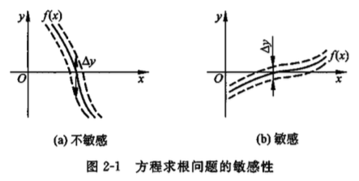

<!DOCTYPE html>
<html lang="zh-Hans-CN">

<head>
    <link rel="stylesheet" type="text/css" href="./css/modern-norm.min.css" />
    <link rel="stylesheet" type="text/css" href="./css/prism.min.css" />
    <link rel="stylesheet" type="text/css" href="./css/katex.min.css" />
    <link rel="stylesheet" type="text/css" href="./css/wolai.css" />
</head>

<body>
    <header>
        

        

            

                

            

            

        

    </header>
    <article>
        

            
要求解的单变量非线性方程为

        

        
<math xmlns="http://www.w3.org/1998/Math/MathML"
                            display="block">
                            <semantics>
                                <mrow>
                                    <mi>f</mi>
                                    <mo stretchy="false">(</mo>
                                    <mi>x</mi>
                                    <mo stretchy="false">)</mo>
                                    <mo>=</mo>
                                    <mn>0</mn>
                                    <mo separator="true">,</mo>
                                </mrow>
                                <annotation encoding="application/x-tex">f(x)=0,</annotation>
                            </semantics>
                        </math>f(x)=0,

        

            
其中, 函数 <math
                                xmlns="http://www.w3.org/1998/Math/MathML">
                                <semantics>
                                    <mrow>
                                        <mi>f</mi>
                                        <mo>:</mo>
                                        <mi mathvariant="double-struck">R</mi>
                                        <mo>→</mo>
                                        <mi mathvariant="double-struck">R</mi>
                                    </mrow>
                                    <annotation encoding="application/x-tex">f: \mathbb{R} \rightarrow \mathbb{R}
                                    </annotation>
                                </semantics>
                            </math>f:R→R。一般而言, 非线性方程的解的存在性和个数是很难确定的, 它可能无解, 也可能有一个或多个解。

        

        

            
在实际问题中, 往往要求的是自变量在一定范围内的解, 如限定 <math xmlns="http://www.w3.org/1998/Math/MathML">
                                <semantics>
                                    <mrow>
                                        <mi>x</mi>
                                        <mo>∈</mo>
                                        <mo stretchy="false">[</mo>
                                        <mi>a</mi>
                                        <mo separator="true">,</mo>
                                        <mi>b</mi>
                                        <mo stretchy="false">]</mo>
                                    </mrow>
                                    <annotation encoding="application/x-tex">x \in[a, b]</annotation>
                                </semantics>
                            </math>x∈[a,b] 。函数
                <math
                                xmlns="http://www.w3.org/1998/Math/MathML">
                                <semantics>
                                    <mrow>
                                        <mi>f</mi>
                                    </mrow>
                                    <annotation encoding="application/x-tex">f </annotation>
                                </semantics>
                            </math>f一般为连续函数, 可记为 <math
                                xmlns="http://www.w3.org/1998/Math/MathML">
                                <semantics>
                                    <mrow>
                                        <mi>f</mi>
                                        <mo stretchy="false">(</mo>
                                        <mi>x</mi>
                                        <mo stretchy="false">)</mo>
                                        <mo>∈</mo>
                                        <mi>C</mi>
                                        <mo stretchy="false">[</mo>
                                        <mi>a</mi>
                                        <mo separator="true">,</mo>
                                        <mi>b</mi>
                                        <mo stretchy="false">]</mo>
                                    </mrow>
                                    <annotation encoding="application/x-tex">f(x) \in C[a, b]</annotation>
                                </semantics>
                            </math>f(x)∈C[a,b]。假设在区间
                <math
                                xmlns="http://www.w3.org/1998/Math/MathML">
                                <semantics>
                                    <mrow>
                                        <mo stretchy="false">[</mo>
                                        <mi>a</mi>
                                        <mo separator="true">,</mo>
                                        <mi>b</mi>
                                        <mo stretchy="false">]</mo>
                                    </mrow>
                                    <annotation encoding="application/x-tex">[a, b]</annotation>
                                </semantics>
                            </math>[a,b] 上方程根为
                <math
                                xmlns="http://www.w3.org/1998/Math/MathML">
                                <semantics>
                                    <mrow>
                                        <msup>
                                            <mi>x</mi>
                                            <mo lspace="0em" rspace="0em">∗</mo>
                                        </msup>
                                    </mrow>
                                    <annotation encoding="application/x-tex">x^{*}</annotation>
                                </semantics>
                            </math>x∗, 也称 <math
                                xmlns="http://www.w3.org/1998/Math/MathML">
                                <semantics>
                                    <mrow>
                                        <msup>
                                            <mi>x</mi>
                                            <mo lspace="0em" rspace="0em">∗</mo>
                                        </msup>
                                    </mrow>
                                    <annotation encoding="application/x-tex">x^{*}</annotation>
                                </semantics>
                            </math>x∗ 为函数 <math
                                xmlns="http://www.w3.org/1998/Math/MathML">
                                <semantics>
                                    <mrow>
                                        <mi>f</mi>
                                        <mo stretchy="false">(</mo>
                                        <mi>x</mi>
                                        <mo stretchy="false">)</mo>
                                    </mrow>
                                    <annotation encoding="application/x-tex">f(x)</annotation>
                                </semantics>
                            </math>f(x)
                    的零点。

        

        <blockquote id="mnnDyhmA32zkGVitUagzkm" class="wolai-block"><b>定义 2.1:
                </b>对光滑函数 <math xmlns="http://www.w3.org/1998/Math/MathML">
                            <semantics>
                                <mrow>
                                    <mi>f</mi>
                                </mrow>
                                <annotation encoding="application/x-tex">f</annotation>
                            </semantics>
                        </math>f, 若 <math
                            xmlns="http://www.w3.org/1998/Math/MathML">
                            <semantics>
                                <mrow>
                                    <mi>f</mi>
                                    <mrow>
                                        <mo fence="true">(</mo>
                                        <msup>
                                            <mi>x</mi>
                                            <mo lspace="0em" rspace="0em">∗</mo>
                                        </msup>
                                        <mo fence="true">)</mo>
                                    </mrow>
                                    <mo>=</mo>
                                    <msup>
                                        <mi>f</mi>
                                        <mo mathvariant="normal" lspace="0em" rspace="0em">′</mo>
                                    </msup>
                                    <mrow>
                                        <mo fence="true">(</mo>
                                        <msup>
                                            <mi>x</mi>
                                            <mo lspace="0em" rspace="0em">∗</mo>
                                        </msup>
                                        <mo fence="true">)</mo>
                                    </mrow>
                                    <mo>=</mo>
                                    <mo>⋯</mo>
                                    <mo>=</mo>
                                    <msup>
                                        <mi>f</mi>
                                        <mrow>
                                            <mo stretchy="false">(</mo>
                                            <mi>m</mi>
                                            <mo>−</mo>
                                            <mn>1</mn>
                                            <mo stretchy="false">)</mo>
                                        </mrow>
                                    </msup>
                                    <mrow>
                                        <mo fence="true">(</mo>
                                        <msup>
                                            <mi>x</mi>
                                            <mo lspace="0em" rspace="0em">∗</mo>
                                        </msup>
                                        <mo fence="true">)</mo>
                                    </mrow>
                                    <mo>=</mo>
                                    <mn>0</mn>
                                    <mo separator="true">,</mo>
                                    <mi>m</mi>
                                    <mo>&gt;</mo>
                                    <mn>1</mn>
                                </mrow>
                                <annotation encoding="application/x-tex">
                                    f\left(x^{*}\right)=f^{\prime}\left(x^{*}\right)=\cdots=f^{(m-1)}\left(x^{*}\right)=0,
                                    m&gt;1</annotation>
                            </semantics>
                        </math>f(x∗)=f′(x∗)=⋯=f(m−1)(x∗)=0,m&gt;1, 但
            <math
                            xmlns="http://www.w3.org/1998/Math/MathML">
                            <semantics>
                                <mrow>
                                    <msup>
                                        <mi>f</mi>
                                        <mrow>
                                            <mo stretchy="false">(</mo>
                                            <mi>m</mi>
                                            <mo stretchy="false">)</mo>
                                        </mrow>
                                    </msup>
                                    <mrow>
                                        <mo fence="true">(</mo>
                                        <msup>
                                            <mi>x</mi>
                                            <mo lspace="0em" rspace="0em">∗</mo>
                                        </msup>
                                        <mo fence="true">)</mo>
                                    </mrow>
                                    <mo mathvariant="normal">≠</mo>
                                    <mn>0</mn>
                                </mrow>
                                <annotation encoding="application/x-tex">f^{(m)}\left(x^{*}\right) \neq 0</annotation>
                            </semantics>
                        </math>f(m)(x∗)=0, 则 称
            <math
                            xmlns="http://www.w3.org/1998/Math/MathML">
                            <semantics>
                                <mrow>
                                    <msup>
                                        <mi>x</mi>
                                        <mo lspace="0em" rspace="0em">∗</mo>
                                    </msup>
                                </mrow>
                                <annotation encoding="application/x-tex">x^{*}</annotation>
                            </semantics>
                        </math>x∗ 为方程 (2.1) 的 <math
                            xmlns="http://www.w3.org/1998/Math/MathML">
                            <semantics>
                                <mrow>
                                    <mi>m</mi>
                                </mrow>
                                <annotation encoding="application/x-tex">m </annotation>
                            </semantics>
                        </math>m<b>重根。</b>若 <math xmlns="http://www.w3.org/1998/Math/MathML">
                            <semantics>
                                <mrow>
                                    <mi>m</mi>
                                    <mo>=</mo>
                                    <mn>1</mn>
                                </mrow>
                                <annotation encoding="application/x-tex">m=1</annotation>
                            </semantics>
                        </math>m=1, 即
            <math
                            xmlns="http://www.w3.org/1998/Math/MathML">
                            <semantics>
                                <mrow>
                                    <mi>f</mi>
                                    <mrow>
                                        <mo fence="true">(</mo>
                                        <msup>
                                            <mi>x</mi>
                                            <mo lspace="0em" rspace="0em">∗</mo>
                                        </msup>
                                        <mo fence="true">)</mo>
                                    </mrow>
                                    <mo>=</mo>
                                    <mn>0</mn>
                                    <mo separator="true">,</mo>
                                    <msup>
                                        <mi>f</mi>
                                        <mo mathvariant="normal" lspace="0em" rspace="0em">′</mo>
                                    </msup>
                                    <mrow>
                                        <mo fence="true">(</mo>
                                        <msup>
                                            <mi>x</mi>
                                            <mo lspace="0em" rspace="0em">∗</mo>
                                        </msup>
                                        <mo fence="true">)</mo>
                                    </mrow>
                                    <mo mathvariant="normal">≠</mo>
                                    <mn>0</mn>
                                </mrow>
                                <annotation encoding="application/x-tex">f\left(x^{*}\right)=0,
                                    f^{\prime}\left(x^{*}\right) \neq 0</annotation>
                            </semantics>
                        </math>f(x∗)=0,f′(x∗)=0 时, 称
            <math
                            xmlns="http://www.w3.org/1998/Math/MathML">
                            <semantics>
                                <mrow>
                                    <msup>
                                        <mi>x</mi>
                                        <mo lspace="0em" rspace="0em">∗</mo>
                                    </msup>
                                </mrow>
                                <annotation encoding="application/x-tex">x^{*}</annotation>
                            </semantics>
                        </math>x∗ 为单根。</blockquote>
        <h3 id="pNviiomNUG77PtwYgBHCLE" class="wolai-block">问题敏感性</h3>
        

            
要分析敏感性, 首先应假设问题中的数据如何扰动, 一种易于分析的情况是将非线性方程写成

        

        
<math xmlns="http://www.w3.org/1998/Math/MathML"
                            display="block">
                            <semantics>
                                <mrow>
                                    <mi>f</mi>
                                    <mo stretchy="false">(</mo>
                                    <mi>x</mi>
                                    <mo stretchy="false">)</mo>
                                    <mo>=</mo>
                                    <mi>y</mi>
                                </mrow>
                                <annotation encoding="application/x-tex">f(x)=y</annotation>
                            </semantics>
                        </math>f(x)=y

        

            
的形式, 然后讨论 y 在 0 值附近的扰动造成的问题敏感性。此时, 求根问题变成了函数求值 问题<math xmlns="http://www.w3.org/1998/Math/MathML">
                                <semantics>
                                    <mrow>
                                        <mi>y</mi>
                                        <mo>=</mo>
                                        <mi>f</mi>
                                        <mo stretchy="false">(</mo>
                                        <mi>x</mi>
                                        <mo stretchy="false">)</mo>
                                    </mrow>
                                    <annotation encoding="application/x-tex"> y=f(x)</annotation>
                                </semantics>
                            </math>y=f(x)
                    的反问题。若函数值 <math
                                xmlns="http://www.w3.org/1998/Math/MathML">
                                <semantics>
                                    <mrow>
                                        <mi>f</mi>
                                        <mo stretchy="false">(</mo>
                                        <mi>x</mi>
                                        <mo stretchy="false">)</mo>
                                    </mrow>
                                    <annotation encoding="application/x-tex">f(x) </annotation>
                                </semantics>
                            </math>f(x)对<b>输入参数 </b><math xmlns="http://www.w3.org/1998/Math/MathML">
                                <semantics>
                                    <mrow>
                                        <mi>x</mi>
                                    </mrow>
                                    <annotation encoding="application/x-tex">x</annotation>
                                </semantics>
                            </math>x 很不敏感 ( <math
                                xmlns="http://www.w3.org/1998/Math/MathML">
                                <semantics>
                                    <mrow>
                                        <mi>x</mi>
                                    </mrow>
                                    <annotation encoding="application/x-tex">x</annotation>
                                </semantics>
                            </math>x 在解 <math
                                xmlns="http://www.w3.org/1998/Math/MathML">
                                <semantics>
                                    <mrow>
                                        <msup>
                                            <mi>x</mi>
                                            <mo lspace="0em" rspace="0em">∗</mo>
                                        </msup>
                                    </mrow>
                                    <annotation encoding="application/x-tex">x^{*}</annotation>
                                </semantics>
                            </math>x∗ 附近变化), 则 求根问题将很敏感; 反之, 若函数值对参数值很敏感, 求根则不敏感。这两种情况如图 2-1 所示。

        

        

            <figure class="wolai-center" style="width: 100%"></figure>
        

        

            
下面分析 y 发生扰动 <math
                                xmlns="http://www.w3.org/1998/Math/MathML">
                                <semantics>
                                    <mrow>
                                        <mi mathvariant="normal">Δ</mi>
                                        <mi>y</mi>
                                    </mrow>
                                    <annotation encoding="application/x-tex">\Delta y</annotation>
                                </semantics>
                            </math>Δy 引起的方程的根的扰动 <math
                                xmlns="http://www.w3.org/1998/Math/MathML">
                                <semantics>
                                    <mrow>
                                        <mi mathvariant="normal">Δ</mi>
                                        <mi>x</mi>
                                    </mrow>
                                    <annotation encoding="application/x-tex">\Delta x</annotation>
                                </semantics>
                            </math>Δx 。由于当 <math
                                xmlns="http://www.w3.org/1998/Math/MathML">
                                <semantics>
                                    <mrow>
                                        <mi>x</mi>
                                        <mo>=</mo>
                                        <msup>
                                            <mi>x</mi>
                                            <mo lspace="0em" rspace="0em">∗</mo>
                                        </msup>
                                    </mrow>
                                    <annotation encoding="application/x-tex">x=x^{*}</annotation>
                                </semantics>
                            </math>x=x∗ 时, <math
                                xmlns="http://www.w3.org/1998/Math/MathML">
                                <semantics>
                                    <mrow>
                                        <mi>y</mi>
                                        <mo>=</mo>
                                        <mn>0</mn>
                                    </mrow>
                                    <annotation encoding="application/x-tex">y=0</annotation>
                                </semantics>
                            </math>y=0, 因此使 用绝对
                    (而不是相对) 条件数

        

        
<math xmlns="http://www.w3.org/1998/Math/MathML"
                            display="block">
                            <semantics>
                                <mrow>
                                    <mtext> cond </mtext>
                                    <mo>=</mo>
                                    <mrow>
                                        <mo fence="true">∣</mo>
                                        <mfrac>
                                            <mrow>
                                                <mi mathvariant="normal">Δ</mi>
                                                <mi>x</mi>
                                            </mrow>
                                            <mrow>
                                                <mi mathvariant="normal">Δ</mi>
                                                <mi>y</mi>
                                            </mrow>
                                        </mfrac>
                                        <mo fence="true">∣</mo>
                                    </mrow>
                                    <mo>≈</mo>
                                    <mfrac>
                                        <mn>1</mn>
                                        <mrow>
                                            <mo fence="true">∣</mo>
                                            <msup>
                                                <mi>f</mi>
                                                <mo mathvariant="normal" lspace="0em" rspace="0em">′</mo>
                                            </msup>
                                            <mrow>
                                                <mo fence="true">(</mo>
                                                <msup>
                                                    <mi>x</mi>
                                                    <mo lspace="0em" rspace="0em">∗</mo>
                                                </msup>
                                                <mo fence="true">)</mo>
                                            </mrow>
                                            <mo fence="true">∣</mo>
                                        </mrow>
                                    </mfrac>
                                </mrow>
                                <annotation encoding="application/x-tex">\text { cond }=\left|\frac{\Delta x}{\Delta
                                    y}\right| \approx \frac{1}{\left|f^{\prime}\left(x^{*}\right)\right|} </annotation>
                            </semantics>
                        </math> cond =∣<svg
                                                                xmlns="http://www.w3.org/2000/svg" width='0.3333em'
                                                                height='1.216em' style='width:0.3333em'
                                                                viewBox='0 0 333.33000000000004 1216'
                                                                preserveAspectRatio='xMinYMin'>
                                                                <path
                                                                    d='M145 0 H188 V1216 H145z M145 0 H188 V1216 H145z' />
                                                            </svg>∣​ΔyΔx​∣<svg
                                                                xmlns="http://www.w3.org/2000/svg" width='0.3333em'
                                                                height='1.216em' style='width:0.3333em'
                                                                viewBox='0 0 333.33000000000004 1216'
                                                                preserveAspectRatio='xMinYMin'>
                                                                <path
                                                                    d='M145 0 H188 V1216 H145z M145 0 H188 V1216 H145z' />
                                                            </svg>∣​≈∣f′(x∗)∣1​

        

            
条件数的大小反映方程求根问题 (式 2.1 ) 的敏感程度,
                <b>若 </b><math xmlns="http://www.w3.org/1998/Math/MathML">
                                <semantics>
                                    <mrow>
                                        <mo>∣</mo>
                                        <msup>
                                            <mi>f</mi>
                                            <mo mathvariant="normal" lspace="0em" rspace="0em">′</mo>
                                        </msup>
                                        <mrow>
                                            <mo fence="true">(</mo>
                                            <msup>
                                                <mi>x</mi>
                                                <mo lspace="0em" rspace="0em">∗</mo>
                                            </msup>
                                        </mrow>
                                        <mo stretchy="false">)</mo>
                                        <mo>∣</mo>
                                    </mrow>
                                    <annotation encoding="application/x-tex">\mid f^{\prime}\left(x^{*}\right. ) \mid
                                    </annotation>
                                </semantics>
                            </math>∣f′(x∗)∣<b>很小, 则问题很敏感, 是 一个病态问题; 若</b><math xmlns="http://www.w3.org/1998/Math/MathML">
                                <semantics>
                                    <mrow>
                                        <mo fence="true">∣</mo>
                                        <msup>
                                            <mi>f</mi>
                                            <mo mathvariant="normal" lspace="0em" rspace="0em">′</mo>
                                        </msup>
                                        <mrow>
                                            <mo fence="true">(</mo>
                                            <msup>
                                                <mi>x</mi>
                                                <mo lspace="0em" rspace="0em">∗</mo>
                                            </msup>
                                            <mo fence="true">)</mo>
                                        </mrow>
                                        <mo fence="true">∣</mo>
                                    </mrow>
                                    <annotation encoding="application/x-tex"> \left|f^{\prime}\left(x^{*}\right)\right|
                                    </annotation>
                                </semantics>
                            </math>∣f′(x∗)∣<b>很大, 则问题不敏感</b><b>。</b>一种特殊情况是 <math
                                xmlns="http://www.w3.org/1998/Math/MathML">
                                <semantics>
                                    <mrow>
                                        <msup>
                                            <mi>f</mi>
                                            <mo mathvariant="normal" lspace="0em" rspace="0em">′</mo>
                                        </msup>
                                        <mrow>
                                            <mo fence="true">(</mo>
                                            <msup>
                                                <mi>x</mi>
                                                <mo lspace="0em" rspace="0em">∗</mo>
                                            </msup>
                                            <mo fence="true">)</mo>
                                        </mrow>
                                        <mo>=</mo>
                                        <mn>0</mn>
                                    </mrow>
                                    <annotation encoding="application/x-tex">f^{\prime}\left(x^{*}\right)=0</annotation>
                                </semantics>
                            </math>f′(x∗)=0,
                即 <math xmlns="http://www.w3.org/1998/Math/MathML">
                                <semantics>
                                    <mrow>
                                        <msup>
                                            <mi>x</mi>
                                            <mo lspace="0em" rspace="0em">∗</mo>
                                        </msup>
                                    </mrow>
                                    <annotation encoding="application/x-tex">x^{*}</annotation>
                                </semantics>
                            </math>x∗<b> 为重根, 此时求根问题很敏感</b>, 原问题的微小扰动将造成很大的解误差,
                    甚至改变解的存在性和唯一性

        

        

            <figure class="wolai-center" style="width: 100%">
            </figure>
        

        <h2 id="5SNMjMyFGkYcJoNKiX3jsb" class="wolai-block">二分法</h2>
        

            
首先介绍<b>有根区间</b>的概念。有根区间就是包含至少一个根的区间，它限定了根存在的范围。如果能计算出一个非常小的有根区间，那么区间的中点就是一个很好的近似解。

        

        

            <figure class="wolai-center" style="width: 100%">
            </figure>
        

        

            
二分法的思想很简单, 就是每次将有根区间一分为二, 得到长度逐次减半的区间序列 <math xmlns="http://www.w3.org/1998/Math/MathML">
                                <semantics>
                                    <mrow>
                                        <mo fence="true">{</mo>
                                        <mrow>
                                            <mo fence="true">(</mo>
                                            <msub>
                                                <mi>a</mi>
                                                <mi>k</mi>
                                            </msub>
                                            <mo separator="true">,</mo>
                                            <msub>
                                                <mi>b</mi>
                                                <mi>k</mi>
                                            </msub>
                                            <mo fence="true">)</mo>
                                        </mrow>
                                        <mo fence="true">}</mo>
                                    </mrow>
                                    <annotation encoding="application/x-tex">\left\{\left(a_{k}, b_{k}\right)\right\}
                                    </annotation>
                                </semantics>
                            </math>{(ak​,bk​)}, <b>则区间中点 </b><math xmlns="http://www.w3.org/1998/Math/MathML">
                                <semantics>
                                    <mrow>
                                        <msub>
                                            <mi>x</mi>
                                            <mi>k</mi>
                                        </msub>
                                        <mo>=</mo>
                                        <mrow>
                                            <mo fence="true">(</mo>
                                            <msub>
                                                <mi>a</mi>
                                                <mi>k</mi>
                                            </msub>
                                            <mo>+</mo>
                                            <msub>
                                                <mi>b</mi>
                                                <mi>k</mi>
                                            </msub>
                                            <mo fence="true">)</mo>
                                        </mrow>
                                        <mi mathvariant="normal">/</mi>
                                        <mn>2</mn>
                                    </mrow>
                                    <annotation encoding="application/x-tex">x_{k}=\left(a_{k}+b_{k}\right) / 2
                                    </annotation>
                                </semantics>
                            </math>xk​=(ak​+bk​)/2<b>就是第 k
                        步迭代的近似解</b>

        

        

            <figure class="wolai-center" style="width: 100%">
            </figure>
        

        <h3 id="4onZSLqTJQGoFMN9xau3Ug" class="wolai-block">误差</h3>
        

            
假设二分法得到的有根区间序列为 <math xmlns="http://www.w3.org/1998/Math/MathML">
                                <semantics>
                                    <mrow>
                                        <mrow>
                                            <mo fence="true">{</mo>
                                            <mrow>
                                                <mo fence="true">(</mo>
                                                <msub>
                                                    <mi>a</mi>
                                                    <mi>k</mi>
                                                </msub>
                                                <mo separator="true">,</mo>
                                                <msub>
                                                    <mi>b</mi>
                                                    <mi>k</mi>
                                                </msub>
                                                <mo fence="true">)</mo>
                                            </mrow>
                                            <mo separator="true">,</mo>
                                            <mi>k</mi>
                                            <mo>=</mo>
                                            <mn>0</mn>
                                            <mo separator="true">,</mo>
                                            <mn>1</mn>
                                            <mo separator="true">,</mo>
                                            <mn>2</mn>
                                            <mo separator="true">,</mo>
                                            <mo>⋯</mo>
                                            <mtext> </mtext>
                                            <mo fence="true">}</mo>
                                        </mrow>
                                        <mo separator="true">,</mo>
                                    </mrow>
                                    <annotation encoding="application/x-tex">\left\{\left(a_{k}, b_{k}\right), k=0,1,2,
                                        \cdots\right\},</annotation>
                                </semantics>
                            </math>{(ak​,bk​),k=0,1,2,⋯}, 若取解
                <math
                                xmlns="http://www.w3.org/1998/Math/MathML">
                                <semantics>
                                    <mrow>
                                        <msub>
                                            <mi>x</mi>
                                            <mi>k</mi>
                                        </msub>
                                        <mo>=</mo>
                                        <mrow>
                                            <mo fence="true">(</mo>
                                            <msub>
                                                <mi>a</mi>
                                                <mi>k</mi>
                                            </msub>
                                            <mo>+</mo>
                                            <msub>
                                                <mi>b</mi>
                                                <mi>k</mi>
                                            </msub>
                                            <mo fence="true">)</mo>
                                        </mrow>
                                        <mi mathvariant="normal">/</mi>
                                        <mn>2</mn>
                                    </mrow>
                                    <annotation encoding="application/x-tex">x_{k}=\left(a_{k}+b_{k}\right) / 2
                                    </annotation>
                                </semantics>
                            </math>xk​=(ak​+bk​)/2,
                    则<b>误差</b>为

        

        
<math xmlns="http://www.w3.org/1998/Math/MathML"
                            display="block">
                            <semantics>
                                <mrow>
                                    <mrow>
                                        <mo fence="true">∣</mo>
                                        <msub>
                                            <mi>x</mi>
                                            <mi>k</mi>
                                        </msub>
                                        <mo>−</mo>
                                        <msup>
                                            <mi>x</mi>
                                            <mo lspace="0em" rspace="0em">∗</mo>
                                        </msup>
                                        <mo fence="true">∣</mo>
                                    </mrow>
                                    <mo>&lt;</mo>
                                    <mrow>
                                        <mo fence="true">(</mo>
                                        <msub>
                                            <mi>b</mi>
                                            <mi>k</mi>
                                        </msub>
                                        <mo>−</mo>
                                        <msub>
                                            <mi>a</mi>
                                            <mi>k</mi>
                                        </msub>
                                        <mo fence="true">)</mo>
                                    </mrow>
                                    <mi mathvariant="normal">/</mi>
                                    <mn>2</mn>
                                    <mo>=</mo>
                                    <mrow>
                                        <mo fence="true">(</mo>
                                        <msub>
                                            <mi>b</mi>
                                            <mn>0</mn>
                                        </msub>
                                        <mo>−</mo>
                                        <msub>
                                            <mi>a</mi>
                                            <mn>0</mn>
                                        </msub>
                                        <mo fence="true">)</mo>
                                    </mrow>
                                    <mi mathvariant="normal">/</mi>
                                    <msup>
                                        <mn>2</mn>
                                        <mrow>
                                            <mi>k</mi>
                                            <mo>+</mo>
                                            <mn>1</mn>
                                        </mrow>
                                    </msup>
                                    <mo separator="true">,</mo>
                                    <mspace width="1em" />
                                    <mi>k</mi>
                                    <mo>=</mo>
                                    <mn>0</mn>
                                    <mo separator="true">,</mo>
                                    <mn>1</mn>
                                    <mo separator="true">,</mo>
                                    <mn>2</mn>
                                    <mo separator="true">,</mo>
                                    <mo>⋯</mo>
                                </mrow>
                                <annotation encoding="application/x-tex">
                                    \left|x_{k}-x^{*}\right|&lt;\left(b_{k}-a_{k}\right) / 2=\left(b_{0}-a_{0}\right) /
                                    2^{k+1}, \quad k=0,1,2, \cdots</annotation>
                            </semantics>
                        </math>∣xk​−x∗∣&lt;(bk​−ak​)/2=(b0​−a0​)/2k+1,k=0,1,2,⋯

        <h3 id="41dQUvGmVuRjjzzDCPczt5" class="wolai-block">稳定性和准确度</h3>
        

            
算法的稳定性考查的是计算过程中的误差对结果的影响。<b>对于二分法来说,主要的计算步骤是计算函数值，一般采用双精度浮点数计算函数值的误差很小</b>，而其他计算是少量的加减法，因此不至于对有根区间以及最终结果的准确度造成多大影响。另外，在计算过程中解的误差限逐次减半,这也说明二分法是稳定的。

        

        

            
<b>算法稳定性：运算简单，误差逐渐缩小，比较稳定</b>

        

        <aside id="4J5NAa1ypVkuZV1XBn2EfK" class="bg-blond wolai-block">
            

<b>定理 2.2</b>: 在实际的浮点算术体系下采用二分法解方程<math xmlns="http://www.w3.org/1998/Math/MathML">
                            <semantics>
                                <mrow>
                                    <mi>f</mi>
                                    <mo stretchy="false">(</mo>
                                    <mi>x</mi>
                                    <mo stretchy="false">)</mo>
                                    <mo>=</mo>
                                    <mn>0</mn>
                                </mrow>
                                <annotation encoding="application/x-tex"> f(x)=0</annotation>
                            </semantics>
                        </math>f(x)=0,
                设初始有根区间为<math
                            xmlns="http://www.w3.org/1998/Math/MathML">
                            <semantics>
                                <mrow>
                                    <mo stretchy="false">(</mo>
                                    <mi>a</mi>
                                    <mo separator="true">,</mo>
                                    <mi>b</mi>
                                    <mo stretchy="false">)</mo>
                                </mrow>
                                <annotation encoding="application/x-tex"> (a, b)</annotation>
                            </semantics>
                        </math>(a,b), 则：
                结果的误差限最小可达到 <math
                            xmlns="http://www.w3.org/1998/Math/MathML">
                            <semantics>
                                <mrow>
                                    <msup>
                                        <mn>2</mn>
                                        <mrow>
                                            <mo fence="true">⌊</mo>
                                            <msub>
                                                <mrow>
                                                    <mi>log</mi>
                                                    <mo>⁡</mo>
                                                </mrow>
                                                <mn>2</mn>
                                            </msub>
                                            <mi mathvariant="normal">∣</mi>
                                            <msup>
                                                <mi>x</mi>
                                                <mo lspace="0em" rspace="0em">∗</mo>
                                            </msup>
                                            <mi mathvariant="normal">∣</mi>
                                            <mo fence="true">⌋</mo>
                                        </mrow>
                                    </msup>
                                    <mo>⋅</mo>
                                    <mn>2</mn>
                                    <msub>
                                        <mi>ε</mi>
                                        <mrow>
                                            <mi>m</mi>
                                            <mi>a</mi>
                                            <mi>c</mi>
                                            <mi>h</mi>
                                            <mo separator="true">,</mo>
                                        </mrow>
                                    </msub>
                                </mrow>
                                <annotation encoding="application/x-tex">2^{\left\lfloor \log_{2}|x^{*}|
                                    \right\rfloor}\cdot 2 \varepsilon_{{mach, }}</annotation>
                            </semantics>
                        </math>2⌊log2​∣x∗∣⌋⋅2εmach,​, 其中 <math
                            xmlns="http://www.w3.org/1998/Math/MathML">
                            <semantics>
                                <mrow>
                                    <msup>
                                        <mi>x</mi>
                                        <mo lspace="0em" rspace="0em">∗</mo>
                                    </msup>
                                </mrow>
                                <annotation encoding="application/x-tex">x^{*}</annotation>
                            </semantics>
                        </math>x∗ 为准确解, 对应的相对误差限为 <math
                            xmlns="http://www.w3.org/1998/Math/MathML">
                            <semantics>
                                <mrow>
                                    <mn>2</mn>
                                    <msub>
                                        <mi>ε</mi>
                                        <mrow>
                                            <mi mathvariant="normal">m</mi>
                                            <mi mathvariant="normal">a</mi>
                                            <mi mathvariant="normal">c</mi>
                                            <mi mathvariant="normal">h</mi>
                                        </mrow>
                                    </msub>
                                </mrow>
                                <annotation encoding="application/x-tex">2 \varepsilon_{\mathrm{mach}} </annotation>
                            </semantics>
                        </math>2εmach​
        </aside>
        

            
最后,对二分法说明几点。

        

        <ul class="wolai-block">
            <li id="ummQRGfo2QpfiDqyxN3vY6">
                
<svg width="24" height="24" viewBox="0 0 24 24" fill="currentColor"
                        xmlns="http://www.w3.org/2000/svg">
                        <path d="M12 14.5a2.5 2.5 0 100-5 2.5 2.5 0 000 5z"></path>
                    </svg>
二分法是求单变量方程(z)=0的实根的一种可靠算法,若存在有根区间，则一定能收敛。
            </li>
            <li id="gwFufTZUt3oBJse2YkxZFK">
                
<svg width="24" height="24" viewBox="0 0 24 24" fill="currentColor"
                        xmlns="http://www.w3.org/2000/svg">
                        <path d="M12 14.5a2.5 2.5 0 100-5 2.5 2.5 0 000 5z"></path>
                    </svg>
二分法解的误差不一定随迭代次数增加一直减小，在实际的有限精度算术体系中，误差限存在最小值
            </li>
            <li id="bCdxE3XD4D41Ln3gebpiB6">
                
<svg width="24" height="24" viewBox="0 0 24 24" fill="currentColor"
                        xmlns="http://www.w3.org/2000/svg">
                        <path d="M12 14.5a2.5 2.5 0 100-5 2.5 2.5 0 000 5z"></path>
                    </svg>
二分法的缺点是，有时<b>不易确定合适的初始有根区间(含两个初始值）</b>、<b>收敛较慢</b>，且无法求解偶数重的根。因此,实际应用中常将二分法与其他方法结合起来。
            </li>
        </ul>
        <h2 id="uqgyWQ7dm6wBnZdNMp4hzS" class="wolai-block">不动点迭代法</h2>
        <h3 id="hBcfu5dx9q7uQMnK9nwv3F" class="wolai-block">原理</h3>
        

            
通过某种等价变换, 可将非线性方程<math xmlns="http://www.w3.org/1998/Math/MathML">
                                <semantics>
                                    <mrow>
                                        <mi>f</mi>
                                        <mo stretchy="false">(</mo>
                                        <mi>x</mi>
                                        <mo stretchy="false">)</mo>
                                        <mo>=</mo>
                                        <mn>0</mn>
                                    </mrow>
                                    <annotation encoding="application/x-tex"> f(x)=0</annotation>
                                </semantics>
                            </math>f(x)=0改写为

        

        
<math xmlns="http://www.w3.org/1998/Math/MathML"
                            display="block">
                            <semantics>
                                <mrow>
                                    <mi>x</mi>
                                    <mo>=</mo>
                                    <mi>φ</mi>
                                    <mo stretchy="false">(</mo>
                                    <mi>x</mi>
                                    <mo stretchy="false">)</mo>
                                </mrow>
                                <annotation encoding="application/x-tex">x=\varphi(x) </annotation>
                            </semantics>
                        </math>x=φ(x)

        

            
其中, <math
                                xmlns="http://www.w3.org/1998/Math/MathML">
                                <semantics>
                                    <mrow>
                                        <mi>φ</mi>
                                        <mo stretchy="false">(</mo>
                                        <mi>x</mi>
                                        <mo stretchy="false">)</mo>
                                    </mrow>
                                    <annotation encoding="application/x-tex">\varphi(x)</annotation>
                                </semantics>
                            </math>φ(x)
                    为连续函数。给定初始值 <math
                                xmlns="http://www.w3.org/1998/Math/MathML">
                                <semantics>
                                    <mrow>
                                        <msub>
                                            <mi>x</mi>
                                            <mn>0</mn>
                                        </msub>
                                    </mrow>
                                    <annotation encoding="application/x-tex">x_{0}</annotation>
                                </semantics>
                            </math>x0​ 后, 可构造迭代计 算公式

        

        
<math xmlns="http://www.w3.org/1998/Math/MathML"
                            display="block">
                            <semantics>
                                <mrow>
                                    <msub>
                                        <mi>x</mi>
                                        <mrow>
                                            <mi>k</mi>
                                            <mo>+</mo>
                                            <mn>1</mn>
                                        </mrow>
                                    </msub>
                                    <mo>=</mo>
                                    <mi>φ</mi>
                                    <mrow>
                                        <mo fence="true">(</mo>
                                        <msub>
                                            <mi>x</mi>
                                            <mi>k</mi>
                                        </msub>
                                        <mo fence="true">)</mo>
                                    </mrow>
                                    <mspace width="1em" />
                                    <mo stretchy="false">(</mo>
                                    <mi>k</mi>
                                    <mo>=</mo>
                                    <mn>0</mn>
                                    <mo separator="true">,</mo>
                                    <mn>1</mn>
                                    <mo separator="true">,</mo>
                                    <mn>2</mn>
                                    <mo separator="true">,</mo>
                                    <mo>⋯</mo>
                                    <mtext> </mtext>
                                    <mo stretchy="false">)</mo>
                                    <mspace width="1em" />
                                    <mo stretchy="false">(</mo>
                                    <mn>2.8</mn>
                                    <mo stretchy="false">)</mo>
                                </mrow>
                                <annotation encoding="application/x-tex">x_{k+1}=\varphi\left(x_{k}\right)
                                    \quad(k=0,1,2, \cdots) \quad(2.8)</annotation>
                            </semantics>
                        </math>xk+1​=φ(xk​)(k=0,1,2,⋯)(2.8)

        

            
从而得到近似解序列 <math
                                xmlns="http://www.w3.org/1998/Math/MathML">
                                <semantics>
                                    <mrow>
                                        <mo stretchy="false">{</mo>
                                        <msub>
                                            <mi>x</mi>
                                            <mi>k</mi>
                                        </msub>
                                        <mo stretchy="false">}</mo>
                                    </mrow>
                                    <annotation encoding="application/x-tex">\{x_{k}\} </annotation>
                                </semantics>
                            </math>{xk​}。很容易证明若序列 <math
                                xmlns="http://www.w3.org/1998/Math/MathML">
                                <semantics>
                                    <mrow>
                                        <mo stretchy="false">{</mo>
                                        <msub>
                                            <mi>x</mi>
                                            <mi>k</mi>
                                        </msub>
                                        <mo stretchy="false">}</mo>
                                    </mrow>
                                    <annotation encoding="application/x-tex">\{x_{k}\}</annotation>
                                </semantics>
                            </math>{xk​} 收敛,
                    其极限必为原 方程的解 <math
                                xmlns="http://www.w3.org/1998/Math/MathML">
                                <semantics>
                                    <mrow>
                                        <msup>
                                            <mi>x</mi>
                                            <mo lspace="0em" rspace="0em">∗</mo>
                                        </msup>
                                    </mrow>
                                    <annotation encoding="application/x-tex">x^{*} </annotation>
                                </semantics>
                            </math>x∗。由于解 <math
                                xmlns="http://www.w3.org/1998/Math/MathML">
                                <semantics>
                                    <mrow>
                                        <msup>
                                            <mi>x</mi>
                                            <mo lspace="0em" rspace="0em">∗</mo>
                                        </msup>
                                    </mrow>
                                    <annotation encoding="application/x-tex">x^{*}</annotation>
                                </semantics>
                            </math>x∗ 满足 <math
                                xmlns="http://www.w3.org/1998/Math/MathML">
                                <semantics>
                                    <mrow>
                                        <msup>
                                            <mi>x</mi>
                                            <mo lspace="0em" rspace="0em">∗</mo>
                                        </msup>
                                        <mo>=</mo>
                                        <mi>φ</mi>
                                        <mrow>
                                            <mo fence="true">(</mo>
                                            <msup>
                                                <mi>x</mi>
                                                <mo lspace="0em" rspace="0em">∗</mo>
                                            </msup>
                                            <mo fence="true">)</mo>
                                        </mrow>
                                    </mrow>
                                    <annotation encoding="application/x-tex">x^{*}=\varphi\left(x^{*}\right)
                                    </annotation>
                                </semantics>
                            </math>x∗=φ(x∗), 因此称它为函数 <math
                                xmlns="http://www.w3.org/1998/Math/MathML">
                                <semantics>
                                    <mrow>
                                        <mi>φ</mi>
                                        <mo stretchy="false">(</mo>
                                        <mi>x</mi>
                                        <mo stretchy="false">)</mo>
                                    </mrow>
                                    <annotation encoding="application/x-tex">\varphi(x)</annotation>
                                </semantics>
                            </math>φ(x) 的不动点
                    (fixed point), 此方法为求解非线性方程的不动点迭代法

        

        

            <figure class="wolai-center" style="width: 100%">
            </figure>
        

        <h3 id="iPV6ktKS2XktYVMheLHXpF" class="wolai-block">全局收敛的充分条件</h3>
        

            
定理2. 3给出一个函数存在唯一不动点的充分条件。

        

        <aside id="rXSiowTzDwfZ2ktViEvotp" class="bg-blond wolai-block">
            

<b>定理 2.3</b>: 设 <math
                            xmlns="http://www.w3.org/1998/Math/MathML">
                            <semantics>
                                <mrow>
                                    <mi>φ</mi>
                                    <mo stretchy="false">(</mo>
                                    <mi>x</mi>
                                    <mo stretchy="false">)</mo>
                                    <mo>∈</mo>
                                    <mi>C</mi>
                                    <mo stretchy="false">[</mo>
                                    <mi>a</mi>
                                    <mo separator="true">,</mo>
                                    <mi>b</mi>
                                    <mo stretchy="false">]</mo>
                                </mrow>
                                <annotation encoding="application/x-tex">\varphi(x) \in C[a, b]</annotation>
                            </semantics>
                        </math>φ(x)∈C[a,b],
                若满足如下两个条件:
                (1) 对任意 <math
                            xmlns="http://www.w3.org/1998/Math/MathML">
                            <semantics>
                                <mrow>
                                    <mi>x</mi>
                                    <mo>∈</mo>
                                    <mo stretchy="false">[</mo>
                                    <mi>a</mi>
                                    <mo separator="true">,</mo>
                                    <mi>b</mi>
                                    <mo stretchy="false">]</mo>
                                </mrow>
                                <annotation encoding="application/x-tex">x \in[a, b]</annotation>
                            </semantics>
                        </math>x∈[a,b],有
            <math
                            xmlns="http://www.w3.org/1998/Math/MathML">
                            <semantics>
                                <mrow>
                                    <mi>a</mi>
                                    <mo>⩽</mo>
                                    <mi>φ</mi>
                                    <mo stretchy="false">(</mo>
                                    <mi>x</mi>
                                    <mo stretchy="false">)</mo>
                                    <mo>⩽</mo>
                                    <mi>b</mi>
                                </mrow>
                                <annotation encoding="application/x-tex">a \leqslant \varphi(x) \leqslant b</annotation>
                            </semantics>
                        </math>a⩽φ(x)⩽b 。
                (2) <b>存在</b>正常数 <math xmlns="http://www.w3.org/1998/Math/MathML">
                            <semantics>
                                <mrow>
                                    <mi>L</mi>
                                    <mo>∈</mo>
                                    <mo stretchy="false">(</mo>
                                    <mn>0</mn>
                                    <mo separator="true">,</mo>
                                    <mn>1</mn>
                                    <mo stretchy="false">)</mo>
                                </mrow>
                                <annotation encoding="application/x-tex">L \in(0,1)</annotation>
                            </semantics>
                        </math>L∈(0,1), 使对任意
            <math
                            xmlns="http://www.w3.org/1998/Math/MathML">
                            <semantics>
                                <mrow>
                                    <msub>
                                        <mi>x</mi>
                                        <mn>1</mn>
                                    </msub>
                                    <mo separator="true">,</mo>
                                    <msub>
                                        <mi>x</mi>
                                        <mn>2</mn>
                                    </msub>
                                    <mo>∈</mo>
                                    <mo stretchy="false">[</mo>
                                    <mi>a</mi>
                                    <mo separator="true">,</mo>
                                    <mi>b</mi>
                                    <mo stretchy="false">]</mo>
                                </mrow>
                                <annotation encoding="application/x-tex">x_{1}, x_{2} \in[a, b]</annotation>
                            </semantics>
                        </math>x1​,x2​∈[a,b],
            
<math xmlns="http://www.w3.org/1998/Math/MathML"
                                display="block">
                                <semantics>
                                    <mrow>
                                        <mrow>
                                            <mo fence="true">∣</mo>
                                            <mi>φ</mi>
                                            <mrow>
                                                <mo fence="true">(</mo>
                                                <msub>
                                                    <mi>x</mi>
                                                    <mn>1</mn>
                                                </msub>
                                                <mo fence="true">)</mo>
                                            </mrow>
                                            <mo>−</mo>
                                            <mi>φ</mi>
                                            <mrow>
                                                <mo fence="true">(</mo>
                                                <msub>
                                                    <mi>x</mi>
                                                    <mn>2</mn>
                                                </msub>
                                                <mo fence="true">)</mo>
                                            </mrow>
                                            <mo fence="true">∣</mo>
                                        </mrow>
                                        <mo>&lt;</mo>
                                        <mi>L</mi>
                                        <mrow>
                                            <mo fence="true">∣</mo>
                                            <msub>
                                                <mi>x</mi>
                                                <mn>1</mn>
                                            </msub>
                                            <mo>−</mo>
                                            <msub>
                                                <mi>x</mi>
                                                <mn>2</mn>
                                            </msub>
                                            <mo fence="true">∣</mo>
                                        </mrow>
                                    </mrow>
                                    <annotation encoding="application/x-tex">
                                        \left|\varphi\left(x_{1}\right)-\varphi\left(x_{2}\right)\right|&lt;L\left|x_{1}-x_{2}\right|
                                    </annotation>
                                </semantics>
                            </math>∣φ(x1​)−φ(x2​)∣&lt;L∣x1​−x2​∣

            

                
则 <math
                                    xmlns="http://www.w3.org/1998/Math/MathML">
                                    <semantics>
                                        <mrow>
                                            <mi>φ</mi>
                                            <mo stretchy="false">(</mo>
                                            <mi>x</mi>
                                            <mo stretchy="false">)</mo>
                                        </mrow>
                                        <annotation encoding="application/x-tex">\varphi(x)</annotation>
                                    </semantics>
                                </math>φ(x) 在
                    <math
                                    xmlns="http://www.w3.org/1998/Math/MathML">
                                    <semantics>
                                        <mrow>
                                            <mo stretchy="false">[</mo>
                                            <mi>a</mi>
                                            <mo separator="true">,</mo>
                                            <mi>b</mi>
                                            <mo stretchy="false">]</mo>
                                        </mrow>
                                        <annotation encoding="application/x-tex">[a, b] </annotation>
                                    </semantics>
                                </math>[a,b]上存在不动点, 且不动点是唯一的。

            

        </aside>
        

            
事实上, 通过画函数曲线图的方式也可以形象地说明不动点 的存在性,如图 2-5 所示, 在虚线正方形中曲线 <math xmlns="http://www.w3.org/1998/Math/MathML">
                                <semantics>
                                    <mrow>
                                        <mi>φ</mi>
                                        <mo stretchy="false">(</mo>
                                        <mi>x</mi>
                                        <mo stretchy="false">)</mo>
                                    </mrow>
                                    <annotation encoding="application/x-tex">\varphi(x)</annotation>
                                </semantics>
                            </math>φ(x)
                    必与正方形对角线相交。

        

        

            <figure class="wolai-center" style="width: 100%">
            </figure>
        

        

            
定理2. 4给出了不动点迭代法收敛的充分条件。

        

        <aside id="d6EpUPd58VmErwxocS1DeJ" class="bg-blond wolai-block">
            

<b>定理 2.4:</b> 设 <math
                            xmlns="http://www.w3.org/1998/Math/MathML">
                            <semantics>
                                <mrow>
                                    <mi>φ</mi>
                                    <mo stretchy="false">(</mo>
                                    <mi>x</mi>
                                    <mo stretchy="false">)</mo>
                                    <mo>∈</mo>
                                    <mi>C</mi>
                                    <mo stretchy="false">[</mo>
                                    <mi>a</mi>
                                    <mo separator="true">,</mo>
                                    <mi>b</mi>
                                    <mo stretchy="false">]</mo>
                                </mrow>
                                <annotation encoding="application/x-tex">\varphi(x) \in C[a, b]</annotation>
                            </semantics>
                        </math>φ(x)∈C[a,b] 满足定理 2.3
                的两个条件, 则对于<b>任意初值 </b><math xmlns="http://www.w3.org/1998/Math/MathML">
                            <semantics>
                                <mrow>
                                    <msub>
                                        <mi>x</mi>
                                        <mn>0</mn>
                                    </msub>
                                    <mo>∈</mo>
                                    <mo stretchy="false">[</mo>
                                    <mi>a</mi>
                                    <mo separator="true">,</mo>
                                    <mi>b</mi>
                                    <mo stretchy="false">]</mo>
                                </mrow>
                                <annotation encoding="application/x-tex">x_{0} \in[a, b]</annotation>
                            </semantics>
                        </math>x0​∈[a,b], 由
                不动点迭代法得到的序列 <math
                            xmlns="http://www.w3.org/1998/Math/MathML">
                            <semantics>
                                <mrow>
                                    <mo stretchy="false">{</mo>
                                    <msub>
                                        <mi>x</mi>
                                        <mi>k</mi>
                                    </msub>
                                    <mo stretchy="false">}</mo>
                                </mrow>
                                <annotation encoding="application/x-tex">\{x_{k}\}</annotation>
                            </semantics>
                        </math>{xk​} 收敛到
            <math
                            xmlns="http://www.w3.org/1998/Math/MathML">
                            <semantics>
                                <mrow>
                                    <mi>φ</mi>
                                    <mo stretchy="false">(</mo>
                                    <mi>x</mi>
                                    <mo stretchy="false">)</mo>
                                </mrow>
                                <annotation encoding="application/x-tex">\varphi(x)</annotation>
                            </semantics>
                        </math>φ(x) 的不动点
            <math
                            xmlns="http://www.w3.org/1998/Math/MathML">
                            <semantics>
                                <mrow>
                                    <msup>
                                        <mi>x</mi>
                                        <mo lspace="0em" rspace="0em">∗</mo>
                                    </msup>
                                </mrow>
                                <annotation encoding="application/x-tex">x^{*}</annotation>
                            </semantics>
                        </math>x∗, 并有误差估计
            
<math xmlns="http://www.w3.org/1998/Math/MathML"
                                display="block">
                                <semantics>
                                    <mrow>
                                        <mrow>
                                            <mo fence="true">∣</mo>
                                            <msub>
                                                <mi>x</mi>
                                                <mi>k</mi>
                                            </msub>
                                            <mo>−</mo>
                                            <msup>
                                                <mi>x</mi>
                                                <mo lspace="0em" rspace="0em">∗</mo>
                                            </msup>
                                            <mo fence="true">∣</mo>
                                        </mrow>
                                        <mo>⩽</mo>
                                        <mfrac>
                                            <msup>
                                                <mi>L</mi>
                                                <mi>k</mi>
                                            </msup>
                                            <mrow>
                                                <mn>1</mn>
                                                <mo>−</mo>
                                                <mi>L</mi>
                                            </mrow>
                                        </mfrac>
                                        <mrow>
                                            <mo fence="true">∣</mo>
                                            <msub>
                                                <mi>x</mi>
                                                <mn>1</mn>
                                            </msub>
                                            <mo>−</mo>
                                            <msub>
                                                <mi>x</mi>
                                                <mn>0</mn>
                                            </msub>
                                            <mo fence="true">∣</mo>
                                        </mrow>
                                        <mi mathvariant="normal">.</mi>
                                    </mrow>
                                    <annotation encoding="application/x-tex">\left|x_{k}-x^{*}\right| \leqslant
                                        \frac{L^{k}}{1-L}\left|x_{1}-x_{0}\right| .</annotation>
                                </semantics>
                            </math>∣xk​−x∗∣⩽1−LLk​∣x1​−x0​∣.

        </aside>
        

            
定理 2.4 为判断不动点迭代法的收敛性提供了依据, 这种收敛不依赖于初值 <math xmlns="http://www.w3.org/1998/Math/MathML">
                                <semantics>
                                    <mrow>
                                        <msub>
                                            <mi>x</mi>
                                            <mn>0</mn>
                                        </msub>
                                    </mrow>
                                    <annotation encoding="application/x-tex">x_{0}</annotation>
                                </semantics>
                            </math>x0​ 的选取, 因此称为<b>全局收敛</b>

        

        

            
为了方便应用, 也可将定理 2.3 和定理 2.4 中的第二个条件替换 为: <b>对任意 </b><math
                                xmlns="http://www.w3.org/1998/Math/MathML">
                                <semantics>
                                    <mrow>
                                        <mi>x</mi>
                                        <mo>∈</mo>
                                        <mo stretchy="false">[</mo>
                                        <mi>a</mi>
                                        <mo separator="true">,</mo>
                                        <mi>b</mi>
                                        <mo stretchy="false">]</mo>
                                    </mrow>
                                    <annotation encoding="application/x-tex">x \in[a, b]</annotation>
                                </semantics>
                            </math>x∈[a,b]<b>, 有
                    </b><math
                                xmlns="http://www.w3.org/1998/Math/MathML">
                                <semantics>
                                    <mrow>
                                        <mrow>
                                            <mo fence="true">∣</mo>
                                            <msup>
                                                <mi>φ</mi>
                                                <mo mathvariant="normal" lspace="0em" rspace="0em">′</mo>
                                            </msup>
                                            <mo stretchy="false">(</mo>
                                            <mi>x</mi>
                                            <mo stretchy="false">)</mo>
                                            <mo fence="true">∣</mo>
                                        </mrow>
                                        <mo>&lt;</mo>
                                        <mn>1</mn>
                                    </mrow>
                                    <annotation encoding="application/x-tex">\left|\varphi^{\prime}(x)\right|&lt;1
                                    </annotation>
                                </semantics>
                            </math>∣φ′(x)∣&lt;1<b>,
                        得到便于使用的定理 2.5 。</b>

        

        <aside id="g2itgduamWbVNBaV3KJZvh" class="bg-blond wolai-block">
            

<b>定理 2.5</b>：设 <math
                            xmlns="http://www.w3.org/1998/Math/MathML">
                            <semantics>
                                <mrow>
                                    <mi>φ</mi>
                                    <mo stretchy="false">(</mo>
                                    <mi>x</mi>
                                    <mo stretchy="false">)</mo>
                                    <mo>∈</mo>
                                    <mi>C</mi>
                                    <mo stretchy="false">[</mo>
                                    <mi>a</mi>
                                    <mo separator="true">,</mo>
                                    <mi>b</mi>
                                    <mo stretchy="false">]</mo>
                                </mrow>
                                <annotation encoding="application/x-tex">\varphi(x) \in C[a, b]</annotation>
                            </semantics>
                        </math>φ(x)∈C[a,b],
                且满足如下两个条件:
                (1) 对任意 <math
                            xmlns="http://www.w3.org/1998/Math/MathML">
                            <semantics>
                                <mrow>
                                    <mi>x</mi>
                                    <mo>∈</mo>
                                    <mo stretchy="false">[</mo>
                                    <mi>a</mi>
                                    <mo separator="true">,</mo>
                                    <mi>b</mi>
                                    <mo stretchy="false">]</mo>
                                </mrow>
                                <annotation encoding="application/x-tex">x \in[a, b]</annotation>
                            </semantics>
                        </math>x∈[a,b],有
            <math
                            xmlns="http://www.w3.org/1998/Math/MathML">
                            <semantics>
                                <mrow>
                                    <mi>a</mi>
                                    <mo>⩽</mo>
                                    <mi>φ</mi>
                                    <mo stretchy="false">(</mo>
                                    <mi>x</mi>
                                    <mo stretchy="false">)</mo>
                                    <mo>⩽</mo>
                                    <mi>b</mi>
                                </mrow>
                                <annotation encoding="application/x-tex">a \leqslant \varphi(x) \leqslant b</annotation>
                            </semantics>
                        </math>a⩽φ(x)⩽b 。
                (2) 对任意 <math
                            xmlns="http://www.w3.org/1998/Math/MathML">
                            <semantics>
                                <mrow>
                                    <mi>x</mi>
                                    <mo>∈</mo>
                                    <mo stretchy="false">[</mo>
                                    <mi>a</mi>
                                    <mo separator="true">,</mo>
                                    <mi>b</mi>
                                    <mo stretchy="false">]</mo>
                                </mrow>
                                <annotation encoding="application/x-tex">x \in[a, b]</annotation>
                            </semantics>
                        </math>x∈[a,b],有
            <math
                            xmlns="http://www.w3.org/1998/Math/MathML">
                            <semantics>
                                <mrow>
                                    <mrow>
                                        <mo fence="true">∣</mo>
                                        <msup>
                                            <mi>φ</mi>
                                            <mo mathvariant="normal" lspace="0em" rspace="0em">′</mo>
                                        </msup>
                                        <mo stretchy="false">(</mo>
                                        <mi>x</mi>
                                        <mo stretchy="false">)</mo>
                                        <mo fence="true">∣</mo>
                                    </mrow>
                                    <mo>&lt;</mo>
                                    <mn>1</mn>
                                </mrow>
                                <annotation encoding="application/x-tex">\left|\varphi^{\prime}(x)\right|&lt;1
                                </annotation>
                            </semantics>
                        </math>∣φ′(x)∣&lt;1 。
                则对于任意初值 <math
                            xmlns="http://www.w3.org/1998/Math/MathML">
                            <semantics>
                                <mrow>
                                    <msub>
                                        <mi>x</mi>
                                        <mn>0</mn>
                                    </msub>
                                    <mo>∈</mo>
                                    <mo stretchy="false">[</mo>
                                    <mi>a</mi>
                                    <mo separator="true">,</mo>
                                    <mi>b</mi>
                                    <mo stretchy="false">]</mo>
                                </mrow>
                                <annotation encoding="application/x-tex">x_{0} \in[a, b]</annotation>
                            </semantics>
                        </math>x0​∈[a,b],
                由不动点迭代法得到的序列 <math
                            xmlns="http://www.w3.org/1998/Math/MathML">
                            <semantics>
                                <mrow>
                                    <mo stretchy="false">{</mo>
                                    <msub>
                                        <mi>x</mi>
                                        <mi>k</mi>
                                    </msub>
                                    <mo stretchy="false">}</mo>
                                </mrow>
                                <annotation encoding="application/x-tex">\{x_{k}\}</annotation>
                            </semantics>
                        </math>{xk​} 收敛到
            <math
                            xmlns="http://www.w3.org/1998/Math/MathML">
                            <semantics>
                                <mrow>
                                    <mi>φ</mi>
                                    <mo stretchy="false">(</mo>
                                    <mi>x</mi>
                                    <mo stretchy="false">)</mo>
                                </mrow>
                                <annotation encoding="application/x-tex">\varphi(x)</annotation>
                            </semantics>
                        </math>φ(x) 的不动点
            <math
                            xmlns="http://www.w3.org/1998/Math/MathML">
                            <semantics>
                                <mrow>
                                    <msup>
                                        <mi>x</mi>
                                        <mo lspace="0em" rspace="0em">∗</mo>
                                    </msup>
                                </mrow>
                                <annotation encoding="application/x-tex">x^{*}</annotation>
                            </semantics>
                        </math>x∗, 并 有误差估计
            
<math xmlns="http://www.w3.org/1998/Math/MathML"
                                display="block">
                                <semantics>
                                    <mrow>
                                        <mrow>
                                            <mo fence="true">∣</mo>
                                            <msub>
                                                <mi>x</mi>
                                                <mi>k</mi>
                                            </msub>
                                            <mo>−</mo>
                                            <msup>
                                                <mi>x</mi>
                                                <mo lspace="0em" rspace="0em">∗</mo>
                                            </msup>
                                            <mo fence="true">∣</mo>
                                        </mrow>
                                        <mo>⩽</mo>
                                        <mfrac>
                                            <msup>
                                                <mi>L</mi>
                                                <mi>k</mi>
                                            </msup>
                                            <mrow>
                                                <mn>1</mn>
                                                <mo>−</mo>
                                                <mi>L</mi>
                                            </mrow>
                                        </mfrac>
                                        <mrow>
                                            <mo fence="true">∣</mo>
                                            <msub>
                                                <mi>x</mi>
                                                <mn>1</mn>
                                            </msub>
                                            <mo>−</mo>
                                            <msub>
                                                <mi>x</mi>
                                                <mn>0</mn>
                                            </msub>
                                            <mo fence="true">∣</mo>
                                        </mrow>
                                        <mo separator="true">,</mo>
                                    </mrow>
                                    <annotation encoding="application/x-tex">\left|x_{k}-x^{*}\right| \leqslant
                                        \frac{L^{k}}{1-L}\left|x_{1}-x_{0}\right|, </annotation>
                                </semantics>
                            </math>∣xk​−x∗∣⩽1−LLk​∣x1​−x0​∣,

            

                
<b>其中 L 是 </b><math xmlns="http://www.w3.org/1998/Math/MathML">
                                    <semantics>
                                        <mrow>
                                            <mo fence="true">∣</mo>
                                            <msup>
                                                <mi>φ</mi>
                                                <mo mathvariant="normal" lspace="0em" rspace="0em">′</mo>
                                            </msup>
                                            <mo stretchy="false">(</mo>
                                            <mi>x</mi>
                                            <mo stretchy="false">)</mo>
                                            <mo fence="true">∣</mo>
                                        </mrow>
                                        <annotation encoding="application/x-tex">\left|\varphi^{\prime}(x)\right|
                                        </annotation>
                                    </semantics>
                                </math>∣φ′(x)∣<b> 的最大值。</b>

            

        </aside>
        <h3 id="uvSY1rDq1h8WnMwpfDb7Ss" class="wolai-block">局部收敛性</h3>
        <blockquote id="5ArnJ6e9WWb4AvXExyDmyn" class="wolai-block"><b>定义 2.2:
                </b>设函数 <math xmlns="http://www.w3.org/1998/Math/MathML">
                            <semantics>
                                <mrow>
                                    <mi>φ</mi>
                                    <mo stretchy="false">(</mo>
                                    <mi>x</mi>
                                    <mo stretchy="false">)</mo>
                                </mrow>
                                <annotation encoding="application/x-tex">\varphi(x)</annotation>
                            </semantics>
                        </math>φ(x) 存在不动点
            <math
                            xmlns="http://www.w3.org/1998/Math/MathML">
                            <semantics>
                                <mrow>
                                    <msup>
                                        <mi>x</mi>
                                        <mo lspace="0em" rspace="0em">∗</mo>
                                    </msup>
                                </mrow>
                                <annotation encoding="application/x-tex">x^{*}</annotation>
                            </semantics>
                        </math>x∗, <b>若存在 </b><math xmlns="http://www.w3.org/1998/Math/MathML">
                            <semantics>
                                <mrow>
                                    <msup>
                                        <mi>x</mi>
                                        <mo lspace="0em" rspace="0em">∗</mo>
                                    </msup>
                                </mrow>
                                <annotation encoding="application/x-tex">x^{*}</annotation>
                            </semantics>
                        </math>x∗<b> 的某个邻域 </b><math xmlns="http://www.w3.org/1998/Math/MathML">
                            <semantics>
                                <mrow>
                                    <mi>D</mi>
                                    <mo>:</mo>
                                    <mrow>
                                        <mo fence="true">[</mo>
                                        <msup>
                                            <mi>x</mi>
                                            <mo lspace="0em" rspace="0em">∗</mo>
                                        </msup>
                                        <mo>−</mo>
                                        <mi>δ</mi>
                                        <mo separator="true">,</mo>
                                        <msup>
                                            <mi>x</mi>
                                            <mo lspace="0em" rspace="0em">∗</mo>
                                        </msup>
                                        <mo>+</mo>
                                        <mi>δ</mi>
                                        <mo fence="true">]</mo>
                                    </mrow>
                                </mrow>
                                <annotation encoding="application/x-tex">D:\left[x^{*}-\delta, x^{*}+\delta\right]
                                </annotation>
                            </semantics>
                        </math>D:[x∗−δ,x∗+δ], 对于任意初值 <math
                            xmlns="http://www.w3.org/1998/Math/MathML">
                            <semantics>
                                <mrow>
                                    <msub>
                                        <mi>x</mi>
                                        <mn>0</mn>
                                    </msub>
                                    <mo>∈</mo>
                                    <mi>D</mi>
                                </mrow>
                                <annotation encoding="application/x-tex">x_{0} \in D</annotation>
                            </semantics>
                        </math>x0​∈D, 迭代法 <math
                            xmlns="http://www.w3.org/1998/Math/MathML">
                            <semantics>
                                <mrow>
                                    <msub>
                                        <mi>x</mi>
                                        <mrow>
                                            <mi>k</mi>
                                            <mo>+</mo>
                                            <mn>1</mn>
                                        </mrow>
                                    </msub>
                                    <mo>=</mo>
                                    <mi>φ</mi>
                                    <mrow>
                                        <mo fence="true">(</mo>
                                        <msub>
                                            <mi>x</mi>
                                            <mi>k</mi>
                                        </msub>
                                        <mo fence="true">)</mo>
                                    </mrow>
                                </mrow>
                                <annotation encoding="application/x-tex">x_{k+1}=\varphi\left(x_{k}\right)</annotation>
                            </semantics>
                        </math>xk+1​=φ(xk​) 产生的解序列 <math
                            xmlns="http://www.w3.org/1998/Math/MathML">
                            <semantics>
                                <mrow>
                                    <mo stretchy="false">{</mo>
                                    <msub>
                                        <mi>x</mi>
                                        <mi>k</mi>
                                    </msub>
                                    <mo stretchy="false">}</mo>
                                </mrow>
                                <annotation encoding="application/x-tex">\{x_{k}\} </annotation>
                            </semantics>
                        </math>{xk​}收敛到
            <math
                            xmlns="http://www.w3.org/1998/Math/MathML">
                            <semantics>
                                <mrow>
                                    <msup>
                                        <mi>x</mi>
                                        <mo lspace="0em" rspace="0em">∗</mo>
                                    </msup>
                                </mrow>
                                <annotation encoding="application/x-tex">x^{*}</annotation>
                            </semantics>
                        </math>x∗, 则称<b>迭代法局部收敛</b>。</blockquote>
        <aside id="puYqNWdE1nJsG15pn4SuYq" class="bg-blond wolai-block">
            

<b>定理 2.6:</b> 设 <math
                            xmlns="http://www.w3.org/1998/Math/MathML">
                            <semantics>
                                <mrow>
                                    <msup>
                                        <mi>x</mi>
                                        <mo lspace="0em" rspace="0em">∗</mo>
                                    </msup>
                                </mrow>
                                <annotation encoding="application/x-tex">x^{*} </annotation>
                            </semantics>
                        </math>x∗为函数 <math
                            xmlns="http://www.w3.org/1998/Math/MathML">
                            <semantics>
                                <mrow>
                                    <mi>φ</mi>
                                    <mo stretchy="false">(</mo>
                                    <mi>x</mi>
                                    <mo stretchy="false">)</mo>
                                </mrow>
                                <annotation encoding="application/x-tex">\varphi(x)</annotation>
                            </semantics>
                        </math>φ(x) 的不动点,
                若<math
                            xmlns="http://www.w3.org/1998/Math/MathML">
                            <semantics>
                                <mrow>
                                    <msup>
                                        <mi>φ</mi>
                                        <mo mathvariant="normal" lspace="0em" rspace="0em">′</mo>
                                    </msup>
                                    <mo stretchy="false">(</mo>
                                    <mi>x</mi>
                                    <mo stretchy="false">)</mo>
                                </mrow>
                                <annotation encoding="application/x-tex"> \varphi^{\prime}(x)</annotation>
                            </semantics>
                        </math>φ′(x) 在
            <math
                            xmlns="http://www.w3.org/1998/Math/MathML">
                            <semantics>
                                <mrow>
                                    <msup>
                                        <mi>x</mi>
                                        <mo lspace="0em" rspace="0em">∗</mo>
                                    </msup>
                                </mrow>
                                <annotation encoding="application/x-tex">x^{*}</annotation>
                            </semantics>
                        </math>x∗ 的某个邻域上连续, 且 <math
                            xmlns="http://www.w3.org/1998/Math/MathML">
                            <semantics>
                                <mrow>
                                    <mrow>
                                        <mo fence="true">∣</mo>
                                        <msup>
                                            <mi>φ</mi>
                                            <mo mathvariant="normal" lspace="0em" rspace="0em">′</mo>
                                        </msup>
                                        <mrow>
                                            <mo fence="true">(</mo>
                                            <msup>
                                                <mi>x</mi>
                                                <mo lspace="0em" rspace="0em">∗</mo>
                                            </msup>
                                            <mo fence="true">)</mo>
                                        </mrow>
                                        <mo fence="true">∣</mo>
                                    </mrow>
                                    <mo>&lt;</mo>
                                    <mn>1</mn>
                                </mrow>
                                <annotation encoding="application/x-tex">
                                    \left|\varphi^{\prime}\left(x^{*}\right)\right|&lt;1</annotation>
                            </semantics>
                        </math>∣φ′(x∗)∣&lt;1, 则不动点迭代法
            <math
                            xmlns="http://www.w3.org/1998/Math/MathML">
                            <semantics>
                                <mrow>
                                    <msub>
                                        <mi>x</mi>
                                        <mrow>
                                            <mi>k</mi>
                                            <mo>+</mo>
                                            <mn>1</mn>
                                        </mrow>
                                    </msub>
                                    <mo>=</mo>
                                    <mi>φ</mi>
                                    <mrow>
                                        <mo fence="true">(</mo>
                                        <msub>
                                            <mi>x</mi>
                                            <mi>k</mi>
                                        </msub>
                                        <mo fence="true">)</mo>
                                    </mrow>
                                </mrow>
                                <annotation encoding="application/x-tex">x_{k+1}=\varphi\left(x_{k}\right)</annotation>
                            </semantics>
                        </math>xk+1​=φ(xk​) 局部收敛。
        </aside>
        

            
注意:

        

        <ul class="wolai-block">
            <li id="jz5tw8XzzcHU8XrYLUu35o">
                
<svg width="24" height="24" viewBox="0 0 24 24" fill="currentColor"
                        xmlns="http://www.w3.org/2000/svg">
                        <path d="M12 14.5a2.5 2.5 0 100-5 2.5 2.5 0 000 5z"></path>
                    </svg>
只需看 <math xmlns="http://www.w3.org/1998/Math/MathML">
                                <semantics>
                                    <mrow>
                                        <msup>
                                            <mi>φ</mi>
                                            <mo mathvariant="normal" lspace="0em" rspace="0em">′</mo>
                                        </msup>
                                        <mrow>
                                            <mo fence="true">(</mo>
                                            <msup>
                                                <mi>x</mi>
                                                <mo lspace="0em" rspace="0em">∗</mo>
                                            </msup>
                                            <mo fence="true">)</mo>
                                        </mrow>
                                    </mrow>
                                    <annotation encoding="application/x-tex">\varphi^{\prime}\left(x^{*}\right)
                                    </annotation>
                                </semantics>
                            </math>φ′(x∗) ，因此局部收敛易判断
            </li>
            <li id="qa4uE8KgTvBCEdX7ngCGCu">
                
<svg width="24" height="24" viewBox="0 0 24 24" fill="currentColor"
                        xmlns="http://www.w3.org/2000/svg">
                        <path d="M12 14.5a2.5 2.5 0 100-5 2.5 2.5 0 000 5z"></path>
                    </svg>
 <math xmlns="http://www.w3.org/1998/Math/MathML">
                                <semantics>
                                    <mrow>
                                        <mrow>
                                            <mo fence="true">∣</mo>
                                            <msup>
                                                <mi>φ</mi>
                                                <mo mathvariant="normal" lspace="0em" rspace="0em">′</mo>
                                            </msup>
                                            <mrow>
                                                <mo fence="true">(</mo>
                                                <msup>
                                                    <mi>x</mi>
                                                    <mo lspace="0em" rspace="0em">∗</mo>
                                                </msup>
                                                <mo fence="true">)</mo>
                                            </mrow>
                                            <mo fence="true">∣</mo>
                                        </mrow>
                                        <mo>&lt;</mo>
                                        <mn>1</mn>
                                    </mrow>
                                    <annotation encoding="application/x-tex">
                                        \left|\varphi^{\prime}\left(x^{*}\right)\right|&lt;1</annotation>
                                </semantics>
                            </math>∣φ′(x∗)∣&lt;1 是充分条件,
                    某种程度上有一定的必要性. 因为若 <math
                                xmlns="http://www.w3.org/1998/Math/MathML">
                                <semantics>
                                    <mrow>
                                        <mrow>
                                            <mo fence="true">∣</mo>
                                            <msup>
                                                <mi>g</mi>
                                                <mo mathvariant="normal" lspace="0em" rspace="0em">′</mo>
                                            </msup>
                                            <mrow>
                                                <mo fence="true">(</mo>
                                                <msup>
                                                    <mi>x</mi>
                                                    <mo lspace="0em" rspace="0em">∗</mo>
                                                </msup>
                                                <mo fence="true">)</mo>
                                            </mrow>
                                            <mo fence="true">∣</mo>
                                        </mrow>
                                        <mo>&gt;</mo>
                                        <mn>1</mn>
                                    </mrow>
                                    <annotation encoding="application/x-tex">
                                        \left|g^{\prime}\left(x^{*}\right)\right|&gt;1</annotation>
                                </semantics>
                            </math>∣g′(x∗)∣&gt;1, 则在
                <math
                                xmlns="http://www.w3.org/1998/Math/MathML">
                                <semantics>
                                    <mrow>
                                        <msup>
                                            <mi>x</mi>
                                            <mo lspace="0em" rspace="0em">∗</mo>
                                        </msup>
                                    </mrow>
                                    <annotation encoding="application/x-tex">x^{*} </annotation>
                                </semantics>
                            </math>x∗附近局部 <math
                                xmlns="http://www.w3.org/1998/Math/MathML">
                                <semantics>
                                    <mrow>
                                        <mrow>
                                            <mo fence="true">∣</mo>
                                            <msup>
                                                <mi>g</mi>
                                                <mo mathvariant="normal" lspace="0em" rspace="0em">′</mo>
                                            </msup>
                                            <mo stretchy="false">(</mo>
                                            <mi>x</mi>
                                            <mo stretchy="false">)</mo>
                                            <mo fence="true">∣</mo>
                                        </mrow>
                                        <mo>&gt;</mo>
                                        <mn>1</mn>
                                    </mrow>
                                    <annotation encoding="application/x-tex">\left|g^{\prime}(x)\right|&gt;1
                                    </annotation>
                                </semantics>
                            </math>∣g′(x)∣&gt;1.
            </li>
        </ul>
        
<math xmlns="http://www.w3.org/1998/Math/MathML"
                            display="block">
                            <semantics>
                                <mrow>
                                    <mrow>
                                        <mo fence="true">∣</mo>
                                        <msub>
                                            <mi>x</mi>
                                            <mrow>
                                                <mi>k</mi>
                                                <mo>+</mo>
                                                <mn>1</mn>
                                            </mrow>
                                        </msub>
                                        <mo>−</mo>
                                        <msup>
                                            <mi>x</mi>
                                            <mrow></mrow>
                                        </msup>
                                        <mo fence="true">∣</mo>
                                    </mrow>
                                    <mo>=</mo>
                                    <mrow>
                                        <mo fence="true">∣</mo>
                                        <mi>g</mi>
                                        <mrow>
                                            <mo fence="true">(</mo>
                                            <msub>
                                                <mi>x</mi>
                                                <mi>k</mi>
                                            </msub>
                                            <mo fence="true">)</mo>
                                        </mrow>
                                        <mo>−</mo>
                                        <msup>
                                            <mi>x</mi>
                                            <mrow></mrow>
                                        </msup>
                                        <mo fence="true">∣</mo>
                                    </mrow>
                                    <mo>=</mo>
                                    <mrow>
                                        <mo fence="true">∣</mo>
                                        <msup>
                                            <mi>g</mi>
                                            <mo mathvariant="normal" lspace="0em" rspace="0em">′</mo>
                                        </msup>
                                        <mo stretchy="false">(</mo>
                                        <mi>ξ</mi>
                                        <mo stretchy="false">)</mo>
                                        <mrow>
                                            <mo fence="true">(</mo>
                                            <msub>
                                                <mi>x</mi>
                                                <mi>k</mi>
                                            </msub>
                                            <mo>−</mo>
                                            <msup>
                                                <mi>x</mi>
                                                <mrow></mrow>
                                            </msup>
                                            <mo fence="true">)</mo>
                                        </mrow>
                                        <mo fence="true">∣</mo>
                                    </mrow>
                                    <mo>&gt;</mo>
                                    <mrow>
                                        <mo fence="true">∣</mo>
                                        <msub>
                                            <mi>x</mi>
                                            <mi>k</mi>
                                        </msub>
                                        <mo>−</mo>
                                        <msup>
                                            <mi>x</mi>
                                            <mrow></mrow>
                                        </msup>
                                        <mo fence="true">∣</mo>
                                    </mrow>
                                </mrow>
                                <annotation encoding="application/x-tex">
                                    \left|x_{k+1}-x^{}\right|=\left|g\left(x_{k}\right)-x^{}\right|=\left|g^{\prime}(\xi)\left(x_{k}-x^{}\right)\right|&gt;\left|x_{k}-x^{}\right|
                                </annotation>
                            </semantics>
                        </math>∣xk+1​−x∣=∣g(xk​)−x∣=∣g′(ξ)(xk​−x)∣&gt;∣xk​−x∣

        

            
误差有放大的趋势

        

        

            
<math xmlns="http://www.w3.org/1998/Math/MathML">
                                <semantics>
                                    <mrow>
                                        <mrow>
                                            <mo fence="true">∣</mo>
                                            <msup>
                                                <mi>g</mi>
                                                <mo mathvariant="normal" lspace="0em" rspace="0em">′</mo>
                                            </msup>
                                            <mrow>
                                                <mo fence="true">(</mo>
                                                <msup>
                                                    <mi>x</mi>
                                                    <mo lspace="0em" rspace="0em">∗</mo>
                                                </msup>
                                                <mo fence="true">)</mo>
                                            </mrow>
                                            <mo fence="true">∣</mo>
                                        </mrow>
                                        <mo>=</mo>
                                        <mn>1</mn>
                                    </mrow>
                                    <annotation encoding="application/x-tex">\left|g^{\prime}\left(x^{*}\right)\right|=1
                                    </annotation>
                                </semantics>
                            </math>∣g′(x∗)∣=1 的例子:
                <math
                                xmlns="http://www.w3.org/1998/Math/MathML">
                                <semantics>
                                    <mrow>
                                        <msub>
                                            <mi>x</mi>
                                            <mrow>
                                                <mi>k</mi>
                                                <mo>+</mo>
                                                <mn>1</mn>
                                            </mrow>
                                        </msub>
                                        <mo>=</mo>
                                        <mi>b</mi>
                                        <mo>−</mo>
                                        <msub>
                                            <mi>x</mi>
                                            <mi>k</mi>
                                        </msub>
                                    </mrow>
                                    <annotation encoding="application/x-tex">x_{k+1}=b-x_{k}</annotation>
                                </semantics>
                            </math>xk+1​=b−xk​ 不收敛
                <math
                                xmlns="http://www.w3.org/1998/Math/MathML">
                                <semantics>
                                    <mrow>
                                        <msub>
                                            <mi>x</mi>
                                            <mrow>
                                                <mi>k</mi>
                                                <mo>+</mo>
                                                <mn>1</mn>
                                            </mrow>
                                        </msub>
                                        <mo>=</mo>
                                        <mfrac>
                                            <msubsup>
                                                <mi>x</mi>
                                                <mi>k</mi>
                                                <mn>3</mn>
                                            </msubsup>
                                            <mn>3</mn>
                                        </mfrac>
                                        <mo>−</mo>
                                        <msub>
                                            <mi>x</mi>
                                            <mi>k</mi>
                                        </msub>
                                    </mrow>
                                    <annotation encoding="application/x-tex">x_{k+1}=\frac{x_{k}^{3}}{3}-x_{k}
                                    </annotation>
                                </semantics>
                            </math>xk+1​=3xk3​​−xk​ 收敛 (在 0 附近的区间上）

        

        <h3 id="mkJNH7Z7CYths6jywrJ5Rp" class="wolai-block">稳定性与收敛阶</h3>
        

            <figure class="wolai-center" style="width: 100%">
            </figure>
        

        <blockquote id="7yKZfrfJQCkyrMXnAsAL5F" class="bg-blond wolai-block"><b>定义
                    2.3</b>：设一个迭代解序列 <math xmlns="http://www.w3.org/1998/Math/MathML">
                            <semantics>
                                <mrow>
                                    <mo stretchy="false">{</mo>
                                    <msub>
                                        <mi>x</mi>
                                        <mn>0</mn>
                                    </msub>
                                    <mo separator="true">,</mo>
                                    <msub>
                                        <mi>x</mi>
                                        <mn>1</mn>
                                    </msub>
                                    <mo separator="true">,</mo>
                                    <msub>
                                        <mi>x</mi>
                                        <mn>2</mn>
                                    </msub>
                                    <mo separator="true">,</mo>
                                    <mo>⋯</mo>
                                    <mtext> </mtext>
                                    <mo separator="true">,</mo>
                                    <msub>
                                        <mi>x</mi>
                                        <mi>k</mi>
                                    </msub>
                                    <mo>⋯</mo>
                                    <mtext> </mtext>
                                    <mo stretchy="false">}</mo>
                                </mrow>
                                <annotation encoding="application/x-tex">\{x_{0}, x_{1}, x_{2}, \cdots, x_{k} \cdots\}
                                </annotation>
                            </semantics>
                        </math>{x0​,x1​,x2​,⋯,xk​⋯} 收敛于准确解
            <math
                            xmlns="http://www.w3.org/1998/Math/MathML">
                            <semantics>
                                <mrow>
                                    <msup>
                                        <mi>x</mi>
                                        <mo lspace="0em" rspace="0em">∗</mo>
                                    </msup>
                                </mrow>
                                <annotation encoding="application/x-tex">x^{*}</annotation>
                            </semantics>
                        </math>x∗, 若迭代解的误差 <math
                            xmlns="http://www.w3.org/1998/Math/MathML">
                            <semantics>
                                <mrow>
                                    <mi>e</mi>
                                    <mrow>
                                        <mo fence="true">(</mo>
                                        <msub>
                                            <mi>x</mi>
                                            <mi>k</mi>
                                        </msub>
                                        <mo fence="true">)</mo>
                                    </mrow>
                                    <mo>=</mo>
                                    <msub>
                                        <mi>x</mi>
                                        <mi>k</mi>
                                    </msub>
                                    <mo>−</mo>
                                    <msup>
                                        <mi>x</mi>
                                        <mo lspace="0em" rspace="0em">∗</mo>
                                    </msup>
                                    <mo separator="true">,</mo>
                                    <mi>k</mi>
                                    <mo>=</mo>
                                    <mn>1</mn>
                                    <mo separator="true">,</mo>
                                    <mn>2</mn>
                                    <mo separator="true">,</mo>
                                    <mo>⋯</mo>
                                </mrow>
                                <annotation encoding="application/x-tex">e\left(x_{k}\right)=x_{k}-x^{*}, k=1,2, \cdots
                                </annotation>
                            </semantics>
                        </math>e(xk​)=xk​−x∗,k=1,2,⋯
                满足以下渐近关系：
            
<math xmlns="http://www.w3.org/1998/Math/MathML"
                                display="block">
                                <semantics>
                                    <mrow>
                                        <munder>
                                            <mrow>
                                                <mi>lim</mi>
                                                <mo>⁡</mo>
                                            </mrow>
                                            <mrow>
                                                <mi>k</mi>
                                                <mo>→</mo>
                                                <mi mathvariant="normal">∞</mi>
                                            </mrow>
                                        </munder>
                                        <mfrac>
                                            <mrow>
                                                <mo fence="true">∣</mo>
                                                <mi>e</mi>
                                                <mrow>
                                                    <mo fence="true">(</mo>
                                                    <msub>
                                                        <mi>x</mi>
                                                        <mrow>
                                                            <mi>k</mi>
                                                            <mo>+</mo>
                                                            <mn>1</mn>
                                                        </mrow>
                                                    </msub>
                                                    <mo fence="true">)</mo>
                                                </mrow>
                                                <mo fence="true">∣</mo>
                                            </mrow>
                                            <msup>
                                                <mrow>
                                                    <mo fence="true">∣</mo>
                                                    <mi>e</mi>
                                                    <mrow>
                                                        <mo fence="true">(</mo>
                                                        <msub>
                                                            <mi>x</mi>
                                                            <mi>k</mi>
                                                        </msub>
                                                        <mo fence="true">)</mo>
                                                    </mrow>
                                                    <mo fence="true">∣</mo>
                                                </mrow>
                                                <mi>p</mi>
                                            </msup>
                                        </mfrac>
                                        <mo>=</mo>
                                        <mi>c</mi>
                                        <mo separator="true">,</mo>
                                        <mspace width="1em" />
                                        <mo stretchy="false">(</mo>
                                        <mi>c</mi>
                                        <mo mathvariant="normal">≠</mo>
                                        <mn>0</mn>
                                        <mo stretchy="false">)</mo>
                                        <mo separator="true">,</mo>
                                    </mrow>
                                    <annotation encoding="application/x-tex">\lim_{k \rightarrow \infty}
                                        \frac{\left|e\left(x_{k+1}\right)\right|}{\left|e\left(x_{k}\right)\right|^{p}}=c,
                                        \quad(c \neq 0),</annotation>
                                </semantics>
                            </math>k→∞lim​∣e(xk​)∣p∣e(xk+1​)∣​=c,(c=0),
            

            

                
则称<b>迭代过程是 </b><math xmlns="http://www.w3.org/1998/Math/MathML">
                                    <semantics>
                                        <mrow>
                                            <mi>p</mi>
                                        </mrow>
                                        <annotation encoding="application/x-tex">p</annotation>
                                    </semantics>
                                </math>p<b> 阶收敛的, 或称收敛阶为 </b><math xmlns="http://www.w3.org/1998/Math/MathML">
                                    <semantics>
                                        <mrow>
                                            <mi>p</mi>
                                        </mrow>
                                        <annotation encoding="application/x-tex">p</annotation>
                                    </semantics>
                                </math>p<b> </b>

            

        </blockquote>
        

            
关于这个定义要注意的是，<u>对一个迭代法，其收敛阶p的值是唯一的，若取其他值，会使极限值c为0或无穷大</u>。此外,这个定义也适合于非线性方程求解以外的其他送代过程。

        

        

            
<b>对于二分法来说，它大体上具有1阶收敛性，收敛常数c=0.5</b>。

        

        <aside id="w1oC4UM68qodHC3BacyG1M" class="bg-blond wolai-block">
            

<b>定理 2. 7</b>：对于不动点迭代法 <math
                            xmlns="http://www.w3.org/1998/Math/MathML">
                            <semantics>
                                <mrow>
                                    <msub>
                                        <mi>x</mi>
                                        <mrow>
                                            <mi>k</mi>
                                            <mo>+</mo>
                                            <mn>1</mn>
                                        </mrow>
                                    </msub>
                                    <mo>=</mo>
                                    <mi>φ</mi>
                                    <mrow>
                                        <mo fence="true">(</mo>
                                        <msub>
                                            <mi>x</mi>
                                            <mi>k</mi>
                                        </msub>
                                        <mo fence="true">)</mo>
                                    </mrow>
                                </mrow>
                                <annotation encoding="application/x-tex">x_{k+1}=\varphi\left(x_{k}\right)</annotation>
                            </semantics>
                        </math>xk+1​=φ(xk​), 若在所求根 <math
                            xmlns="http://www.w3.org/1998/Math/MathML">
                            <semantics>
                                <mrow>
                                    <msup>
                                        <mi>x</mi>
                                        <mo lspace="0em" rspace="0em">∗</mo>
                                    </msup>
                                </mrow>
                                <annotation encoding="application/x-tex">x^{*}</annotation>
                            </semantics>
                        </math>x∗ 的邻域上函数 <math
                            xmlns="http://www.w3.org/1998/Math/MathML">
                            <semantics>
                                <mrow>
                                    <mi>φ</mi>
                                    <mo stretchy="false">(</mo>
                                    <mi>x</mi>
                                    <mo stretchy="false">)</mo>
                                </mrow>
                                <annotation encoding="application/x-tex">\varphi(x)</annotation>
                            </semantics>
                        </math>φ(x) 的
            <math
                            xmlns="http://www.w3.org/1998/Math/MathML">
                            <semantics>
                                <mrow>
                                    <mi>p</mi>
                                </mrow>
                                <annotation encoding="application/x-tex">p</annotation>
                            </semantics>
                        </math>p
                阶导数 连续, <math
                            xmlns="http://www.w3.org/1998/Math/MathML">
                            <semantics>
                                <mrow>
                                    <mi>p</mi>
                                    <mo>⩾</mo>
                                    <mn>2</mn>
                                </mrow>
                                <annotation encoding="application/x-tex">p \geqslant 2</annotation>
                            </semantics>
                        </math>p⩾2, 则该迭代法在
            <math
                            xmlns="http://www.w3.org/1998/Math/MathML">
                            <semantics>
                                <mrow>
                                    <msup>
                                        <mi>x</mi>
                                        <mo lspace="0em" rspace="0em">∗</mo>
                                    </msup>
                                </mrow>
                                <annotation encoding="application/x-tex">x^{*}</annotation>
                            </semantics>
                        </math>x∗ 的邻域上<math
                            xmlns="http://www.w3.org/1998/Math/MathML">
                            <semantics>
                                <mrow>
                                    <mi>p</mi>
                                </mrow>
                                <annotation encoding="application/x-tex"> p</annotation>
                            </semantics>
                        </math>p<b> 阶收敛</b>的充分必要条件是:
            
<math xmlns="http://www.w3.org/1998/Math/MathML"
                                display="block">
                                <semantics>
                                    <mrow>
                                        <msup>
                                            <mi>φ</mi>
                                            <mo mathvariant="normal" lspace="0em" rspace="0em">′</mo>
                                        </msup>
                                        <mrow>
                                            <mo fence="true">(</mo>
                                            <msup>
                                                <mi>x</mi>
                                                <mo lspace="0em" rspace="0em">∗</mo>
                                            </msup>
                                            <mo fence="true">)</mo>
                                        </mrow>
                                        <mo>=</mo>
                                        <msup>
                                            <mi>φ</mi>
                                            <mrow>
                                                <mo mathvariant="normal">′</mo>
                                                <mo mathvariant="normal">′</mo>
                                            </mrow>
                                        </msup>
                                        <mrow>
                                            <mo fence="true">(</mo>
                                            <msup>
                                                <mi>x</mi>
                                                <mo lspace="0em" rspace="0em">∗</mo>
                                            </msup>
                                            <mo fence="true">)</mo>
                                        </mrow>
                                        <mo>=</mo>
                                        <mo>⋯</mo>
                                        <mo>=</mo>
                                        <msup>
                                            <mi>φ</mi>
                                            <mrow>
                                                <mo stretchy="false">(</mo>
                                                <mi>p</mi>
                                                <mo>−</mo>
                                                <mn>1</mn>
                                                <mo stretchy="false">)</mo>
                                            </mrow>
                                        </msup>
                                        <mrow>
                                            <mo fence="true">(</mo>
                                            <msup>
                                                <mi>x</mi>
                                                <mo lspace="0em" rspace="0em">∗</mo>
                                            </msup>
                                            <mo fence="true">)</mo>
                                        </mrow>
                                        <mo>=</mo>
                                        <mn>0</mn>
                                        <mo separator="true">,</mo>
                                        <mtext>且</mtext>
                                        <msup>
                                            <mi>φ</mi>
                                            <mrow>
                                                <mo stretchy="false">(</mo>
                                                <mi>p</mi>
                                                <mo stretchy="false">)</mo>
                                            </mrow>
                                        </msup>
                                        <mrow>
                                            <mo fence="true">(</mo>
                                            <msup>
                                                <mi>x</mi>
                                                <mo lspace="0em" rspace="0em">∗</mo>
                                            </msup>
                                            <mo fence="true">)</mo>
                                        </mrow>
                                        <mo mathvariant="normal">≠</mo>
                                        <mn>0</mn>
                                        <mtext>。</mtext>
                                    </mrow>
                                    <annotation encoding="application/x-tex">
                                        \varphi^{\prime}\left(x^{*}\right)=\varphi^{\prime
                                        \prime}\left(x^{*}\right)=\cdots= \varphi^{(p-1)}\left(x^{*}\right)=0, 且
                                        \varphi^{(p)}\left(x^{*}\right) \neq 0 。</annotation>
                                </semantics>
                            </math>φ′(x∗)=φ′′(x∗)=⋯=φ(p−1)(x∗)=0,且φ(p)(x∗)=0。

        </aside>
        <h2 id="mSCsv8VgAvZi1efdZzJonC" class="wolai-block">牛顿法</h2>
        

            
下面结合介绍牛顿法的构造思想。图中显示函数<math xmlns="http://www.w3.org/1998/Math/MathML">
                                <semantics>
                                    <mrow>
                                        <mi>f</mi>
                                        <mo stretchy="false">(</mo>
                                        <mi>x</mi>
                                        <mo stretchy="false">)</mo>
                                    </mrow>
                                    <annotation encoding="application/x-tex">f(x)</annotation>
                                </semantics>
                            </math>f(x)要求方程
                <math
                                xmlns="http://www.w3.org/1998/Math/MathML">
                                <semantics>
                                    <mrow>
                                        <mi>f</mi>
                                        <mo stretchy="false">(</mo>
                                        <mi>x</mi>
                                        <mo stretchy="false">)</mo>
                                        <mo>=</mo>
                                        <mn>0</mn>
                                    </mrow>
                                    <annotation encoding="application/x-tex">f(x)=0</annotation>
                                </semantics>
                            </math>f(x)=0 的根
                <math
                                xmlns="http://www.w3.org/1998/Math/MathML">
                                <semantics>
                                    <mrow>
                                        <msup>
                                            <mi>x</mi>
                                            <mo lspace="0em" rspace="0em">∗</mo>
                                        </msup>
                                    </mrow>
                                    <annotation encoding="application/x-tex">x^{*}</annotation>
                                </semantics>
                            </math>x∗, 即求该曲线与横坐标轴的交点。假设已得到第 <math xmlns="http://www.w3.org/1998/Math/MathML">
                                <semantics>
                                    <mrow>
                                        <mi>k</mi>
                                    </mrow>
                                    <annotation encoding="application/x-tex">k</annotation>
                                </semantics>
                            </math>k 个近似解 <math
                                xmlns="http://www.w3.org/1998/Math/MathML">
                                <semantics>
                                    <mrow>
                                        <msub>
                                            <mi>x</mi>
                                            <mi>k</mi>
                                        </msub>
                                    </mrow>
                                    <annotation encoding="application/x-tex">x_{k}</annotation>
                                </semantics>
                            </math>xk​, 则可用如下方法得到下 一个近似解 <math xmlns="http://www.w3.org/1998/Math/MathML">
                                <semantics>
                                    <mrow>
                                        <msub>
                                            <mi>x</mi>
                                            <mrow>
                                                <mi>k</mi>
                                                <mo>+</mo>
                                                <mn>1</mn>
                                            </mrow>
                                        </msub>
                                    </mrow>
                                    <annotation encoding="application/x-tex">x_{k+1}</annotation>
                                </semantics>
                            </math>xk+1​ (希望它更接近<math
                                xmlns="http://www.w3.org/1998/Math/MathML">
                                <semantics>
                                    <mrow>
                                        <msup>
                                            <mi>x</mi>
                                            <mo lspace="0em" rspace="0em">∗</mo>
                                        </msup>
                                    </mrow>
                                    <annotation encoding="application/x-tex"> x^{*}</annotation>
                                </semantics>
                            </math>x∗ )

        

        

            
先求出 <math
                                xmlns="http://www.w3.org/1998/Math/MathML">
                                <semantics>
                                    <mrow>
                                        <mi>f</mi>
                                        <mo stretchy="false">(</mo>
                                        <mi>x</mi>
                                        <mo stretchy="false">)</mo>
                                    </mrow>
                                    <annotation encoding="application/x-tex">f(x)</annotation>
                                </semantics>
                            </math>f(x) 在
                <math
                                xmlns="http://www.w3.org/1998/Math/MathML">
                                <semantics>
                                    <mrow>
                                        <mi>x</mi>
                                        <mo>=</mo>
                                        <msub>
                                            <mi>x</mi>
                                            <mi>k</mi>
                                        </msub>
                                    </mrow>
                                    <annotation encoding="application/x-tex">x=x_{k}</annotation>
                                </semantics>
                            </math>x=xk​ 处的切线, 设切线方程为 <math
                                xmlns="http://www.w3.org/1998/Math/MathML">
                                <semantics>
                                    <mrow>
                                        <mi>y</mi>
                                        <mo>=</mo>
                                        <mi>P</mi>
                                        <mo stretchy="false">(</mo>
                                        <mi>x</mi>
                                        <mo stretchy="false">)</mo>
                                    </mrow>
                                    <annotation encoding="application/x-tex">y=P(x)</annotation>
                                </semantics>
                            </math>y=P(x),
                    它是一次多项式函数, 用 <math
                                xmlns="http://www.w3.org/1998/Math/MathML">
                                <semantics>
                                    <mrow>
                                        <mi>P</mi>
                                        <mo stretchy="false">(</mo>
                                        <mi>x</mi>
                                        <mo stretchy="false">)</mo>
                                    </mrow>
                                    <annotation encoding="application/x-tex">P(x)</annotation>
                                </semantics>
                            </math>P(x) 近似
                <math
                                xmlns="http://www.w3.org/1998/Math/MathML">
                                <semantics>
                                    <mrow>
                                        <mi>f</mi>
                                        <mo stretchy="false">(</mo>
                                        <mi>x</mi>
                                        <mo stretchy="false">)</mo>
                                    </mrow>
                                    <annotation encoding="application/x-tex">f(x)</annotation>
                                </semantics>
                            </math>f(x), 则
                <math
                                xmlns="http://www.w3.org/1998/Math/MathML">
                                <semantics>
                                    <mrow>
                                        <mi>P</mi>
                                        <mo stretchy="false">(</mo>
                                        <mi>x</mi>
                                        <mo stretchy="false">)</mo>
                                        <mo>=</mo>
                                        <mn>0</mn>
                                    </mrow>
                                    <annotation encoding="application/x-tex">P(x)=0</annotation>
                                </semantics>
                            </math>P(x)=0
                    的根就是新的近似解 <math
                                xmlns="http://www.w3.org/1998/Math/MathML">
                                <semantics>
                                    <mrow>
                                        <msub>
                                            <mi>x</mi>
                                            <mrow>
                                                <mi>k</mi>
                                                <mo>+</mo>
                                                <mn>1</mn>
                                            </mrow>
                                        </msub>
                                    </mrow>
                                    <annotation encoding="application/x-tex">x_{k+1}</annotation>
                                </semantics>
                            </math>xk+1​ 从几何的角度看, 就是将切线与横轴交点处的 <math xmlns="http://www.w3.org/1998/Math/MathML">
                                <semantics>
                                    <mrow>
                                        <mi>x</mi>
                                    </mrow>
                                    <annotation encoding="application/x-tex">x </annotation>
                                </semantics>
                            </math>x值作为下 一步近似解。

        

        

            
采用点斜式公式, 切线方程为

        

        
<math xmlns="http://www.w3.org/1998/Math/MathML"
                            display="block">
                            <semantics>
                                <mrow>
                                    <mi>P</mi>
                                    <mo stretchy="false">(</mo>
                                    <mi>x</mi>
                                    <mo stretchy="false">)</mo>
                                    <mo>=</mo>
                                    <mi>f</mi>
                                    <mrow>
                                        <mo fence="true">(</mo>
                                        <msub>
                                            <mi>x</mi>
                                            <mi>k</mi>
                                        </msub>
                                        <mo fence="true">)</mo>
                                    </mrow>
                                    <mo>+</mo>
                                    <mrow>
                                        <mo fence="true">(</mo>
                                        <mi>x</mi>
                                        <mo>−</mo>
                                        <msub>
                                            <mi>x</mi>
                                            <mi>k</mi>
                                        </msub>
                                        <mo fence="true">)</mo>
                                    </mrow>
                                    <msup>
                                        <mi>f</mi>
                                        <mo mathvariant="normal" lspace="0em" rspace="0em">′</mo>
                                    </msup>
                                    <mrow>
                                        <mo fence="true">(</mo>
                                        <msub>
                                            <mi>x</mi>
                                            <mi>k</mi>
                                        </msub>
                                        <mo fence="true">)</mo>
                                    </mrow>
                                </mrow>
                                <annotation encoding="application/x-tex">P(x)=f\left(x_{k}\right)+\left(x-x_{k}\right)
                                    f^{\prime}\left(x_{k}\right) </annotation>
                            </semantics>
                        </math>P(x)=f(xk​)+(x−xk​)f′(xk​)

        

            
解方程 <math
                                xmlns="http://www.w3.org/1998/Math/MathML">
                                <semantics>
                                    <mrow>
                                        <mi>P</mi>
                                        <mo stretchy="false">(</mo>
                                        <mi>x</mi>
                                        <mo stretchy="false">)</mo>
                                        <mo>=</mo>
                                        <mn>0</mn>
                                    </mrow>
                                    <annotation encoding="application/x-tex">P(x)=0</annotation>
                                </semantics>
                            </math>P(x)=0,得到

        

        
<math xmlns="http://www.w3.org/1998/Math/MathML"
                            display="block">
                            <semantics>
                                <mrow>
                                    <msub>
                                        <mi>x</mi>
                                        <mrow>
                                            <mi>k</mi>
                                            <mo>+</mo>
                                            <mn>1</mn>
                                        </mrow>
                                    </msub>
                                    <mo>=</mo>
                                    <msub>
                                        <mi>x</mi>
                                        <mi>k</mi>
                                    </msub>
                                    <mo>−</mo>
                                    <mfrac>
                                        <mrow>
                                            <mi>f</mi>
                                            <mrow>
                                                <mo fence="true">(</mo>
                                                <msub>
                                                    <mi>x</mi>
                                                    <mi>k</mi>
                                                </msub>
                                                <mo fence="true">)</mo>
                                            </mrow>
                                        </mrow>
                                        <mrow>
                                            <msup>
                                                <mi>f</mi>
                                                <mo mathvariant="normal" lspace="0em" rspace="0em">′</mo>
                                            </msup>
                                            <mrow>
                                                <mo fence="true">(</mo>
                                                <msub>
                                                    <mi>x</mi>
                                                    <mi>k</mi>
                                                </msub>
                                                <mo fence="true">)</mo>
                                            </mrow>
                                        </mrow>
                                    </mfrac>
                                </mrow>
                                <annotation encoding="application/x-tex">
                                    x_{k+1}=x_{k}-\frac{f\left(x_{k}\right)}{f^{\prime}\left(x_{k}\right)} </annotation>
                            </semantics>
                        </math>xk+1​=xk​−f′(xk​)f(xk​)​

        

            
便是牛顿迭代法的迭代计算公式。

        

        

            
下面考查牛顿迭代法的<b>局部收敛性</b>和<b>收敛阶</b>。假设
                <math
                                xmlns="http://www.w3.org/1998/Math/MathML">
                                <semantics>
                                    <mrow>
                                        <msup>
                                            <mi>f</mi>
                                            <mo mathvariant="normal" lspace="0em" rspace="0em">′</mo>
                                        </msup>
                                        <mrow>
                                            <mo fence="true">(</mo>
                                            <msup>
                                                <mi>x</mi>
                                                <mo lspace="0em" rspace="0em">∗</mo>
                                            </msup>
                                            <mo fence="true">)</mo>
                                        </mrow>
                                        <mo mathvariant="normal">≠</mo>
                                        <mn>0</mn>
                                    </mrow>
                                    <annotation encoding="application/x-tex">f^{\prime}\left(x^{*}\right) \neq 0
                                    </annotation>
                                </semantics>
                            </math>f′(x∗)=0, 即
                <math
                                xmlns="http://www.w3.org/1998/Math/MathML">
                                <semantics>
                                    <mrow>
                                        <msup>
                                            <mi>x</mi>
                                            <mo lspace="0em" rspace="0em">∗</mo>
                                        </msup>
                                    </mrow>
                                    <annotation encoding="application/x-tex">x^{*}</annotation>
                                </semantics>
                            </math>x∗ 为方程 <math
                                xmlns="http://www.w3.org/1998/Math/MathML">
                                <semantics>
                                    <mrow>
                                        <mi>f</mi>
                                        <mo stretchy="false">(</mo>
                                        <mi>x</mi>
                                        <mo stretchy="false">)</mo>
                                        <mo>=</mo>
                                        <mn>0</mn>
                                    </mrow>
                                    <annotation encoding="application/x-tex">f(x)=0</annotation>
                                </semantics>
                            </math>f(x)=0 的单根
                    (根据定义 2.1), 我们来看 <math
                                xmlns="http://www.w3.org/1998/Math/MathML">
                                <semantics>
                                    <mrow>
                                        <msup>
                                            <mi>φ</mi>
                                            <mo mathvariant="normal" lspace="0em" rspace="0em">′</mo>
                                        </msup>
                                        <mrow>
                                            <mo fence="true">(</mo>
                                            <msup>
                                                <mi>x</mi>
                                                <mo lspace="0em" rspace="0em">∗</mo>
                                            </msup>
                                            <mo fence="true">)</mo>
                                        </mrow>
                                    </mrow>
                                    <annotation encoding="application/x-tex">\varphi^{\prime}\left(x^{*}\right)
                                    </annotation>
                                </semantics>
                            </math>φ′(x∗) 的值。

        

        
<math xmlns="http://www.w3.org/1998/Math/MathML"
                            display="block">
                            <semantics>
                                <mrow>
                                    <msup>
                                        <mi>φ</mi>
                                        <mo mathvariant="normal" lspace="0em" rspace="0em">′</mo>
                                    </msup>
                                    <mo stretchy="false">(</mo>
                                    <mi>x</mi>
                                    <mo stretchy="false">)</mo>
                                    <mo>=</mo>
                                    <mn>1</mn>
                                    <mo>−</mo>
                                    <mfrac>
                                        <mrow>
                                            <msup>
                                                <mrow>
                                                    <mo fence="true">[</mo>
                                                    <msup>
                                                        <mi>f</mi>
                                                        <mo mathvariant="normal" lspace="0em" rspace="0em">′</mo>
                                                    </msup>
                                                    <mo stretchy="false">(</mo>
                                                    <mi>x</mi>
                                                    <mo stretchy="false">)</mo>
                                                    <mo fence="true">]</mo>
                                                </mrow>
                                                <mn>2</mn>
                                            </msup>
                                            <mo>−</mo>
                                            <mi>f</mi>
                                            <mo stretchy="false">(</mo>
                                            <mi>x</mi>
                                            <mo stretchy="false">)</mo>
                                            <msup>
                                                <mi>f</mi>
                                                <mrow>
                                                    <mo mathvariant="normal">′</mo>
                                                    <mo mathvariant="normal">′</mo>
                                                </mrow>
                                            </msup>
                                            <mo stretchy="false">(</mo>
                                            <mi>x</mi>
                                            <mo stretchy="false">)</mo>
                                        </mrow>
                                        <msup>
                                            <mrow>
                                                <mo fence="true">[</mo>
                                                <msup>
                                                    <mi>f</mi>
                                                    <mo mathvariant="normal" lspace="0em" rspace="0em">′</mo>
                                                </msup>
                                                <mo stretchy="false">(</mo>
                                                <mi>x</mi>
                                                <mo stretchy="false">)</mo>
                                                <mo fence="true">]</mo>
                                            </mrow>
                                            <mn>2</mn>
                                        </msup>
                                    </mfrac>
                                    <mo>=</mo>
                                    <mfrac>
                                        <mrow>
                                            <mi>f</mi>
                                            <mo stretchy="false">(</mo>
                                            <mi>x</mi>
                                            <mo stretchy="false">)</mo>
                                            <msup>
                                                <mi>f</mi>
                                                <mrow>
                                                    <mo mathvariant="normal">′</mo>
                                                    <mo mathvariant="normal">′</mo>
                                                </mrow>
                                            </msup>
                                            <mo stretchy="false">(</mo>
                                            <mi>x</mi>
                                            <mo stretchy="false">)</mo>
                                        </mrow>
                                        <msup>
                                            <mrow>
                                                <mo fence="true">[</mo>
                                                <msup>
                                                    <mi>f</mi>
                                                    <mo mathvariant="normal" lspace="0em" rspace="0em">′</mo>
                                                </msup>
                                                <mo stretchy="false">(</mo>
                                                <mi>x</mi>
                                                <mo stretchy="false">)</mo>
                                                <mo fence="true">]</mo>
                                            </mrow>
                                            <mn>2</mn>
                                        </msup>
                                    </mfrac>
                                    <mo>⇒</mo>
                                    <msup>
                                        <mi>φ</mi>
                                        <mo mathvariant="normal" lspace="0em" rspace="0em">′</mo>
                                    </msup>
                                    <mrow>
                                        <mo fence="true">(</mo>
                                        <msup>
                                            <mi>x</mi>
                                            <mo lspace="0em" rspace="0em">∗</mo>
                                        </msup>
                                        <mo fence="true">)</mo>
                                    </mrow>
                                    <mo>=</mo>
                                    <mn>0</mn>
                                </mrow>
                                <annotation encoding="application/x-tex">
                                    \varphi^{\prime}(x)=1-\frac{\left[f^{\prime}(x)\right]^{2}-f(x) f^{\prime
                                    \prime}(x)}{\left[f^{\prime}(x)\right]^{2}}=\frac{f(x) f^{\prime
                                    \prime}(x)}{\left[f^{\prime}(x)\right]^{2}} \Rightarrow
                                    \varphi^{\prime}\left(x^{*}\right)=0 </annotation>
                            </semantics>
                        </math>φ′(x)=1−[f′(x)]2[f′(x)]2−f(x)f′′(x)​=[f′(x)]2f(x)f′′(x)​⇒φ′(x∗)=0
        

        

            
对 <math
                                xmlns="http://www.w3.org/1998/Math/MathML">
                                <semantics>
                                    <mrow>
                                        <msup>
                                            <mi>φ</mi>
                                            <mo mathvariant="normal" lspace="0em" rspace="0em">′</mo>
                                        </msup>
                                        <mo stretchy="false">(</mo>
                                        <mi>x</mi>
                                        <mo stretchy="false">)</mo>
                                    </mrow>
                                    <annotation encoding="application/x-tex">\varphi^{\prime}(x) </annotation>
                                </semantics>
                            </math>φ′(x)再求导一次,整理公式得到（从一次导可以看出局部收敛）

        

        
<math xmlns="http://www.w3.org/1998/Math/MathML"
                            display="block">
                            <semantics>
                                <mrow>
                                    <msup>
                                        <mi>φ</mi>
                                        <mrow>
                                            <mo mathvariant="normal">′</mo>
                                            <mo mathvariant="normal">′</mo>
                                        </mrow>
                                    </msup>
                                    <mrow>
                                        <mo fence="true">(</mo>
                                        <msup>
                                            <mi>x</mi>
                                            <mo lspace="0em" rspace="0em">∗</mo>
                                        </msup>
                                        <mo fence="true">)</mo>
                                    </mrow>
                                    <mo>=</mo>
                                    <mfrac>
                                        <mrow>
                                            <msup>
                                                <mi>f</mi>
                                                <mrow>
                                                    <mo mathvariant="normal">′</mo>
                                                    <mo mathvariant="normal">′</mo>
                                                </mrow>
                                            </msup>
                                            <mrow>
                                                <mo fence="true">(</mo>
                                                <msup>
                                                    <mi>x</mi>
                                                    <mo lspace="0em" rspace="0em">∗</mo>
                                                </msup>
                                                <mo fence="true">)</mo>
                                            </mrow>
                                        </mrow>
                                        <mrow>
                                            <msup>
                                                <mi>f</mi>
                                                <mo mathvariant="normal" lspace="0em" rspace="0em">′</mo>
                                            </msup>
                                            <mrow>
                                                <mo fence="true">(</mo>
                                                <msup>
                                                    <mi>x</mi>
                                                    <mo lspace="0em" rspace="0em">∗</mo>
                                                </msup>
                                                <mo fence="true">)</mo>
                                            </mrow>
                                        </mrow>
                                    </mfrac>
                                </mrow>
                                <annotation encoding="application/x-tex">\varphi^{\prime
                                    \prime}\left(x^{*}\right)=\frac{f^{\prime
                                    \prime}\left(x^{*}\right)}{f^{\prime}\left(x^{*}\right)}</annotation>
                            </semantics>
                        </math>φ′′(x∗)=f′(x∗)f′′(x∗)​

        

            
一般情况下, <math
                                xmlns="http://www.w3.org/1998/Math/MathML">
                                <semantics>
                                    <mrow>
                                        <msup>
                                            <mi>φ</mi>
                                            <mrow>
                                                <mo mathvariant="normal">′</mo>
                                                <mo mathvariant="normal">′</mo>
                                            </mrow>
                                        </msup>
                                        <mrow>
                                            <mo fence="true">(</mo>
                                            <msup>
                                                <mi>x</mi>
                                                <mo lspace="0em" rspace="0em">∗</mo>
                                            </msup>
                                            <mo fence="true">)</mo>
                                        </mrow>
                                        <mo mathvariant="normal">≠</mo>
                                        <mn>0</mn>
                                    </mrow>
                                    <annotation encoding="application/x-tex">\varphi^{\prime \prime}\left(x^{*}\right)
                                        \neq 0 </annotation>
                                </semantics>
                            </math>φ′′(x∗)=0。根据定理 2.6
                    和定理 2.7 , 得到如下关于牛顿迭代法收敛性的结论。

        

        <aside id="3iKmA94Qe6y1NzTwkr1jE1" class="bg-blond wolai-block">
            

<b>定理2.9
                </b>设 <math
                            xmlns="http://www.w3.org/1998/Math/MathML">
                            <semantics>
                                <mrow>
                                    <msup>
                                        <mi>x</mi>
                                        <mo lspace="0em" rspace="0em">∗</mo>
                                    </msup>
                                </mrow>
                                <annotation encoding="application/x-tex">x^{*}</annotation>
                            </semantics>
                        </math>x∗ 是方程 <math
                            xmlns="http://www.w3.org/1998/Math/MathML">
                            <semantics>
                                <mrow>
                                    <mi>f</mi>
                                    <mo stretchy="false">(</mo>
                                    <mi>x</mi>
                                    <mo stretchy="false">)</mo>
                                    <mo>=</mo>
                                    <mn>0</mn>
                                </mrow>
                                <annotation encoding="application/x-tex">f(x)=0</annotation>
                            </semantics>
                        </math>f(x)=0
                的单根，且<math
                            xmlns="http://www.w3.org/1998/Math/MathML">
                            <semantics>
                                <mrow>
                                    <mi>f</mi>
                                    <mo stretchy="false">(</mo>
                                    <mi>x</mi>
                                    <mo stretchy="false">)</mo>
                                </mrow>
                                <annotation encoding="application/x-tex"> f(x)</annotation>
                            </semantics>
                        </math>f(x) 在
            <math
                            xmlns="http://www.w3.org/1998/Math/MathML">
                            <semantics>
                                <mrow>
                                    <msup>
                                        <mi>x</mi>
                                        <mo lspace="0em" rspace="0em">∗</mo>
                                    </msup>
                                </mrow>
                                <annotation encoding="application/x-tex">x^{*} </annotation>
                            </semantics>
                        </math>x∗附近有连续的二阶导数，则<b>牛顿法至少局部二阶收敛.</b>
        </aside>
        <aside id="dq437qY8u2gP5phYuMSQSx" class="bg-blond wolai-block">
            

若要求二阶收敛的结果，则考虑对<math xmlns="http://www.w3.org/1998/Math/MathML">
                            <semantics>
                                <mrow>
                                    <msub>
                                        <mi>x</mi>
                                        <mrow>
                                            <mi>k</mi>
                                            <mo>+</mo>
                                            <mn>1</mn>
                                        </mrow>
                                    </msub>
                                </mrow>
                                <annotation encoding="application/x-tex">x_{k+1}</annotation>
                            </semantics>
                        </math>xk+1​进行泰勒展开
        </aside>
        

            
方程<math
                                xmlns="http://www.w3.org/1998/Math/MathML">
                                <semantics>
                                    <mrow>
                                        <mi>f</mi>
                                        <mo stretchy="false">(</mo>
                                        <mi>x</mi>
                                        <mo stretchy="false">)</mo>
                                        <mo>=</mo>
                                        <mn>0</mn>
                                    </mrow>
                                    <annotation encoding="application/x-tex">f(x)=0</annotation>
                                </semantics>
                            </math>f(x)=0有重根的情况

        

        <ul class="wolai-block">
            <li id="f7u3rJsar4DEmo2ysZoZzH">
                
<svg width="24" height="24" viewBox="0 0 24 24" fill="currentColor"
                        xmlns="http://www.w3.org/2000/svg">
                        <path d="M12 14.5a2.5 2.5 0 100-5 2.5 2.5 0 000 5z"></path>
                    </svg>
结论是只有线性阶的收敛速度
            </li>
            <li id="drac5ZXWoxGywGtafG75Ma">
                
<svg width="24" height="24" viewBox="0 0 24 24" fill="currentColor"
                        xmlns="http://www.w3.org/2000/svg">
                        <path d="M12 14.5a2.5 2.5 0 100-5 2.5 2.5 0 000 5z"></path>
                    </svg>
并不比二分法(若可行)更好
            </li>
        </ul>
        <h3 id="aNvr4PsoESkHzjcRkTdi4B" class="wolai-block">判停准则</h3>
        

            
在迭代方法的实现中, 使用合适的判停准则非常重要。它既影响迭代步数, 即整体计算 效率, 也影响结果的猚确度。

        

        

            
对于二分法, 我们可方便地计算结果的误差限, 根据有根区间 的长度, 就可以确定迭代过程停止的条件。而对于一般的不动点迭代法 (包括牛顿法),
                    较难直接估计误差限, 迭代过程的判停准则主要有 3 种。

        

        <ul class="wolai-block">
            <li id="rZwMEhZmBwVogWWwx6kxKH">
                
<svg width="24" height="24" viewBox="0 0 24 24" fill="currentColor"
                        xmlns="http://www.w3.org/2000/svg">
                        <path d="M12 14.5a2.5 2.5 0 100-5 2.5 2.5 0 000 5z"></path>
                    </svg>
残差判据, 即要求<math xmlns="http://www.w3.org/1998/Math/MathML">
                                <semantics>
                                    <mrow>
                                        <mrow>
                                            <mo fence="true">∣</mo>
                                            <mi>f</mi>
                                            <mrow>
                                                <mo fence="true">(</mo>
                                                <msub>
                                                    <mi>x</mi>
                                                    <mi>k</mi>
                                                </msub>
                                                <mo fence="true">)</mo>
                                            </mrow>
                                            <mo fence="true">∣</mo>
                                        </mrow>
                                        <mo>⩽</mo>
                                        <msub>
                                            <mi>ε</mi>
                                            <mn>1</mn>
                                        </msub>
                                    </mrow>
                                    <annotation encoding="application/x-tex"> \left|f\left(x_{k}\right)\right| \leqslant
                                        \varepsilon_{1}</annotation>
                                </semantics>
                            </math>∣f(xk​)∣⩽ε1​, 其中 <math
                                xmlns="http://www.w3.org/1998/Math/MathML">
                                <semantics>
                                    <mrow>
                                        <msub>
                                            <mi>ε</mi>
                                            <mn>1</mn>
                                        </msub>
                                    </mrow>
                                    <annotation encoding="application/x-tex">\varepsilon_{1} </annotation>
                                </semantics>
                            </math>ε1​为某个阈值。
            </li>
            <li id="3hQSbvdz5iVNjTyhh9UWNu">
                
<svg width="24" height="24" viewBox="0 0 24 24" fill="currentColor"
                        xmlns="http://www.w3.org/2000/svg">
                        <path d="M12 14.5a2.5 2.5 0 100-5 2.5 2.5 0 000 5z"></path>
                    </svg>
误差判据, 即要求 <math xmlns="http://www.w3.org/1998/Math/MathML">
                                <semantics>
                                    <mrow>
                                        <mrow>
                                            <mo fence="true">∣</mo>
                                            <msub>
                                                <mi>x</mi>
                                                <mrow>
                                                    <mi>k</mi>
                                                    <mo>+</mo>
                                                    <mn>1</mn>
                                                </mrow>
                                            </msub>
                                            <mo>−</mo>
                                            <msub>
                                                <mi>x</mi>
                                                <mi>k</mi>
                                            </msub>
                                            <mo fence="true">∣</mo>
                                        </mrow>
                                        <mo>⩽</mo>
                                        <msub>
                                            <mi>ε</mi>
                                            <mn>2</mn>
                                        </msub>
                                    </mrow>
                                    <annotation encoding="application/x-tex">\left|x_{k+1}-x_{k}\right| \leqslant
                                        \varepsilon_{2}</annotation>
                                </semantics>
                            </math>∣xk+1​−xk​∣⩽ε2​, 其中 <math
                                xmlns="http://www.w3.org/1998/Math/MathML">
                                <semantics>
                                    <mrow>
                                        <msub>
                                            <mi>ε</mi>
                                            <mn>2</mn>
                                        </msub>
                                    </mrow>
                                    <annotation encoding="application/x-tex">\varepsilon_{2} </annotation>
                                </semantics>
                            </math>ε2​为某个阈值。
            </li>
            <li id="tf2r46S5bRYht4ckKoeayX">
                
<svg width="24" height="24" viewBox="0 0 24 24" fill="currentColor"
                        xmlns="http://www.w3.org/2000/svg">
                        <path d="M12 14.5a2.5 2.5 0 100-5 2.5 2.5 0 000 5z"></path>
                    </svg>
相对误差判据, 即要求 <math xmlns="http://www.w3.org/1998/Math/MathML">
                                <semantics>
                                    <mrow>
                                        <mrow>
                                            <mo fence="true">∣</mo>
                                            <msub>
                                                <mi>x</mi>
                                                <mrow>
                                                    <mi>k</mi>
                                                    <mo>+</mo>
                                                    <mn>1</mn>
                                                </mrow>
                                            </msub>
                                            <mo>−</mo>
                                            <msub>
                                                <mi>x</mi>
                                                <mi>k</mi>
                                            </msub>
                                            <mo fence="true">∣</mo>
                                        </mrow>
                                        <mo>⩽</mo>
                                        <msub>
                                            <mi>ε</mi>
                                            <mn>3</mn>
                                        </msub>
                                        <mrow>
                                            <mo fence="true">∣</mo>
                                            <msub>
                                                <mi>x</mi>
                                                <mrow>
                                                    <mi>k</mi>
                                                    <mo>+</mo>
                                                    <mn>1</mn>
                                                </mrow>
                                            </msub>
                                            <mo fence="true">∣</mo>
                                        </mrow>
                                    </mrow>
                                    <annotation encoding="application/x-tex">\left|x_{k+1}-x_{k}\right| \leqslant
                                        \varepsilon_{3}\left|x_{k+1}\right|</annotation>
                                </semantics>
                            </math>∣xk+1​−xk​∣⩽ε3​∣xk+1​∣, 其中 <math
                                xmlns="http://www.w3.org/1998/Math/MathML">
                                <semantics>
                                    <mrow>
                                        <msub>
                                            <mi>ε</mi>
                                            <mn>3</mn>
                                        </msub>
                                    </mrow>
                                    <annotation encoding="application/x-tex">\varepsilon_{3} </annotation>
                                </semantics>
                            </math>ε3​为某个阈值。
            </li>
        </ul>
        

            
残差判据和误差判据都有一定道理, 但也有缺陷。

        

        <ul class="wolai-block">
            <li id="maznbLVV98aSdXEiA21kzF">
                
<svg width="24" height="24" viewBox="0 0 24 24" fill="currentColor"
                        xmlns="http://www.w3.org/2000/svg">
                        <path d="M12 14.5a2.5 2.5 0 100-5 2.5 2.5 0 000 5z"></path>
                    </svg>
当问题比较敏感时 (如求重根或 <math xmlns="http://www.w3.org/1998/Math/MathML">
                                <semantics>
                                    <mrow>
                                        <msup>
                                            <mi>f</mi>
                                            <mo mathvariant="normal" lspace="0em" rspace="0em">′</mo>
                                        </msup>
                                        <mrow>
                                            <mo fence="true">(</mo>
                                            <msup>
                                                <mi>x</mi>
                                                <mo lspace="0em" rspace="0em">∗</mo>
                                            </msup>
                                            <mo fence="true">)</mo>
                                        </mrow>
                                    </mrow>
                                    <annotation encoding="application/x-tex">f^{\prime}\left(x^{*}\right) </annotation>
                                </semantics>
                            </math>f′(x∗)很小的情况 ),<math
                                xmlns="http://www.w3.org/1998/Math/MathML">
                                <semantics>
                                    <mrow>
                                        <mo fence="true">∣</mo>
                                        <mi>f</mi>
                                        <mrow>
                                            <mo fence="true">(</mo>
                                            <msub>
                                                <mi>x</mi>
                                                <mi>k</mi>
                                            </msub>
                                            <mo fence="true">)</mo>
                                        </mrow>
                                        <mo fence="true">∣</mo>
                                    </mrow>
                                    <annotation encoding="application/x-tex">\left|f\left(x_{k}\right)\right|
                                    </annotation>
                                </semantics>
                            </math>∣f(xk​)∣很小并不意味着 <math
                                xmlns="http://www.w3.org/1998/Math/MathML">
                                <semantics>
                                    <mrow>
                                        <msub>
                                            <mi>x</mi>
                                            <mi>k</mi>
                                        </msub>
                                    </mrow>
                                    <annotation encoding="application/x-tex">x_{k} </annotation>
                                </semantics>
                            </math>xk​很接近 <math
                                xmlns="http://www.w3.org/1998/Math/MathML">
                                <semantics>
                                    <mrow>
                                        <msup>
                                            <mi>x</mi>
                                            <mo lspace="0em" rspace="0em">∗</mo>
                                        </msup>
                                    </mrow>
                                    <annotation encoding="application/x-tex">x^{*} </annotation>
                                </semantics>
                            </math>x∗。
            </li>
            <li id="sDgwUpPqhUzcgAFsAtsEMk">
                
<svg width="24" height="24" viewBox="0 0 24 24" fill="currentColor"
                        xmlns="http://www.w3.org/2000/svg">
                        <path d="M12 14.5a2.5 2.5 0 100-5 2.5 2.5 0 000 5z"></path>
                    </svg>
而当近似解序列 <math xmlns="http://www.w3.org/1998/Math/MathML">
                                <semantics>
                                    <mrow>
                                        <mo stretchy="false">{</mo>
                                        <msub>
                                            <mi>x</mi>
                                            <mi>k</mi>
                                        </msub>
                                        <mo stretchy="false">}</mo>
                                    </mrow>
                                    <annotation encoding="application/x-tex">\{x_{k}\} </annotation>
                                </semantics>
                            </math>{xk​}收敛很慢时,
                <math
                                xmlns="http://www.w3.org/1998/Math/MathML">
                                <semantics>
                                    <mrow>
                                        <mo fence="true">∣</mo>
                                        <msub>
                                            <mi>x</mi>
                                            <mrow>
                                                <mi>k</mi>
                                                <mo>+</mo>
                                                <mn>1</mn>
                                            </mrow>
                                        </msub>
                                        <mo>−</mo>
                                        <msub>
                                            <mi>x</mi>
                                            <mi>k</mi>
                                        </msub>
                                        <mo fence="true">∣</mo>
                                    </mrow>
                                    <annotation encoding="application/x-tex">\left|x_{k+1}-x_{k}\right| </annotation>
                                </semantics>
                            </math>∣xk+1​−xk​∣很小并不能说明<math
                                xmlns="http://www.w3.org/1998/Math/MathML">
                                <semantics>
                                    <mrow>
                                        <mo fence="true">∣</mo>
                                        <msub>
                                            <mi>x</mi>
                                            <mrow>
                                                <mi>k</mi>
                                                <mo>+</mo>
                                                <mn>1</mn>
                                            </mrow>
                                        </msub>
                                        <mo>−</mo>
                                        <msup>
                                            <mi>x</mi>
                                            <mo lspace="0em" rspace="0em">∗</mo>
                                        </msup>
                                        <mo fence="true">∣</mo>
                                    </mrow>
                                    <annotation encoding="application/x-tex"> \left|x_{k+1}-x^{*}\right| </annotation>
                                </semantics>
                            </math>∣xk+1​−x∗∣很小。
            </li>
        </ul>
        

            
因此, 实际应用时往往将这 3 种判据组合起来使用,有时也需要根据问题特点和经验额外设置条件。

        

        <h3 id="cQ1s5MjjYTRNc9aJBgWv2W" class="wolai-block">牛顿法的问题</h3>
        

            
当 f(x) 满足 2 阶导数连续, 且 <math xmlns="http://www.w3.org/1998/Math/MathML">
                                <semantics>
                                    <mrow>
                                        <msup>
                                            <mi>x</mi>
                                            <mo lspace="0em" rspace="0em">∗</mo>
                                        </msup>
                                    </mrow>
                                    <annotation encoding="application/x-tex">x^{*}</annotation>
                                </semantics>
                            </math>x∗ 为它的单根时,牛顿法在局部范围内 2 次收敛。然 而, 当这些假设不满足时, 牛顿法可能变得非常不可靠。若 <math xmlns="http://www.w3.org/1998/Math/MathML">
                                <semantics>
                                    <mrow>
                                        <mi>f</mi>
                                        <mo stretchy="false">(</mo>
                                        <mi>x</mi>
                                        <mo stretchy="false">)</mo>
                                    </mrow>
                                    <annotation encoding="application/x-tex">f(x)</annotation>
                                </semantics>
                            </math>f(x) 不具有连续的
                    2 阶导数, 或 者初始解不够靠近准确解, 那么它可能收敛得很慢, 或者根本不收敛。

        

        

            
可见, 牛顿法仍有如下 3 方面不足之处。

        

        <ul class="wolai-block">
            <li id="n19rsJHwHJszjyZD2jHuoR">
                
<svg width="24" height="24" viewBox="0 0 24 24" fill="currentColor"
                        xmlns="http://www.w3.org/2000/svg">
                        <path d="M12 14.5a2.5 2.5 0 100-5 2.5 2.5 0 000 5z"></path>
                    </svg>
无法保证全局收敛性。也就是说,如果初始 解 <math xmlns="http://www.w3.org/1998/Math/MathML">
                                <semantics>
                                    <mrow>
                                        <msub>
                                            <mi>x</mi>
                                            <mn>0</mn>
                                        </msub>
                                    </mrow>
                                    <annotation encoding="application/x-tex">x_{0} </annotation>
                                </semantics>
                            </math>x0​不在局部收敛的范围内, 迭代过程可能发散。
            </li>
            <li id="6hZBkUga1iWXLDRQw2p5kf">
                
<svg width="24" height="24" viewBox="0 0 24 24" fill="currentColor"
                        xmlns="http://www.w3.org/2000/svg">
                        <path d="M12 14.5a2.5 2.5 0 100-5 2.5 2.5 0 000 5z"></path>
                    </svg>
对函数的连续性要求较高,需要 <math xmlns="http://www.w3.org/1998/Math/MathML">
                                <semantics>
                                    <mrow>
                                        <mi>f</mi>
                                        <mo stretchy="false">(</mo>
                                        <mi>x</mi>
                                        <mo stretchy="false">)</mo>
                                    </mrow>
                                    <annotation encoding="application/x-tex">f(x) </annotation>
                                </semantics>
                            </math>f(x)在
                <math
                                xmlns="http://www.w3.org/1998/Math/MathML">
                                <semantics>
                                    <mrow>
                                        <msup>
                                            <mi>x</mi>
                                            <mo lspace="0em" rspace="0em">∗</mo>
                                        </msup>
                                    </mrow>
                                    <annotation encoding="application/x-tex">x^{* } </annotation>
                                </semantics>
                            </math>x∗附近有连续的 2 阶导数。
            </li>
            <li id="s3Lz2m3qgAAcDjJCQr8oVY">
                
<svg width="24" height="24" viewBox="0 0 24 24" fill="currentColor"
                        xmlns="http://www.w3.org/2000/svg">
                        <path d="M12 14.5a2.5 2.5 0 100-5 2.5 2.5 0 000 5z"></path>
                    </svg>
每步迭代都要计算 <math xmlns="http://www.w3.org/1998/Math/MathML">
                                <semantics>
                                    <mrow>
                                        <mn>1</mn>
                                    </mrow>
                                    <annotation encoding="application/x-tex">1</annotation>
                                </semantics>
                            </math>1 阶导数
                <math
                                xmlns="http://www.w3.org/1998/Math/MathML">
                                <semantics>
                                    <mrow>
                                        <msup>
                                            <mi>f</mi>
                                            <mo mathvariant="normal" lspace="0em" rspace="0em">′</mo>
                                        </msup>
                                        <mo stretchy="false">(</mo>
                                        <mi>x</mi>
                                        <mo stretchy="false">)</mo>
                                    </mrow>
                                    <annotation encoding="application/x-tex">f^{\prime}(x)</annotation>
                                </semantics>
                            </math>f′(x),
                    其计算量可能较大, 或根本无法计算。
            </li>
        </ul>
        <h2 id="4kGAyyuE5s1KxGBWwpwJJ5" class="wolai-block">割线法与抛物线法</h2>
        

            
割线法的基本思路就是利用差商近似导数，从而避免复杂的求导计算，利用相邻两次迭代的函数值做差商,得

        

        
<math xmlns="http://www.w3.org/1998/Math/MathML"
                            display="block">
                            <semantics>
                                <mrow>
                                    <msup>
                                        <mi>f</mi>
                                        <mo mathvariant="normal" lspace="0em" rspace="0em">′</mo>
                                    </msup>
                                    <mrow>
                                        <mo fence="true">(</mo>
                                        <msub>
                                            <mi>x</mi>
                                            <mi>k</mi>
                                        </msub>
                                        <mo fence="true">)</mo>
                                    </mrow>
                                    <mo>≈</mo>
                                    <mfrac>
                                        <mrow>
                                            <mi>f</mi>
                                            <mrow>
                                                <mo fence="true">(</mo>
                                                <msub>
                                                    <mi>x</mi>
                                                    <mi>k</mi>
                                                </msub>
                                                <mo fence="true">)</mo>
                                            </mrow>
                                            <mo>−</mo>
                                            <mi>f</mi>
                                            <mrow>
                                                <mo fence="true">(</mo>
                                                <msub>
                                                    <mi>x</mi>
                                                    <mrow>
                                                        <mi>k</mi>
                                                        <mo>−</mo>
                                                        <mn>1</mn>
                                                    </mrow>
                                                </msub>
                                                <mo fence="true">)</mo>
                                            </mrow>
                                        </mrow>
                                        <mrow>
                                            <msub>
                                                <mi>x</mi>
                                                <mi>k</mi>
                                            </msub>
                                            <mo>−</mo>
                                            <msub>
                                                <mi>x</mi>
                                                <mrow>
                                                    <mi>k</mi>
                                                    <mo>−</mo>
                                                    <mn>1</mn>
                                                </mrow>
                                            </msub>
                                        </mrow>
                                    </mfrac>
                                    <mi mathvariant="normal">.</mi>
                                </mrow>
                                <annotation encoding="application/x-tex">f^{\prime}\left(x_{k}\right) \approx
                                    \frac{f\left(x_{k}\right)-f\left(x_{k-1}\right)}{x_{k}-x_{k-1}} .</annotation>
                            </semantics>
                        </math>f′(xk​)≈xk​−xk−1​f(xk​)−f(xk−1​)​.

        

            
这在几何图形上就是函数曲线的割线,那么割线与横轴的交点就是下一个近似解,如图 2-9 所示。割线方程为

        

        
<math xmlns="http://www.w3.org/1998/Math/MathML"
                            display="block">
                            <semantics>
                                <mrow>
                                    <msub>
                                        <mi>P</mi>
                                        <mn>1</mn>
                                    </msub>
                                    <mo stretchy="false">(</mo>
                                    <mi>x</mi>
                                    <mo stretchy="false">)</mo>
                                    <mo>=</mo>
                                    <mi>f</mi>
                                    <mrow>
                                        <mo fence="true">(</mo>
                                        <msub>
                                            <mi>x</mi>
                                            <mi>k</mi>
                                        </msub>
                                        <mo fence="true">)</mo>
                                    </mrow>
                                    <mo>+</mo>
                                    <mfrac>
                                        <mrow>
                                            <mi>f</mi>
                                            <mrow>
                                                <mo fence="true">(</mo>
                                                <msub>
                                                    <mi>x</mi>
                                                    <mi>k</mi>
                                                </msub>
                                                <mo fence="true">)</mo>
                                            </mrow>
                                            <mo>−</mo>
                                            <mi>f</mi>
                                            <mrow>
                                                <mo fence="true">(</mo>
                                                <msub>
                                                    <mi>x</mi>
                                                    <mrow>
                                                        <mi>k</mi>
                                                        <mo>−</mo>
                                                        <mn>1</mn>
                                                    </mrow>
                                                </msub>
                                                <mo fence="true">)</mo>
                                            </mrow>
                                        </mrow>
                                        <mrow>
                                            <msub>
                                                <mi>x</mi>
                                                <mi>k</mi>
                                            </msub>
                                            <mo>−</mo>
                                            <msub>
                                                <mi>x</mi>
                                                <mrow>
                                                    <mi>k</mi>
                                                    <mo>−</mo>
                                                    <mn>1</mn>
                                                </mrow>
                                            </msub>
                                        </mrow>
                                    </mfrac>
                                    <mrow>
                                        <mo fence="true">(</mo>
                                        <mi>x</mi>
                                        <mo>−</mo>
                                        <msub>
                                            <mi>x</mi>
                                            <mi>k</mi>
                                        </msub>
                                        <mo fence="true">)</mo>
                                    </mrow>
                                    <mi mathvariant="normal">.</mi>
                                </mrow>
                                <annotation encoding="application/x-tex">
                                    P_{1}(x)=f\left(x_{k}\right)+\frac{f\left(x_{k}\right)-f\left(x_{k-1}\right)}{x_{k}-x_{k-1}}\left(x-x_{k}\right)
                                    .</annotation>
                            </semantics>
                        </math>P1​(x)=f(xk​)+xk​−xk−1​f(xk​)−f(xk−1​)​(x−xk​).

        

            <figure class="wolai-center" style="width: 100%">
            </figure>
        

        

            
求解方程 <math
                                xmlns="http://www.w3.org/1998/Math/MathML">
                                <semantics>
                                    <mrow>
                                        <msub>
                                            <mi>P</mi>
                                            <mn>1</mn>
                                        </msub>
                                        <mo stretchy="false">(</mo>
                                        <mi>x</mi>
                                        <mo stretchy="false">)</mo>
                                        <mo>=</mo>
                                        <mn>0</mn>
                                    </mrow>
                                    <annotation encoding="application/x-tex">P_{1}(x)=0</annotation>
                                </semantics>
                            </math>P1​(x)=0,
                    得到下一个近似解

        

        
<math xmlns="http://www.w3.org/1998/Math/MathML"
                            display="block">
                            <semantics>
                                <mrow>
                                    <msub>
                                        <mi>x</mi>
                                        <mrow>
                                            <mi>k</mi>
                                            <mo>+</mo>
                                            <mn>1</mn>
                                        </mrow>
                                    </msub>
                                    <mo>=</mo>
                                    <msub>
                                        <mi>x</mi>
                                        <mi>k</mi>
                                    </msub>
                                    <mo>−</mo>
                                    <mfrac>
                                        <mrow>
                                            <mi>f</mi>
                                            <mrow>
                                                <mo fence="true">(</mo>
                                                <msub>
                                                    <mi>x</mi>
                                                    <mi>k</mi>
                                                </msub>
                                                <mo fence="true">)</mo>
                                            </mrow>
                                        </mrow>
                                        <mrow>
                                            <mi>f</mi>
                                            <mrow>
                                                <mo fence="true">(</mo>
                                                <msub>
                                                    <mi>x</mi>
                                                    <mi>k</mi>
                                                </msub>
                                                <mo fence="true">)</mo>
                                            </mrow>
                                            <mo>−</mo>
                                            <mi>f</mi>
                                            <mrow>
                                                <mo fence="true">(</mo>
                                                <msub>
                                                    <mi>x</mi>
                                                    <mrow>
                                                        <mi>k</mi>
                                                        <mo>−</mo>
                                                        <mn>1</mn>
                                                    </mrow>
                                                </msub>
                                                <mo fence="true">)</mo>
                                            </mrow>
                                        </mrow>
                                    </mfrac>
                                    <mrow>
                                        <mo fence="true">(</mo>
                                        <msub>
                                            <mi>x</mi>
                                            <mi>k</mi>
                                        </msub>
                                        <mo>−</mo>
                                        <msub>
                                            <mi>x</mi>
                                            <mrow>
                                                <mi>k</mi>
                                                <mo>−</mo>
                                                <mn>1</mn>
                                            </mrow>
                                        </msub>
                                        <mo fence="true">)</mo>
                                    </mrow>
                                </mrow>
                                <annotation encoding="application/x-tex">
                                    x_{k+1}=x_{k}-\frac{f\left(x_{k}\right)}{f\left(x_{k}\right)-f\left(x_{k-1}\right)}\left(x_{k}-x_{k-1}\right)
                                </annotation>
                            </semantics>
                        </math>xk+1​=xk​−f(xk​)−f(xk−1​)f(xk​)​(xk​−xk−1​)

        <aside id="ew6uv6N4M8zWdi967Q7WpJ" class="bg-blond wolai-block">
            

<b>定理 2.10</b>: 假设 <math
                            xmlns="http://www.w3.org/1998/Math/MathML">
                            <semantics>
                                <mrow>
                                    <mi>f</mi>
                                    <mo stretchy="false">(</mo>
                                    <mi>x</mi>
                                    <mo stretchy="false">)</mo>
                                </mrow>
                                <annotation encoding="application/x-tex">f(x)</annotation>
                            </semantics>
                        </math>f(x) 在根
            <math
                            xmlns="http://www.w3.org/1998/Math/MathML">
                            <semantics>
                                <mrow>
                                    <msup>
                                        <mi>x</mi>
                                        <mo lspace="0em" rspace="0em">∗</mo>
                                    </msup>
                                </mrow>
                                <annotation encoding="application/x-tex">x^{*}</annotation>
                            </semantics>
                        </math>x∗ 的邻域 <math
                            xmlns="http://www.w3.org/1998/Math/MathML">
                            <semantics>
                                <mrow>
                                    <mi>D</mi>
                                    <mo>:</mo>
                                    <mrow>
                                        <mo fence="true">[</mo>
                                        <msup>
                                            <mi>x</mi>
                                            <mo lspace="0em" rspace="0em">∗</mo>
                                        </msup>
                                        <mo>−</mo>
                                        <mi>δ</mi>
                                        <mo separator="true">,</mo>
                                        <msup>
                                            <mi>x</mi>
                                            <mo lspace="0em" rspace="0em">∗</mo>
                                        </msup>
                                        <mo>+</mo>
                                        <mi>δ</mi>
                                        <mo fence="true">]</mo>
                                    </mrow>
                                </mrow>
                                <annotation encoding="application/x-tex">D:\left[x^{*}-\delta, x^{*}+\delta\right]
                                </annotation>
                            </semantics>
                        </math>D:[x∗−δ,x∗+δ]内具有 2 阶连续导数, <b>且对任意 </b><math xmlns="http://www.w3.org/1998/Math/MathML">
                            <semantics>
                                <mrow>
                                    <mi>x</mi>
                                    <mo>∈</mo>
                                    <mi>D</mi>
                                </mrow>
                                <annotation encoding="application/x-tex">x \in D</annotation>
                            </semantics>
                        </math>x∈D<b>, 都有</b><math
                            xmlns="http://www.w3.org/1998/Math/MathML">
                            <semantics>
                                <mrow>
                                    <msup>
                                        <mi>f</mi>
                                        <mo mathvariant="normal" lspace="0em" rspace="0em">′</mo>
                                    </msup>
                                    <mo stretchy="false">(</mo>
                                    <mi>x</mi>
                                    <mo stretchy="false">)</mo>
                                    <mo mathvariant="normal">≠</mo>
                                    <mn>0</mn>
                                </mrow>
                                <annotation encoding="application/x-tex"> f^{\prime}(x) \neq 0</annotation>
                            </semantics>
                        </math>f′(x)=0, 如果初值
            <math
                            xmlns="http://www.w3.org/1998/Math/MathML">
                            <semantics>
                                <mrow>
                                    <msub>
                                        <mi>x</mi>
                                        <mn>0</mn>
                                    </msub>
                                    <mo separator="true">,</mo>
                                    <msub>
                                        <mi>x</mi>
                                        <mn>1</mn>
                                    </msub>
                                    <mo>∈</mo>
                                    <mi>D</mi>
                                </mrow>
                                <annotation encoding="application/x-tex">x_{0}, x_{1} \in D</annotation>
                            </semantics>
                        </math>x0​,x1​∈D 充分接近 <math
                            xmlns="http://www.w3.org/1998/Math/MathML">
                            <semantics>
                                <mrow>
                                    <msup>
                                        <mi>x</mi>
                                        <mo lspace="0em" rspace="0em">∗</mo>
                                    </msup>
                                </mrow>
                                <annotation encoding="application/x-tex">x^{*}</annotation>
                            </semantics>
                        </math>x∗, 则割线法将按阶 <math
                            xmlns="http://www.w3.org/1998/Math/MathML">
                            <semantics>
                                <mrow>
                                    <mi>p</mi>
                                    <mo>=</mo>
                                    <mfrac>
                                        <mrow>
                                            <mn>1</mn>
                                            <mo>+</mo>
                                            <msqrt>
                                                <mn>5</mn>
                                            </msqrt>
                                        </mrow>
                                        <mn>2</mn>
                                    </mfrac>
                                    <mo>≈</mo>
                                    <mn>1.618</mn>
                                </mrow>
                                <annotation encoding="application/x-tex">p=\frac{1+\sqrt{5}}{2} \approx 1.618
                                </annotation>
                            </semantics>
                        </math>p=21+5<svg
                                                                                        xmlns="http://www.w3.org/2000/svg"
                                                                                        width='400em' height='1.09em'
                                                                                        viewBox='0 0 400000 1090'
                                                                                        preserveAspectRatio='xMinYMin slice'>
                                                                                        <path d='M95,712
c-2.7,0,-7.17,-2.7,-13.5,-8c-5.8,-5.3,-9.5,-10,-9.5,-14
c0,-2,0.3,-3.3,1,-4c1.3,-2.7,23.83,-20.7,67.5,-54
c44.2,-33.3,65.8,-50.3,66.5,-51c1.3,-1.3,3,-2,5,-2c4.7,0,8.7,3.3,12,10
s173,378,173,378c0.7,0,35.3,-71,104,-213c68.7,-142,137.5,-285,206.5,-429
c69,-144,104.5,-217.7,106.5,-221
l4.819277108433735 -10.000000000000002
c5.3,-9.3,12,-14,20,-14
H400000v50H845.2724
s-225.272,467,-225.272,467s-235,486,-235,486c-2.7,4.7,-9,7,-19,7
c-6,0,-10,-1,-12,-3s-194,-422,-194,-422s-65,47,-65,47z
M844 80h400000v50h-400000z' />
                                                                                    </svg>​​≈1.618
                收敛。
        </aside>
        <h3 id="eRSsLmgYmfMw6ZynmpwRvP" class="wolai-block">抛物线法</h3>
        

            
割线法使用前两个近似解得到下一个解, 将此思路进行扩展, 可考虑利用前 3 个近似解。 一般地, 前 3 个解 <math xmlns="http://www.w3.org/1998/Math/MathML">
                                <semantics>
                                    <mrow>
                                        <msub>
                                            <mi>x</mi>
                                            <mrow>
                                                <mi>k</mi>
                                                <mo>−</mo>
                                                <mn>2</mn>
                                            </mrow>
                                        </msub>
                                    </mrow>
                                    <annotation encoding="application/x-tex">x_{k-2} </annotation>
                                </semantics>
                            </math>xk−2​、 <math
                                xmlns="http://www.w3.org/1998/Math/MathML">
                                <semantics>
                                    <mrow>
                                        <msub>
                                            <mi>x</mi>
                                            <mrow>
                                                <mi>k</mi>
                                                <mo>−</mo>
                                                <mn>1</mn>
                                            </mrow>
                                        </msub>
                                    </mrow>
                                    <annotation encoding="application/x-tex">x_{k-1} </annotation>
                                </semantics>
                            </math>xk−1​和<math
                                xmlns="http://www.w3.org/1998/Math/MathML">
                                <semantics>
                                    <mrow>
                                        <msub>
                                            <mi>x</mi>
                                            <mi>k</mi>
                                        </msub>
                                    </mrow>
                                    <annotation encoding="application/x-tex"> x_{k}</annotation>
                                </semantics>
                            </math>xk​, 及其对应的函数值 <math
                                xmlns="http://www.w3.org/1998/Math/MathML">
                                <semantics>
                                    <mrow>
                                        <mi>f</mi>
                                        <mrow>
                                            <mo fence="true">(</mo>
                                            <msub>
                                                <mi>x</mi>
                                                <mrow>
                                                    <mi>k</mi>
                                                    <mo>−</mo>
                                                    <mn>2</mn>
                                                </mrow>
                                            </msub>
                                            <mo fence="true">)</mo>
                                        </mrow>
                                    </mrow>
                                    <annotation encoding="application/x-tex">f\left(x_{k-2}\right) </annotation>
                                </semantics>
                            </math>f(xk−2​)、 <math
                                xmlns="http://www.w3.org/1998/Math/MathML">
                                <semantics>
                                    <mrow>
                                        <mi>f</mi>
                                        <mrow>
                                            <mo fence="true">(</mo>
                                            <msub>
                                                <mi>x</mi>
                                                <mrow>
                                                    <mi>k</mi>
                                                    <mo>−</mo>
                                                    <mn>1</mn>
                                                </mrow>
                                            </msub>
                                            <mo fence="true">)</mo>
                                        </mrow>
                                    </mrow>
                                    <annotation encoding="application/x-tex">f\left(x_{k-1}\right) </annotation>
                                </semantics>
                            </math>f(xk−1​)和 <math
                                xmlns="http://www.w3.org/1998/Math/MathML">
                                <semantics>
                                    <mrow>
                                        <mi>f</mi>
                                        <mrow>
                                            <mo fence="true">(</mo>
                                            <msub>
                                                <mi>x</mi>
                                                <mi>k</mi>
                                            </msub>
                                            <mo fence="true">)</mo>
                                        </mrow>
                                    </mrow>
                                    <annotation encoding="application/x-tex">f\left(x_{k}\right)</annotation>
                                </semantics>
                            </math>f(xk​) 可唯一确定一 个二次多项式, 若将它看成原函数 <math xmlns="http://www.w3.org/1998/Math/MathML">
                                <semantics>
                                    <mrow>
                                        <mi>y</mi>
                                        <mo>=</mo>
                                        <mi>f</mi>
                                        <mo stretchy="false">(</mo>
                                        <mi>x</mi>
                                        <mo stretchy="false">)</mo>
                                    </mrow>
                                    <annotation encoding="application/x-tex">y=f(x)</annotation>
                                </semantics>
                            </math>y=f(x) 的近似,
                    则求解这个一元二次方程得到的根就可作为 迭代过程的下一个解。

        

        

            
由于平面上通过 3 个点的曲线为抛物线, 由此导出的方法称为拋物线法。 抛物线法又分两种: 一种方法是根据 3 个已知点构造关于 x 的二次多项式
                    (抛物线), 求这个抛物线与 x 轴的交点作为下一个迭代解。求二次多项式的方法一般用揷值法, 因此 这种方法称为二次掐值法。关于揷值法的细节将在第 6 章介绍，这里不做讨论。

        

        

            
二次揷值法得到的抛物线可能不与 x 轴相交, 因为二次方程末必有实数根。所以, 拹 物线法的另一种方法是将这 3 个点揷值为关于 y 的二次函数
                <math
                                xmlns="http://www.w3.org/1998/Math/MathML">
                                <semantics>
                                    <mrow>
                                        <msub>
                                            <mi>P</mi>
                                            <mn>2</mn>
                                        </msub>
                                        <mo stretchy="false">(</mo>
                                        <mi>y</mi>
                                        <mo stretchy="false">)</mo>
                                    </mrow>
                                    <annotation encoding="application/x-tex">P_{2}(y)</annotation>
                                </semantics>
                            </math>P2​(y),
                    即得到通过这 3 点的“侧向抛物线”。这个二次函数 <math
                                xmlns="http://www.w3.org/1998/Math/MathML">
                                <semantics>
                                    <mrow>
                                        <msub>
                                            <mi>P</mi>
                                            <mn>2</mn>
                                        </msub>
                                        <mo stretchy="false">(</mo>
                                        <mi>y</mi>
                                        <mo stretchy="false">)</mo>
                                    </mrow>
                                    <annotation encoding="application/x-tex">P_{2}(y) </annotation>
                                </semantics>
                            </math>P2​(y)满足方程

        

        
<math xmlns="http://www.w3.org/1998/Math/MathML"
                            display="block">
                            <semantics>
                                <mrow>
                                    <mo fence="true">{</mo>
                                    <mtable rowspacing="0.16em" columnalign="left" columnspacing="1em">
                                        <mtr>
                                            <mtd>
                                                <mstyle scriptlevel="0" displaystyle="false">
                                                    <mrow>
                                                        <msub>
                                                            <mi>x</mi>
                                                            <mrow>
                                                                <mi>k</mi>
                                                                <mo>−</mo>
                                                                <mn>2</mn>
                                                            </mrow>
                                                        </msub>
                                                        <mo>=</mo>
                                                        <msub>
                                                            <mi>P</mi>
                                                            <mn>2</mn>
                                                        </msub>
                                                        <mrow>
                                                            <mo fence="true">(</mo>
                                                            <mi>f</mi>
                                                            <mrow>
                                                                <mo fence="true">(</mo>
                                                                <msub>
                                                                    <mi>x</mi>
                                                                    <mrow>
                                                                        <mi>k</mi>
                                                                        <mo>−</mo>
                                                                        <mn>2</mn>
                                                                    </mrow>
                                                                </msub>
                                                                <mo fence="true">)</mo>
                                                            </mrow>
                                                            <mo fence="true">)</mo>
                                                        </mrow>
                                                    </mrow>
                                                </mstyle>
                                            </mtd>
                                        </mtr>
                                        <mtr>
                                            <mtd>
                                                <mstyle scriptlevel="0" displaystyle="false">
                                                    <mrow>
                                                        <msub>
                                                            <mi>x</mi>
                                                            <mrow>
                                                                <mi>k</mi>
                                                                <mo>−</mo>
                                                                <mn>1</mn>
                                                            </mrow>
                                                        </msub>
                                                        <mo>=</mo>
                                                        <msub>
                                                            <mi>P</mi>
                                                            <mn>2</mn>
                                                        </msub>
                                                        <mrow>
                                                            <mo fence="true">(</mo>
                                                            <mi>f</mi>
                                                            <mrow>
                                                                <mo fence="true">(</mo>
                                                                <msub>
                                                                    <mi>x</mi>
                                                                    <mrow>
                                                                        <mi>k</mi>
                                                                        <mo>−</mo>
                                                                        <mn>1</mn>
                                                                    </mrow>
                                                                </msub>
                                                                <mo fence="true">)</mo>
                                                            </mrow>
                                                            <mo fence="true">)</mo>
                                                        </mrow>
                                                    </mrow>
                                                </mstyle>
                                            </mtd>
                                        </mtr>
                                        <mtr>
                                            <mtd>
                                                <mstyle scriptlevel="0" displaystyle="false">
                                                    <mrow>
                                                        <msub>
                                                            <mi>x</mi>
                                                            <mi>k</mi>
                                                        </msub>
                                                        <mo>=</mo>
                                                        <msub>
                                                            <mi>P</mi>
                                                            <mn>2</mn>
                                                        </msub>
                                                        <mrow>
                                                            <mo fence="true">(</mo>
                                                            <mi>f</mi>
                                                            <mrow>
                                                                <mo fence="true">(</mo>
                                                                <msub>
                                                                    <mi>x</mi>
                                                                    <mi>k</mi>
                                                                </msub>
                                                                <mo fence="true">)</mo>
                                                            </mrow>
                                                            <mo fence="true">)</mo>
                                                        </mrow>
                                                    </mrow>
                                                </mstyle>
                                            </mtd>
                                        </mtr>
                                    </mtable>
                                </mrow>
                                <annotation encoding="application/x-tex">
                                    \left\{\begin{array}{l}x_{k-2}=P_{2}\left(f\left(x_{k-2}\right)\right)
                                    \\x_{k-1}=P_{2}\left(f\left(x_{k-1}\right)\right)
                                    \\x_{k}=P_{2}\left(f\left(x_{k}\right)\right)\\\end{array}\right.</annotation>
                            </semantics>
                        </math>⎩<svg
                                                                xmlns="http://www.w3.org/2000/svg" width='0.8889em'
                                                                height='0.016em' style='width:0.8889em'
                                                                viewBox='0 0 888.89 16' preserveAspectRatio='xMinYMin'>
                                                                <path d='M384 0 H504 V16 H384z M384 0 H504 V16 H384z' />
                                                            </svg>⎨<svg
                                                                xmlns="http://www.w3.org/2000/svg" width='0.8889em'
                                                                height='0.016em' style='width:0.8889em'
                                                                viewBox='0 0 888.89 16' preserveAspectRatio='xMinYMin'>
                                                                <path d='M384 0 H504 V16 H384z M384 0 H504 V16 H384z' />
                                                            </svg>⎧​xk−2​=P2​(f(xk−2​))xk−1​=P2​(f(xk−1​))xk​=P2​(f(xk​))​

        

            
只要 <math
                                xmlns="http://www.w3.org/1998/Math/MathML">
                                <semantics>
                                    <mrow>
                                        <mi>f</mi>
                                        <mrow>
                                            <mo fence="true">(</mo>
                                            <msub>
                                                <mi>x</mi>
                                                <mrow>
                                                    <mi>k</mi>
                                                    <mo>−</mo>
                                                    <mn>2</mn>
                                                </mrow>
                                            </msub>
                                            <mo fence="true">)</mo>
                                        </mrow>
                                    </mrow>
                                    <annotation encoding="application/x-tex">f\left(x_{k-2}\right)</annotation>
                                </semantics>
                            </math>f(xk−2​) 、 <math
                                xmlns="http://www.w3.org/1998/Math/MathML">
                                <semantics>
                                    <mrow>
                                        <mi>f</mi>
                                        <mrow>
                                            <mo fence="true">(</mo>
                                            <msub>
                                                <mi>x</mi>
                                                <mrow>
                                                    <mi>k</mi>
                                                    <mo>−</mo>
                                                    <mn>1</mn>
                                                </mrow>
                                            </msub>
                                            <mo fence="true">)</mo>
                                        </mrow>
                                    </mrow>
                                    <annotation encoding="application/x-tex">f\left(x_{k-1}\right) </annotation>
                                </semantics>
                            </math>f(xk−1​)和 <math
                                xmlns="http://www.w3.org/1998/Math/MathML">
                                <semantics>
                                    <mrow>
                                        <mi>f</mi>
                                        <mrow>
                                            <mo fence="true">(</mo>
                                            <msub>
                                                <mi>x</mi>
                                                <mi>k</mi>
                                            </msub>
                                            <mo fence="true">)</mo>
                                        </mrow>
                                    </mrow>
                                    <annotation encoding="application/x-tex">f\left(x_{k}\right)</annotation>
                                </semantics>
                            </math>f(xk​) 这 3 个值互不相等,抛物线 <math xmlns="http://www.w3.org/1998/Math/MathML">
                                <semantics>
                                    <mrow>
                                        <mi>x</mi>
                                        <mo>=</mo>
                                        <msub>
                                            <mi>P</mi>
                                            <mn>2</mn>
                                        </msub>
                                        <mo stretchy="false">(</mo>
                                        <mi>y</mi>
                                        <mo stretchy="false">)</mo>
                                    </mrow>
                                    <annotation encoding="application/x-tex">x=P_{2}(y)</annotation>
                                </semantics>
                            </math>x=P2​(y)
                    就可以构造出来, 并且它一定与 <math
                                xmlns="http://www.w3.org/1998/Math/MathML">
                                <semantics>
                                    <mrow>
                                        <mi>x</mi>
                                    </mrow>
                                    <annotation encoding="application/x-tex">x</annotation>
                                </semantics>
                            </math>x 轴有交点 (见图 2-10)。在交点处, <math xmlns="http://www.w3.org/1998/Math/MathML">
                                <semantics>
                                    <mrow>
                                        <mi>y</mi>
                                        <mo>=</mo>
                                        <mn>0</mn>
                                    </mrow>
                                    <annotation encoding="application/x-tex">y=0</annotation>
                                </semantics>
                            </math>y=0, 对应的 x
                    值为下一步迭代解 <math
                                xmlns="http://www.w3.org/1998/Math/MathML">
                                <semantics>
                                    <mrow>
                                        <msub>
                                            <mi>x</mi>
                                            <mrow>
                                                <mi>k</mi>
                                                <mo>+</mo>
                                                <mn>1</mn>
                                            </mrow>
                                        </msub>
                                        <mo>=</mo>
                                        <msub>
                                            <mi>P</mi>
                                            <mn>2</mn>
                                        </msub>
                                        <mo stretchy="false">(</mo>
                                        <mn>0</mn>
                                        <mo stretchy="false">)</mo>
                                    </mrow>
                                    <annotation encoding="application/x-tex">x_{k+1}=P_{2}(0)</annotation>
                                </semantics>
                            </math>xk+1​=P2​(0)这种方法称为逆二次插值法 (inverse quadratic interpolation)。

        

        

            
理论上可以证明,两种抛物线法都具有超线性收敛速度，其共同的收敛阶是1.839。此外，抛物线方法也是局部收敛的，因此迭代的初始值必须尽量接近准确解。

        

        

            
 

        

        

            
 

        

        

            <figure class="wolai-center" style="width: 100%">
            </figure>
        

    </article>
    <footer></footer>
</body>

</html>
