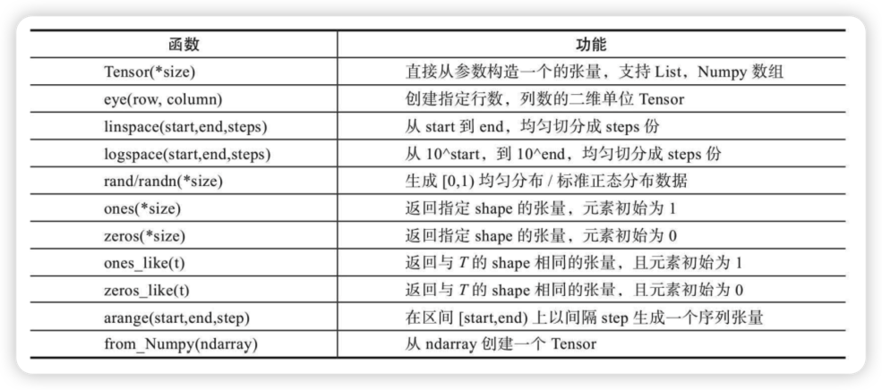
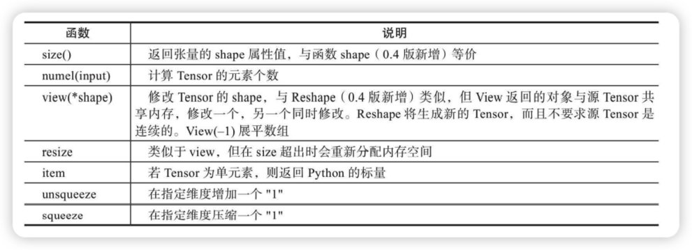
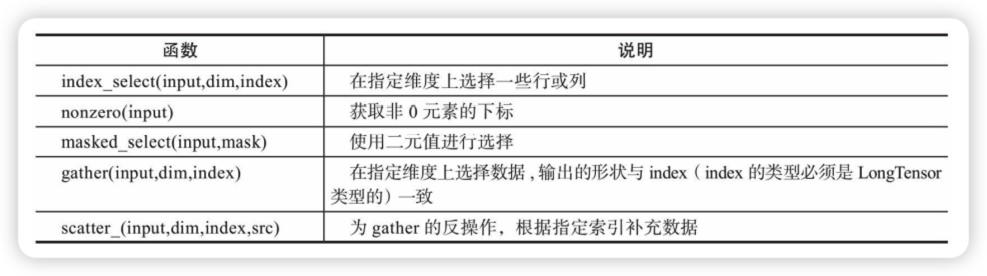
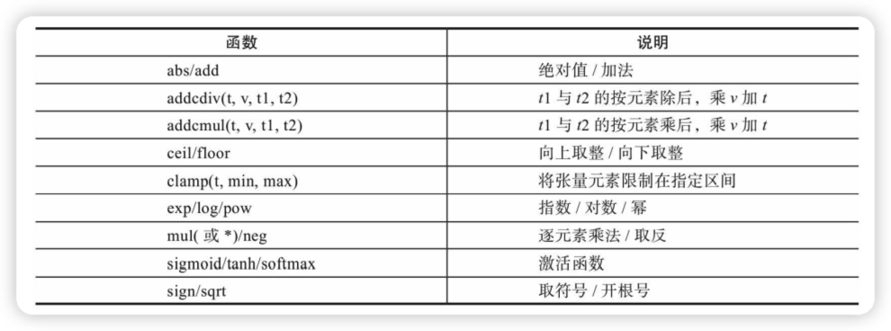
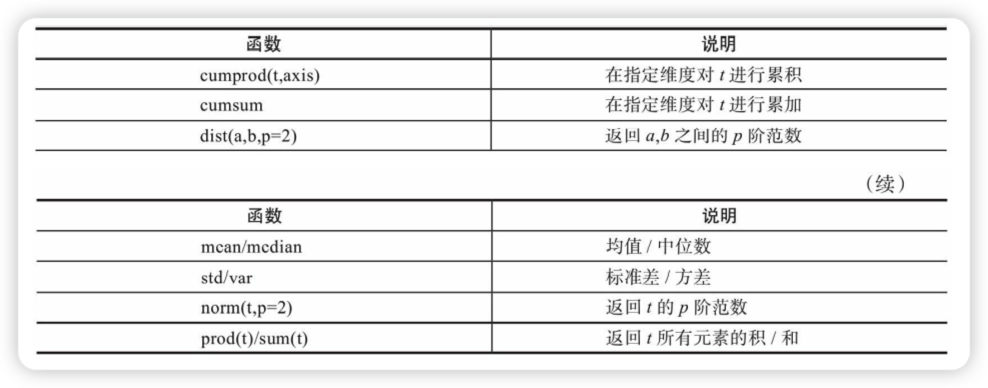
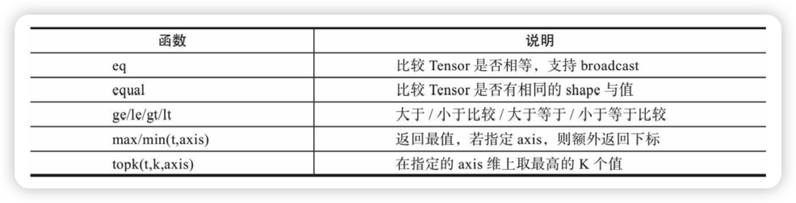
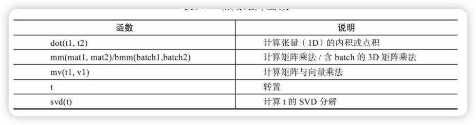
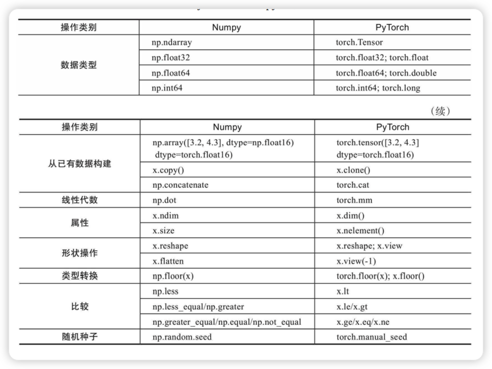
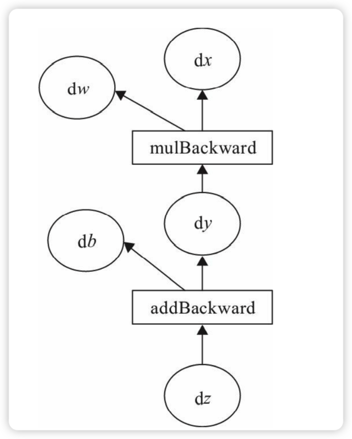
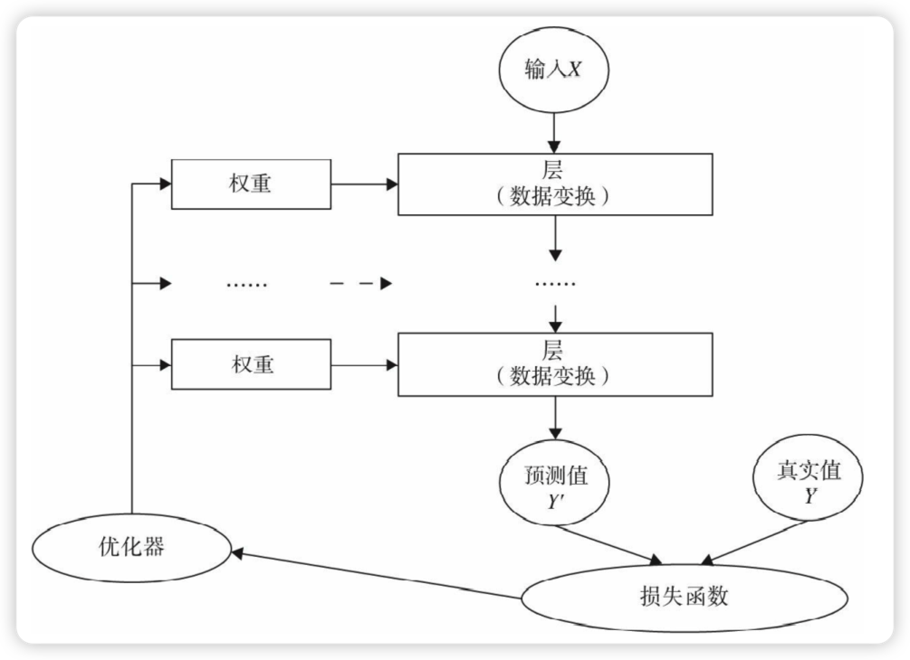

<!doctype html>
<html>
<head>
<meta charset='UTF-8'><meta name='viewport' content='width=device-width initial-scale=1'>

<title>Pytorch学习_jCxErCfMaipFLs6GyxuDKT</title>
</head>
<body class='typora-export'>

<h1 id='pytorch学习'>Pytorch学习</h1><h1 id='前言tricks）'>前言（tricks）</h1><h2 id='批量处理的技巧'>批量处理的技巧</h2>
在深度学习中，由于源数据都比较大，所以通常需要用到批处理。如利用批量来计算梯度的随机梯度法（SGD）就是一个典型应用。深度学习的计算一般比较复杂，并且数据量一般比较大，如果一次处理整个数据，较大概率会出现资源瓶颈。为了更有效地计算，一般将整个数据集分批次处理。与处理整个数据集相反的另一个极端是每次只处理一条记录，这种方法也不科学，一次处理一条记录无法充分发挥GPU、Numpy的平行处理优势。因此，在实际使用中往往采用批量处理（Mini-Batch）的方法。

&nbsp;

如何把大数据拆分成多个批次呢？可采用如下步骤：

1）得到数据集

2）随机打乱数据

3）定义批大小

4）批处理数据集

下面我们通过一个示例来具体说明：
<pre class="md-fences md-end-block md-fences-with-lineno ty-contain-cm modeLoaded" spellcheck="false" lang="python" style="break-inside: unset;">

<textarea autocorrect="off" autocapitalize="off" spellcheck="false" tabindex="0" style="position: absolute; bottom: -1em; padding: 0px; width: 1000px; height: 1em; outline: none;"></textarea>

<pre>xxxxxxxxxx</pre>

15

1

<pre class=" CodeMirror-line " role="presentation">import numpy as np</pre>

2

<pre class=" CodeMirror-line " role="presentation">#生成10000个形状为2X3的矩阵</pre>

3

<pre class=" CodeMirror-line " role="presentation">data_train = np.random.randn(10000,2,3)</pre>

4

<pre class=" CodeMirror-line " role="presentation">#这是一个3维矩阵，第1个维度为样本数，后两个是数据形状</pre>

5

<pre class=" CodeMirror-line " role="presentation">print(data_train.shape)</pre>

6

<pre class=" CodeMirror-line " role="presentation">#(10000,2,3)</pre>

7

<pre class=" CodeMirror-line " role="presentation">#打乱这10000条数据</pre>

8

<pre class=" CodeMirror-line " role="presentation">np.random.shuffle(data_train)</pre>

9

<pre class=" CodeMirror-line " role="presentation">#定义批量大小</pre>

10

<pre class=" CodeMirror-line " role="presentation">batch_size=100</pre>

11

<pre class=" CodeMirror-line " role="presentation">#进行批处理</pre>

12

<pre class=" CodeMirror-line " role="presentation">for i in range(0,len(data_train),batch_size):</pre>

13

<pre class=" CodeMirror-line " role="presentation"> &nbsp; &nbsp;x_batch_sum=np.sum(data_train[i:i+batch_size])</pre>

14

<pre class=" CodeMirror-line " role="presentation"> &nbsp; &nbsp;print("第{}批次,该批次的数据之和:{}".format(i,x_batch_sum))</pre>

15

<pre class=" CodeMirror-line " role="presentation">
</pre>

</pre><h1 id='pytorch基础'>PyTorch基础</h1><blockquote>
PyTorch采用Python语言接口来实现编程，非常容易上手。它就像带GPU的Numpy，与Python一样都属于动态框架。PyTorch继承了Torch灵活、动态的编程环境和用户友好的界面，支持以快速和灵活的方式构建动态神经网络，还允许在训练过程中快速更改代码而不妨碍其性能，支持动态图形等尖端AI模型的能力，是快速实验的理想选择。
</blockquote>
PyTorch是一个建立在Torch库之上的Python包，旨在加速深度学习应用。它提供一种类似Numpy的抽象方法来表征张量（或多维数组），可以利用GPU来加速训练。由于PyTorch采用了动态计算图（Dynamic Computational Graph）结构，且基于tape的Autograd系统的深度神经网络。其他很多框架，比如TensorFlow（TensorFlow2.0也加入了动态网络的支持）、Caffe、CNTK、Theano等，采用静态计算图。使用PyTorch，通过一种称为Reverse-mode auto-differentiation（反向模式自动微分）的技术，可以零延迟或零成本地任意改变你的网络的行为。

PyTorch由4个主要的包组成：

<code>·torch</code>：类似于Numpy的通用数组库，可将张量类型转换为torch.cuda.TensorFloat，并在GPU上进行计算。

<code>·torch.autograd</code>：用于构建计算图形并自动获取梯度的包。

<code>·torch.nn</code>：具有共享层和损失函数的神经网络库。

<code>·torch.optim</code>：具有通用优化算法（如SGD、Adam等）的优化包
<h2 id='tensor概述'>Tensor概述</h2><blockquote>
PyTorch的Tensor，它可以是零维（又称为标量或一个数）、一维、二维及多维的数组。Tensor自称为神经网络界的Numpy，它与Numpy相似，二者可以共享内存，且之间的转换非常方便和高效。不过它们也有不同之处，最大的区别就是Numpy会把ndarray放在CPU中进行加速运算，而由Torch产生的Tensor会放在GPU中进行加速运算（假设当前环境有GPU）
</blockquote>
对Tensor的操作很多，从接口的角度来划分，可以分为两类：
<ul><li>1）torch.function，如torch.sum、torch.add等；</li><li>2）tensor.function，如tensor.view、tensor.add等。</li></ul>
这些操作对大部分Tensor都是等价的，如torch.add(x,y)与x.add(y)等价。在实际使用时，可以根据个人爱好选择。如果从修改方式的角度来划分，可以分为以下两类：
<ul><li>1）不修改自身数据，如x.add(y)，x的数据不变，返回一个新的Tensor。</li><li>2）修改自身数据，如x.add_(y)（运行符带下划线后缀），运算结果存在x中，x被修改。</li></ul><h3 id='创建tensor'>创建Tensor</h3>
创建Tensor的方法有很多，可以从列表或ndarray等类型进行构建，也可根据指定的形状构建。常见的创建Tensor的方法可参考表：

<pre class="md-fences md-end-block md-fences-with-lineno ty-contain-cm modeLoaded" spellcheck="false" lang="python">

<textarea autocorrect="off" autocapitalize="off" spellcheck="false" tabindex="0" style="position: absolute; bottom: -1em; padding: 0px; width: 1000px; height: 1em; outline: none;"></textarea>

<pre>xxxxxxxxxx</pre>

13

1

<pre class=" CodeMirror-line " role="presentation">import torch</pre>

2

<pre class=" CodeMirror-line " role="presentation">#根据list数据生成Tensor</pre>

3

<pre class=" CodeMirror-line " role="presentation">torch.Tensor([1,2,3,4,5,6])</pre>

4

<pre class=" CodeMirror-line " role="presentation">#根据指定形状生成Tensor</pre>

5

<pre class=" CodeMirror-line " role="presentation">torch.Tensor(2,3)</pre>

6

<pre class=" CodeMirror-line " role="presentation">#根据给定的Tensor的形状</pre>

7

<pre class=" CodeMirror-line " role="presentation">t=torch.Tensor([[1,2,3],[4,5,6]])</pre>

8

<pre class=" CodeMirror-line " role="presentation">#查看Tensor的形状</pre>

9

<pre class=" CodeMirror-line " role="presentation">t.size()</pre>

10

<pre class=" CodeMirror-line " role="presentation">#shape与size()等价方式</pre>

11

<pre class=" CodeMirror-line " role="presentation">t.shape</pre>

12

<pre class=" CodeMirror-line " role="presentation">#根据已有形状创建Tensor</pre>

13

<pre class=" CodeMirror-line " role="presentation">torch.Tensor(t.size())</pre>

</pre><blockquote>
📌注意torch.Tensor与torch.tensor的几点区别：
<ul><li>torch.Tensor是torch.empty和torch.tensor之间的一种混合，但是，当传入数据时，torch.Tensor使用全局默认dtype（FloatTensor），而torch.tensor是从数据中推断数据类型。</li><li>torch.tensor(1)返回一个固定值1，而torch.Tensor(1)返回一个大小为1的张量，它是随机初始化的值。</li></ul><pre class="md-fences md-end-block md-fences-with-lineno ty-contain-cm modeLoaded" spellcheck="false" lang="python">

<textarea autocorrect="off" autocapitalize="off" spellcheck="false" tabindex="0" style="position: absolute; bottom: -1em; padding: 0px; width: 1000px; height: 1em; outline: none;"></textarea>

<pre>xxxxxxxxxx</pre>

5

1

<pre class=" CodeMirror-line " role="presentation">import torch</pre>

2

<pre class=" CodeMirror-line " role="presentation">t1=torch.Tensor(1)</pre>

3

<pre class=" CodeMirror-line " role="presentation">t2=torch.tensor(1)</pre>

4

<pre class=" CodeMirror-line " role="presentation">print("t1的值{},t1的数据类型{}".format(t1,t1.type()))</pre>

5

<pre class=" CodeMirror-line " role="presentation">print("t2的值{},t2的数据类型{}".format(t2,t2.type()))</pre>

</pre></blockquote><h3 id='修改tensor形状'>修改Tensor形状</h3>
在处理数据、构建网络层等过程中，经常需要了解Tensor的形状、修改Tensor的形状。与修改Numpy的形状类似，修改Tenor的形状也有很多类似函数，具体可参考表：

<pre class="md-fences md-end-block md-fences-with-lineno ty-contain-cm modeLoaded" spellcheck="false" lang="python" style="break-inside: unset;">

<textarea autocorrect="off" autocapitalize="off" spellcheck="false" tabindex="0" style="position: absolute; bottom: -1em; padding: 0px; width: 1000px; height: 1em; outline: none;"></textarea>

<pre>xxxxxxxxxx</pre>

18

1

<pre class=" CodeMirror-line " role="presentation">import torch</pre>

2

<pre class=" CodeMirror-line " role="presentation">#生成一个形状为2x3的矩阵</pre>

3

<pre class=" CodeMirror-line " role="presentation">x = torch.randn(2, 3)</pre>

4

<pre class=" CodeMirror-line " role="presentation">#查看矩阵的形状</pre>

5

<pre class=" CodeMirror-line " role="presentation">x.size() #结果为torch.Size([2, 3])</pre>

6

<pre class=" CodeMirror-line " role="presentation">#查看x的维度</pre>

7

<pre class=" CodeMirror-line " role="presentation">x.dim() #结果为2</pre>

8

<pre class=" CodeMirror-line " role="presentation">#把x变为3x2的矩阵</pre>

9

<pre class=" CodeMirror-line " role="presentation">x.view(3,2)</pre>

10

<pre class=" CodeMirror-line " role="presentation">#把x展平为1维向量</pre>

11

<pre class=" CodeMirror-line " role="presentation">y=x.view(-1)</pre>

12

<pre class=" CodeMirror-line " role="presentation">y.shape</pre>

13

<pre class=" CodeMirror-line " role="presentation">#添加一个维度</pre>

14

<pre class=" CodeMirror-line " role="presentation">z=torch.unsqueeze(y,0)</pre>

15

<pre class=" CodeMirror-line " role="presentation">#查看z的形状</pre>

16

<pre class=" CodeMirror-line " role="presentation">z.size() #结果为torch.Size([1, 6])</pre>

17

<pre class=" CodeMirror-line " role="presentation">#计算Z的元素个数</pre>

18

<pre class=" CodeMirror-line " role="presentation">z.numel() #结果为6</pre>

</pre><blockquote>
📌torch.view与torch.reshpae的异同
1）reshape()可以由torch.reshape()，也可由torch.Tensor.reshape()调用。但view()只可由torch.Tensor.view()来调用。
2）对于一个将要被view的Tensor，新的size必须与原来的size与stride兼容。否则，在view之前必须调用contiguous()方法。
3）同样也是返回与input数据量相同，但形状不同的Tensor。若满足view的条件，则不会copy，若不满足，则会copy。
4）如果你只想重塑张量，请使用torch.reshape。如果你还关注内存使用情况并希望确保两个张量共享相同的数据，请使用torch.view
</blockquote><h3 id='索引操作'>索引操作</h3>
Tensor的索引操作与Numpy类似，一般情况下索引结果与源数据共享内存。从Tensor获取元素除了可以通过索引，也可以借助一些函数，常用的选择函数可参考表：

<pre class="md-fences md-end-block md-fences-with-lineno ty-contain-cm modeLoaded" spellcheck="false" lang="python" style="break-inside: unset;">

<textarea autocorrect="off" autocapitalize="off" spellcheck="false" tabindex="0" style="position: absolute; bottom: -1em; padding: 0px; width: 1000px; height: 1em; outline: none;"></textarea>

<pre>xxxxxxxxxx</pre>

26

1

<pre class=" CodeMirror-line " role="presentation">import torch</pre>

2

<pre class=" CodeMirror-line " role="presentation">#设置一个随机种子</pre>

3

<pre class=" CodeMirror-line " role="presentation">torch.manual_seed(100)</pre>

4

<pre class=" CodeMirror-line " role="presentation">#生成一个形状为2x3的矩阵</pre>

5

<pre class=" CodeMirror-line " role="presentation">x = torch.randn(2, 3)</pre>

6

<pre class=" CodeMirror-line " role="presentation">#根据索引获取第1行，所有数据</pre>

7

<pre class=" CodeMirror-line " role="presentation">x[0,:]</pre>

8

<pre class=" CodeMirror-line " role="presentation">#获取最后一列数据</pre>

9

<pre class=" CodeMirror-line " role="presentation">x[:,-1]</pre>

10

<pre class=" CodeMirror-line " role="presentation">#生成是否大于0的Byter张量</pre>

11

<pre class=" CodeMirror-line " role="presentation">mask=x&gt;0</pre>

12

<pre class=" CodeMirror-line " role="presentation">#获取大于0的值</pre>

13

<pre class=" CodeMirror-line " role="presentation">torch.masked_select(x,mask)</pre>

14

<pre class=" CodeMirror-line " role="presentation">#获取非0下标,即行，列索引</pre>

15

<pre class=" CodeMirror-line " role="presentation">torch.nonzero(mask)</pre>

16

<pre class=" CodeMirror-line " role="presentation">#获取指定索引对应的值,输出根据以下规则得到</pre>

17

<pre class=" CodeMirror-line " role="presentation">#out[i][j] = input[index[i][j]][j] # if dim == 0</pre>

18

<pre class=" CodeMirror-line " role="presentation">#out[i][j] = input[i][index[i][j]] # if dim == 1</pre>

19

<pre class=" CodeMirror-line " role="presentation">index=torch.LongTensor([[0,1,1]])</pre>

20

<pre class=" CodeMirror-line " role="presentation">torch.gather(x,0,index)</pre>

21

<pre class=" CodeMirror-line " role="presentation">index=torch.LongTensor([[0,1,1],[1,1,1]])</pre>

22

<pre class=" CodeMirror-line " role="presentation">a=torch.gather(x,1,index)</pre>

23

<pre class=" CodeMirror-line " role="presentation">#把a的值返回到一个2x3的0矩阵中</pre>

24

<pre class=" CodeMirror-line " role="presentation">z=torch.zeros(2,3)</pre>

25

<pre class=" CodeMirror-line " role="presentation">z.scatter_(1,index,a)</pre>

26

<pre class=" CodeMirror-line " role="presentation">
</pre>

</pre><h3 id='逐元素操作'>逐元素操作</h3>
与Numpy一样，Tensor也有逐元素操作（Element-Wise），且操作内容相似，但使用函数可能不尽相同。大部分数学运算都属于逐元素操作，其输入与输出的形状相同。常见的逐元素操作可参考表：

<pre class="md-fences md-end-block md-fences-with-lineno ty-contain-cm modeLoaded" spellcheck="false" lang="python">

<textarea autocorrect="off" autocapitalize="off" spellcheck="false" tabindex="0" style="position: absolute; bottom: -1em; padding: 0px; width: 1000px; height: 1em; outline: none;"></textarea>

<pre>xxxxxxxxxx</pre>

13

1

<pre class=" CodeMirror-line " role="presentation">import torch</pre>

2

<pre class=" CodeMirror-line " role="presentation">t = torch.randn(1, 3)</pre>

3

<pre class=" CodeMirror-line " role="presentation">t1 = torch.randn(3, 1)</pre>

4

<pre class=" CodeMirror-line " role="presentation">t2 = torch.randn(1, 3)</pre>

5

<pre class=" CodeMirror-line " role="presentation">#t+0.1*(t1/t2)</pre>

6

<pre class=" CodeMirror-line " role="presentation">torch.addcdiv(t, 0.1, t1, t2)</pre>

7

<pre class=" CodeMirror-line " role="presentation">#计算sigmoid</pre>

8

<pre class=" CodeMirror-line " role="presentation">torch.sigmoid(t)</pre>

9

<pre class=" CodeMirror-line " role="presentation">#将t限制在[0,1]之间</pre>

10

<pre class=" CodeMirror-line " role="presentation">torch.clamp(t,0,1)</pre>

11

<pre class=" CodeMirror-line " role="presentation">#t+2进行就地运算</pre>

12

<pre class=" CodeMirror-line " role="presentation">t.add_(2)</pre>

13

<pre class=" CodeMirror-line " role="presentation">
</pre>

</pre><h3 id='归并操作'>归并操作</h3>
归并操作顾名思义，就是对输入进行归并或合计等操作，这类操作的输入输出形状一般并不相同，而且往往是输入大于输出形状。归并操作可以对整个Tensor，也可以沿着某个维度进行归并。常见的归并操作可参考表：

<blockquote>
📌归并操作一般涉及一个dim参数，指定沿哪个维进行归并。另一个参数是keepdim，说明输出结果中是否保留维度1，缺省情况是False，即不保留。
</blockquote><pre class="md-fences md-end-block md-fences-with-lineno ty-contain-cm modeLoaded" spellcheck="false" lang="python">

<textarea autocorrect="off" autocapitalize="off" spellcheck="false" tabindex="0" style="position: absolute; bottom: -1em; padding: 0px; width: 1000px; height: 1em; outline: none;"></textarea>

<pre>xxxxxxxxxx</pre>

10

1

<pre class=" CodeMirror-line " role="presentation">import torch</pre>

2

<pre class=" CodeMirror-line " role="presentation">#生成一个含6个数的向量</pre>

3

<pre class=" CodeMirror-line " role="presentation">a=torch.linspace(0,10,6)</pre>

4

<pre class=" CodeMirror-line " role="presentation">#使用view方法，把a变为2x3矩阵</pre>

5

<pre class=" CodeMirror-line " role="presentation">a=a.view((2,3))</pre>

6

<pre class=" CodeMirror-line " role="presentation">#沿y轴方向累加，即dim=0</pre>

7

<pre class=" CodeMirror-line " role="presentation">b=a.sum(dim=0) #b的形状为[3]</pre>

8

<pre class=" CodeMirror-line " role="presentation">#沿y轴方向累加，即dim=0,并保留含1的维度</pre>

9

<pre class=" CodeMirror-line " role="presentation">b=a.sum(dim=0,keepdim=True) #b的形状为[1,3]</pre>

10

<pre class=" CodeMirror-line " role="presentation">
</pre>

</pre><h3 id='比较操作'>比较操作</h3>

<pre class="md-fences md-end-block md-fences-with-lineno ty-contain-cm modeLoaded" spellcheck="false" lang="python">

<textarea autocorrect="off" autocapitalize="off" spellcheck="false" tabindex="0" style="position: absolute; bottom: -1em; padding: 0px; width: 1000px; height: 1em; outline: none;"></textarea>

<pre>xxxxxxxxxx</pre>

9

1

<pre class=" CodeMirror-line " role="presentation">import torch</pre>

2

<pre class=" CodeMirror-line " role="presentation">x=torch.linspace(0,10,6).view(2,3)</pre>

3

<pre class=" CodeMirror-line " role="presentation">#求所有元素的最大值</pre>

4

<pre class=" CodeMirror-line " role="presentation">torch.max(x) #结果为10</pre>

5

<pre class=" CodeMirror-line " role="presentation">#求y轴方向的最大值</pre>

6

<pre class=" CodeMirror-line " role="presentation">torch.max(x,dim=0) #结果为[6,8,10]</pre>

7

<pre class=" CodeMirror-line " role="presentation">#求最大的2个元素</pre>

8

<pre class=" CodeMirror-line " role="presentation">torch.topk(x,1,dim=0) #结果为[6,8,10],对应索引为tensor([[1, 1, 1]</pre>

9

<pre class=" CodeMirror-line " role="presentation">
</pre>

</pre><h3 id='矩阵操作'>矩阵操作</h3>
机器学习和深度学习中存在大量的矩阵运算，常用的算法有两种：一种是逐元素乘法，另外一种是点积乘法。

<blockquote>
📌1）Torch的dot与Numpy的dot有点不同，Torch中的dot是对两个为1D张量进行点积运算，Numpy中的dot无此限制。
2）mm是对2D的矩阵进行点积，bmm对含batch的3D进行点积运算。
3）转置运算会导致存储空间不连续，需要调用contiguous方法转为连续。
</blockquote><h3 id='pytorch和numpy比较'>PyTorch和NumPy比较</h3>
PyTorch与Numpy有很多类似的地方，并且有很多相同的操作函数名称，或虽然函数名称不同但含义相同；当然也有一些虽然函数名称相同，但含义不尽相同。有些很容易混淆，下面我们把一些主要的区别进行汇总

<h2 id='tensor与autograd'>Tensor与Autograd</h2><blockquote>
在神经网络中，一个重要内容就是进行参数学习，而参数学习离不开求导，那么PyTorch是如何进行求导的呢？
现在大部分深度学习架构都有自动求导的功能，PyTorch也不例外，torch.autograd包就是用来自动求导的。Autograd包为张量上所有的操作提供了自动求导功能，而torch.Tensor和torch.Function为Autograd的两个核心类，它们相互连接并生成一个有向非循环图。接下来我们先简单介绍Tensor如何实现自动求导，然后介绍计算图，最后用代码来实现这些功能
</blockquote><h3 id='自动求导要点'>自动求导要点</h3>
为实现对Tensor自动求导，需考虑如下事项：
<ol start='' ><li>创建叶子节点（Leaf Node）的Tensor，使用<code>requires_grad</code>参数指定是否记录对其的操作，以便之后利用backward()方法进行梯度求解。requires_grad参数的缺省值为False，如果要对其求导需设置为True，然后与之有依赖关系的节点会自动变为True。</li><li>可利用requires_grad_()方法修改Tensor的requires_grad属性。可以调用<code>.detach()</code>或<code>with torch.no_grad()：</code>，将不再计算张量的梯度，跟踪张量的历史记录。<strong>这点在评估模型、测试模型阶段中常常用到。</strong></li><li>通过运算创建的Tensor（即非叶子节点），会自动被赋予grad_fn属性。该属性表示梯度函数。叶子节点的grad_fn为None。</li><li>最后得到的Tensor执行backward()函数，此时自动计算各变量的梯度，并将累加结果保存到grad属性中。计算完成后，非叶子节点的梯度自动释放。</li><li>backward()函数接收参数，该参数应和调用backward()函数的Tensor的维度相同，或者是可broadcast的维度。如果求导的Tensor为标量（即一个数字），则backward中的参数可省略。</li><li>反向传播的中间缓存会被清空，如果需<strong>要进行多次反向传播，需要指定backward中的参数retain_graph=True。多次反向传播时，梯度是累加的。</strong>否则会将计算图清空。</li><li>非叶子节点的梯度backward调用后即被清空。</li><li>可以通过用torch.no_grad()包裹代码块的形式来阻止autograd去跟踪那些标记</li></ol>
为.requesgrad=True的张量的历史记录。这步在测试阶段经常使用。在整个过程中，PyTorch采用计算图的形式进行组织，该计算图为动态图，且在每次前向传播时，将重新构建。其他深度学习架构，如TensorFlow、Keras一般为静态图。接下来我们介绍计算图，用图的形式来描述就更直观了，该计算图为有向无环图（DAG）

PyTorch调用backward()方法，将自动计算各节点的梯度，这是一个反向传播过程，这个过程可用图2-9表示。且在反向传播过程中，autograd沿着图2-10，从当前根节点z反向溯源，利用导数链式法则，计算所有叶子节点的梯度，其梯度值将累加到grad属性中。对非叶子节点的计算操作（或Function）记录在grad_fn属性中，叶子节点的grad_fn值为None。

<h3 id='非标量反向传播'>非标量反向传播</h3>
在2.5.3节中介绍了当目标张量为标量时，可以调用backward()方法且无须传入参数。目标张量一般都是标量，如我们经常使用的损失值Loss，一般都是一个标量。但也有非标量的情况，后面将介绍的Deep Dream的目标值就是一个含多个元素的张量。那如何对非标量进行反向传播呢？PyTorch有个简单的规定，<strong>不让张量（Tensor）对张量求导，只允许标量对张量求导</strong>，因此，如果目标张量对一个非标量调用ackward()，则需要传入一个gradient参数，该参数也是张量，而且需要与调用backward()的张量形状相同。那么为什么要传入一个张量gradient呢？

传入这个参数就是为了把张量对张量的求导转换为标量对张量的求导。这有点拗口，我们举一个例子来说，假设目标值为<mjx-container class="MathJax" jax="SVG" style="position: relative;"><svg xmlns="http://www.w3.org/2000/svg" width="21.611ex" height="2.262ex" role="img" focusable="false" viewBox="0 -750 9552.2 1000" xmlns:xlink="http://www.w3.org/1999/xlink" aria-hidden="true" style="vertical-align: -0.566ex;"><defs><path id="MJX-7-TEX-I-1D459" d="M117 59Q117 26 142 26Q179 26 205 131Q211 151 215 152Q217 153 225 153H229Q238 153 241 153T246 151T248 144Q247 138 245 128T234 90T214 43T183 6T137 -11Q101 -11 70 11T38 85Q38 97 39 102L104 360Q167 615 167 623Q167 626 166 628T162 632T157 634T149 635T141 636T132 637T122 637Q112 637 109 637T101 638T95 641T94 647Q94 649 96 661Q101 680 107 682T179 688Q194 689 213 690T243 693T254 694Q266 694 266 686Q266 675 193 386T118 83Q118 81 118 75T117 65V59Z"></path><path id="MJX-7-TEX-I-1D45C" d="M201 -11Q126 -11 80 38T34 156Q34 221 64 279T146 380Q222 441 301 441Q333 441 341 440Q354 437 367 433T402 417T438 387T464 338T476 268Q476 161 390 75T201 -11ZM121 120Q121 70 147 48T206 26Q250 26 289 58T351 142Q360 163 374 216T388 308Q388 352 370 375Q346 405 306 405Q243 405 195 347Q158 303 140 230T121 120Z"></path><path id="MJX-7-TEX-I-1D460" d="M131 289Q131 321 147 354T203 415T300 442Q362 442 390 415T419 355Q419 323 402 308T364 292Q351 292 340 300T328 326Q328 342 337 354T354 372T367 378Q368 378 368 379Q368 382 361 388T336 399T297 405Q249 405 227 379T204 326Q204 301 223 291T278 274T330 259Q396 230 396 163Q396 135 385 107T352 51T289 7T195 -10Q118 -10 86 19T53 87Q53 126 74 143T118 160Q133 160 146 151T160 120Q160 94 142 76T111 58Q109 57 108 57T107 55Q108 52 115 47T146 34T201 27Q237 27 263 38T301 66T318 97T323 122Q323 150 302 164T254 181T195 196T148 231Q131 256 131 289Z"></path><path id="MJX-7-TEX-N-3D" d="M56 347Q56 360 70 367H707Q722 359 722 347Q722 336 708 328L390 327H72Q56 332 56 347ZM56 153Q56 168 72 173H708Q722 163 722 153Q722 140 707 133H70Q56 140 56 153Z"></path><path id="MJX-7-TEX-N-28" d="M94 250Q94 319 104 381T127 488T164 576T202 643T244 695T277 729T302 750H315H319Q333 750 333 741Q333 738 316 720T275 667T226 581T184 443T167 250T184 58T225 -81T274 -167T316 -220T333 -241Q333 -250 318 -250H315H302L274 -226Q180 -141 137 -14T94 250Z"></path><path id="MJX-7-TEX-I-1D466" d="M21 287Q21 301 36 335T84 406T158 442Q199 442 224 419T250 355Q248 336 247 334Q247 331 231 288T198 191T182 105Q182 62 196 45T238 27Q261 27 281 38T312 61T339 94Q339 95 344 114T358 173T377 247Q415 397 419 404Q432 431 462 431Q475 431 483 424T494 412T496 403Q496 390 447 193T391 -23Q363 -106 294 -155T156 -205Q111 -205 77 -183T43 -117Q43 -95 50 -80T69 -58T89 -48T106 -45Q150 -45 150 -87Q150 -107 138 -122T115 -142T102 -147L99 -148Q101 -153 118 -160T152 -167H160Q177 -167 186 -165Q219 -156 247 -127T290 -65T313 -9T321 21L315 17Q309 13 296 6T270 -6Q250 -11 231 -11Q185 -11 150 11T104 82Q103 89 103 113Q103 170 138 262T173 379Q173 380 173 381Q173 390 173 393T169 400T158 404H154Q131 404 112 385T82 344T65 302T57 280Q55 278 41 278H27Q21 284 21 287Z"></path><path id="MJX-7-TEX-N-31" d="M213 578L200 573Q186 568 160 563T102 556H83V602H102Q149 604 189 617T245 641T273 663Q275 666 285 666Q294 666 302 660V361L303 61Q310 54 315 52T339 48T401 46H427V0H416Q395 3 257 3Q121 3 100 0H88V46H114Q136 46 152 46T177 47T193 50T201 52T207 57T213 61V578Z"></path><path id="MJX-7-TEX-N-2C" d="M78 35T78 60T94 103T137 121Q165 121 187 96T210 8Q210 -27 201 -60T180 -117T154 -158T130 -185T117 -194Q113 -194 104 -185T95 -172Q95 -168 106 -156T131 -126T157 -76T173 -3V9L172 8Q170 7 167 6T161 3T152 1T140 0Q113 0 96 17Z"></path><path id="MJX-7-TEX-N-32" d="M109 429Q82 429 66 447T50 491Q50 562 103 614T235 666Q326 666 387 610T449 465Q449 422 429 383T381 315T301 241Q265 210 201 149L142 93L218 92Q375 92 385 97Q392 99 409 186V189H449V186Q448 183 436 95T421 3V0H50V19V31Q50 38 56 46T86 81Q115 113 136 137Q145 147 170 174T204 211T233 244T261 278T284 308T305 340T320 369T333 401T340 431T343 464Q343 527 309 573T212 619Q179 619 154 602T119 569T109 550Q109 549 114 549Q132 549 151 535T170 489Q170 464 154 447T109 429Z"></path><path id="MJX-7-TEX-N-2026" d="M78 60Q78 84 95 102T138 120Q162 120 180 104T199 61Q199 36 182 18T139 0T96 17T78 60ZM525 60Q525 84 542 102T585 120Q609 120 627 104T646 61Q646 36 629 18T586 0T543 17T525 60ZM972 60Q972 84 989 102T1032 120Q1056 120 1074 104T1093 61Q1093 36 1076 18T1033 0T990 17T972 60Z"></path><path id="MJX-7-TEX-I-1D45A" d="M21 287Q22 293 24 303T36 341T56 388T88 425T132 442T175 435T205 417T221 395T229 376L231 369Q231 367 232 367L243 378Q303 442 384 442Q401 442 415 440T441 433T460 423T475 411T485 398T493 385T497 373T500 364T502 357L510 367Q573 442 659 442Q713 442 746 415T780 336Q780 285 742 178T704 50Q705 36 709 31T724 26Q752 26 776 56T815 138Q818 149 821 151T837 153Q857 153 857 145Q857 144 853 130Q845 101 831 73T785 17T716 -10Q669 -10 648 17T627 73Q627 92 663 193T700 345Q700 404 656 404H651Q565 404 506 303L499 291L466 157Q433 26 428 16Q415 -11 385 -11Q372 -11 364 -4T353 8T350 18Q350 29 384 161L420 307Q423 322 423 345Q423 404 379 404H374Q288 404 229 303L222 291L189 157Q156 26 151 16Q138 -11 108 -11Q95 -11 87 -5T76 7T74 17Q74 30 112 181Q151 335 151 342Q154 357 154 369Q154 405 129 405Q107 405 92 377T69 316T57 280Q55 278 41 278H27Q21 284 21 287Z"></path><path id="MJX-7-TEX-N-29" d="M60 749L64 750Q69 750 74 750H86L114 726Q208 641 251 514T294 250Q294 182 284 119T261 12T224 -76T186 -143T145 -194T113 -227T90 -246Q87 -249 86 -250H74Q66 -250 63 -250T58 -247T55 -238Q56 -237 66 -225Q221 -64 221 250T66 725Q56 737 55 738Q55 746 60 749Z"></path></defs><g stroke="currentColor" fill="currentColor" stroke-width="0" transform="scale(1,-1)"><g data-mml-node="math"><g data-mml-node="mi"><use data-c="1D459" xlink:href="#MJX-7-TEX-I-1D459"></use></g><g data-mml-node="mi" transform="translate(298,0)"><use data-c="1D45C" xlink:href="#MJX-7-TEX-I-1D45C"></use></g><g data-mml-node="mi" transform="translate(783,0)"><use data-c="1D460" xlink:href="#MJX-7-TEX-I-1D460"></use></g><g data-mml-node="mi" transform="translate(1252,0)"><use data-c="1D460" xlink:href="#MJX-7-TEX-I-1D460"></use></g><g data-mml-node="mo" transform="translate(1998.8,0)"><use data-c="3D" xlink:href="#MJX-7-TEX-N-3D"></use></g><g data-mml-node="mo" transform="translate(3054.6,0)"><use data-c="28" xlink:href="#MJX-7-TEX-N-28"></use></g><g data-mml-node="msub" transform="translate(3443.6,0)"><g data-mml-node="mi"><use data-c="1D466" xlink:href="#MJX-7-TEX-I-1D466"></use></g><g data-mml-node="mn" transform="translate(523,-150) scale(0.707)"><use data-c="31" xlink:href="#MJX-7-TEX-N-31"></use></g></g><g data-mml-node="mo" transform="translate(4370.1,0)"><use data-c="2C" xlink:href="#MJX-7-TEX-N-2C"></use></g><g data-mml-node="msub" transform="translate(4814.8,0)"><g data-mml-node="mi"><use data-c="1D466" xlink:href="#MJX-7-TEX-I-1D466"></use></g><g data-mml-node="mn" transform="translate(523,-150) scale(0.707)"><use data-c="32" xlink:href="#MJX-7-TEX-N-32"></use></g></g><g data-mml-node="mo" transform="translate(5741.3,0)"><use data-c="2C" xlink:href="#MJX-7-TEX-N-2C"></use></g><g data-mml-node="mo" transform="translate(6186,0)"><use data-c="2026" xlink:href="#MJX-7-TEX-N-2026"></use></g><g data-mml-node="mo" transform="translate(7524.7,0)"><use data-c="2C" xlink:href="#MJX-7-TEX-N-2C"></use></g><g data-mml-node="msub" transform="translate(7969.3,0)"><g data-mml-node="mi"><use data-c="1D466" xlink:href="#MJX-7-TEX-I-1D466"></use></g><g data-mml-node="mi" transform="translate(523,-150) scale(0.707)"><use data-c="1D45A" xlink:href="#MJX-7-TEX-I-1D45A"></use></g></g><g data-mml-node="mo" transform="translate(9163.2,0)"><use data-c="29" xlink:href="#MJX-7-TEX-N-29"></use></g></g></g></svg><mjx-assistive-mml unselectable="on" display="inline"><math xmlns="http://www.w3.org/1998/Math/MathML"><mi>l</mi><mi>o</mi><mi>s</mi><mi>s</mi><mo>=</mo><mo stretchy="false">(</mo><msub><mi>y</mi><mn>1</mn></msub><mo>,</mo><msub><mi>y</mi><mn>2</mn></msub><mo>,</mo><mo>…</mo><mo>,</mo><msub><mi>y</mi><mi>m</mi></msub><mo stretchy="false">)</mo></math></mjx-assistive-mml></mjx-container>，传入的参数为<mjx-container class="MathJax" jax="SVG" style="position: relative;"><svg xmlns="http://www.w3.org/2000/svg" width="18.781ex" height="2.262ex" role="img" focusable="false" viewBox="0 -750 8301.2 1000" xmlns:xlink="http://www.w3.org/1999/xlink" aria-hidden="true" style="vertical-align: -0.566ex;"><defs><path id="MJX-8-TEX-I-1D463" d="M173 380Q173 405 154 405Q130 405 104 376T61 287Q60 286 59 284T58 281T56 279T53 278T49 278T41 278H27Q21 284 21 287Q21 294 29 316T53 368T97 419T160 441Q202 441 225 417T249 361Q249 344 246 335Q246 329 231 291T200 202T182 113Q182 86 187 69Q200 26 250 26Q287 26 319 60T369 139T398 222T409 277Q409 300 401 317T383 343T365 361T357 383Q357 405 376 424T417 443Q436 443 451 425T467 367Q467 340 455 284T418 159T347 40T241 -11Q177 -11 139 22Q102 54 102 117Q102 148 110 181T151 298Q173 362 173 380Z"></path><path id="MJX-8-TEX-N-3D" d="M56 347Q56 360 70 367H707Q722 359 722 347Q722 336 708 328L390 327H72Q56 332 56 347ZM56 153Q56 168 72 173H708Q722 163 722 153Q722 140 707 133H70Q56 140 56 153Z"></path><path id="MJX-8-TEX-N-28" d="M94 250Q94 319 104 381T127 488T164 576T202 643T244 695T277 729T302 750H315H319Q333 750 333 741Q333 738 316 720T275 667T226 581T184 443T167 250T184 58T225 -81T274 -167T316 -220T333 -241Q333 -250 318 -250H315H302L274 -226Q180 -141 137 -14T94 250Z"></path><path id="MJX-8-TEX-N-31" d="M213 578L200 573Q186 568 160 563T102 556H83V602H102Q149 604 189 617T245 641T273 663Q275 666 285 666Q294 666 302 660V361L303 61Q310 54 315 52T339 48T401 46H427V0H416Q395 3 257 3Q121 3 100 0H88V46H114Q136 46 152 46T177 47T193 50T201 52T207 57T213 61V578Z"></path><path id="MJX-8-TEX-N-2C" d="M78 35T78 60T94 103T137 121Q165 121 187 96T210 8Q210 -27 201 -60T180 -117T154 -158T130 -185T117 -194Q113 -194 104 -185T95 -172Q95 -168 106 -156T131 -126T157 -76T173 -3V9L172 8Q170 7 167 6T161 3T152 1T140 0Q113 0 96 17Z"></path><path id="MJX-8-TEX-N-32" d="M109 429Q82 429 66 447T50 491Q50 562 103 614T235 666Q326 666 387 610T449 465Q449 422 429 383T381 315T301 241Q265 210 201 149L142 93L218 92Q375 92 385 97Q392 99 409 186V189H449V186Q448 183 436 95T421 3V0H50V19V31Q50 38 56 46T86 81Q115 113 136 137Q145 147 170 174T204 211T233 244T261 278T284 308T305 340T320 369T333 401T340 431T343 464Q343 527 309 573T212 619Q179 619 154 602T119 569T109 550Q109 549 114 549Q132 549 151 535T170 489Q170 464 154 447T109 429Z"></path><path id="MJX-8-TEX-N-2026" d="M78 60Q78 84 95 102T138 120Q162 120 180 104T199 61Q199 36 182 18T139 0T96 17T78 60ZM525 60Q525 84 542 102T585 120Q609 120 627 104T646 61Q646 36 629 18T586 0T543 17T525 60ZM972 60Q972 84 989 102T1032 120Q1056 120 1074 104T1093 61Q1093 36 1076 18T1033 0T990 17T972 60Z"></path><path id="MJX-8-TEX-I-1D45A" d="M21 287Q22 293 24 303T36 341T56 388T88 425T132 442T175 435T205 417T221 395T229 376L231 369Q231 367 232 367L243 378Q303 442 384 442Q401 442 415 440T441 433T460 423T475 411T485 398T493 385T497 373T500 364T502 357L510 367Q573 442 659 442Q713 442 746 415T780 336Q780 285 742 178T704 50Q705 36 709 31T724 26Q752 26 776 56T815 138Q818 149 821 151T837 153Q857 153 857 145Q857 144 853 130Q845 101 831 73T785 17T716 -10Q669 -10 648 17T627 73Q627 92 663 193T700 345Q700 404 656 404H651Q565 404 506 303L499 291L466 157Q433 26 428 16Q415 -11 385 -11Q372 -11 364 -4T353 8T350 18Q350 29 384 161L420 307Q423 322 423 345Q423 404 379 404H374Q288 404 229 303L222 291L189 157Q156 26 151 16Q138 -11 108 -11Q95 -11 87 -5T76 7T74 17Q74 30 112 181Q151 335 151 342Q154 357 154 369Q154 405 129 405Q107 405 92 377T69 316T57 280Q55 278 41 278H27Q21 284 21 287Z"></path><path id="MJX-8-TEX-N-29" d="M60 749L64 750Q69 750 74 750H86L114 726Q208 641 251 514T294 250Q294 182 284 119T261 12T224 -76T186 -143T145 -194T113 -227T90 -246Q87 -249 86 -250H74Q66 -250 63 -250T58 -247T55 -238Q56 -237 66 -225Q221 -64 221 250T66 725Q56 737 55 738Q55 746 60 749Z"></path></defs><g stroke="currentColor" fill="currentColor" stroke-width="0" transform="scale(1,-1)"><g data-mml-node="math"><g data-mml-node="mi"><use data-c="1D463" xlink:href="#MJX-8-TEX-I-1D463"></use></g><g data-mml-node="mo" transform="translate(762.8,0)"><use data-c="3D" xlink:href="#MJX-8-TEX-N-3D"></use></g><g data-mml-node="mo" transform="translate(1818.6,0)"><use data-c="28" xlink:href="#MJX-8-TEX-N-28"></use></g><g data-mml-node="msub" transform="translate(2207.6,0)"><g data-mml-node="mi"><use data-c="1D463" xlink:href="#MJX-8-TEX-I-1D463"></use></g><g data-mml-node="mn" transform="translate(518,-150) scale(0.707)"><use data-c="31" xlink:href="#MJX-8-TEX-N-31"></use></g></g><g data-mml-node="mo" transform="translate(3129.1,0)"><use data-c="2C" xlink:href="#MJX-8-TEX-N-2C"></use></g><g data-mml-node="msub" transform="translate(3573.8,0)"><g data-mml-node="mi"><use data-c="1D463" xlink:href="#MJX-8-TEX-I-1D463"></use></g><g data-mml-node="mn" transform="translate(518,-150) scale(0.707)"><use data-c="32" xlink:href="#MJX-8-TEX-N-32"></use></g></g><g data-mml-node="mo" transform="translate(4495.3,0)"><use data-c="2C" xlink:href="#MJX-8-TEX-N-2C"></use></g><g data-mml-node="mo" transform="translate(4940,0)"><use data-c="2026" xlink:href="#MJX-8-TEX-N-2026"></use></g><g data-mml-node="mo" transform="translate(6278.7,0)"><use data-c="2C" xlink:href="#MJX-8-TEX-N-2C"></use></g><g data-mml-node="msub" transform="translate(6723.3,0)"><g data-mml-node="mi"><use data-c="1D463" xlink:href="#MJX-8-TEX-I-1D463"></use></g><g data-mml-node="mi" transform="translate(518,-150) scale(0.707)"><use data-c="1D45A" xlink:href="#MJX-8-TEX-I-1D45A"></use></g></g><g data-mml-node="mo" transform="translate(7912.2,0)"><use data-c="29" xlink:href="#MJX-8-TEX-N-29"></use></g></g></g></svg><mjx-assistive-mml unselectable="on" display="inline"><math xmlns="http://www.w3.org/1998/Math/MathML"><mi>v</mi><mo>=</mo><mo stretchy="false">(</mo><msub><mi>v</mi><mn>1</mn></msub><mo>,</mo><msub><mi>v</mi><mn>2</mn></msub><mo>,</mo><mo>…</mo><mo>,</mo><msub><mi>v</mi><mi>m</mi></msub><mo stretchy="false">)</mo></math></mjx-assistive-mml></mjx-container>，那么就可把对loss的求导，转换为对<mjx-container class="MathJax" jax="SVG" style="position: relative;"><svg xmlns="http://www.w3.org/2000/svg" width="8.442ex" height="1.929ex" role="img" focusable="false" viewBox="0 -841.7 3731.2 852.7" xmlns:xlink="http://www.w3.org/1999/xlink" aria-hidden="true" style="vertical-align: -0.025ex;"><defs><path id="MJX-9-TEX-I-1D459" d="M117 59Q117 26 142 26Q179 26 205 131Q211 151 215 152Q217 153 225 153H229Q238 153 241 153T246 151T248 144Q247 138 245 128T234 90T214 43T183 6T137 -11Q101 -11 70 11T38 85Q38 97 39 102L104 360Q167 615 167 623Q167 626 166 628T162 632T157 634T149 635T141 636T132 637T122 637Q112 637 109 637T101 638T95 641T94 647Q94 649 96 661Q101 680 107 682T179 688Q194 689 213 690T243 693T254 694Q266 694 266 686Q266 675 193 386T118 83Q118 81 118 75T117 65V59Z"></path><path id="MJX-9-TEX-I-1D45C" d="M201 -11Q126 -11 80 38T34 156Q34 221 64 279T146 380Q222 441 301 441Q333 441 341 440Q354 437 367 433T402 417T438 387T464 338T476 268Q476 161 390 75T201 -11ZM121 120Q121 70 147 48T206 26Q250 26 289 58T351 142Q360 163 374 216T388 308Q388 352 370 375Q346 405 306 405Q243 405 195 347Q158 303 140 230T121 120Z"></path><path id="MJX-9-TEX-I-1D460" d="M131 289Q131 321 147 354T203 415T300 442Q362 442 390 415T419 355Q419 323 402 308T364 292Q351 292 340 300T328 326Q328 342 337 354T354 372T367 378Q368 378 368 379Q368 382 361 388T336 399T297 405Q249 405 227 379T204 326Q204 301 223 291T278 274T330 259Q396 230 396 163Q396 135 385 107T352 51T289 7T195 -10Q118 -10 86 19T53 87Q53 126 74 143T118 160Q133 160 146 151T160 120Q160 94 142 76T111 58Q109 57 108 57T107 55Q108 52 115 47T146 34T201 27Q237 27 263 38T301 66T318 97T323 122Q323 150 302 164T254 181T195 196T148 231Q131 256 131 289Z"></path><path id="MJX-9-TEX-N-2217" d="M229 286Q216 420 216 436Q216 454 240 464Q241 464 245 464T251 465Q263 464 273 456T283 436Q283 419 277 356T270 286L328 328Q384 369 389 372T399 375Q412 375 423 365T435 338Q435 325 425 315Q420 312 357 282T289 250L355 219L425 184Q434 175 434 161Q434 146 425 136T401 125Q393 125 383 131T328 171L270 213Q283 79 283 63Q283 53 276 44T250 35Q231 35 224 44T216 63Q216 80 222 143T229 213L171 171Q115 130 110 127Q106 124 100 124Q87 124 76 134T64 161Q64 166 64 169T67 175T72 181T81 188T94 195T113 204T138 215T170 230T210 250L74 315Q65 324 65 338Q65 353 74 363T98 374Q106 374 116 368T171 328L229 286Z"></path><path id="MJX-9-TEX-I-1D463" d="M173 380Q173 405 154 405Q130 405 104 376T61 287Q60 286 59 284T58 281T56 279T53 278T49 278T41 278H27Q21 284 21 287Q21 294 29 316T53 368T97 419T160 441Q202 441 225 417T249 361Q249 344 246 335Q246 329 231 291T200 202T182 113Q182 86 187 69Q200 26 250 26Q287 26 319 60T369 139T398 222T409 277Q409 300 401 317T383 343T365 361T357 383Q357 405 376 424T417 443Q436 443 451 425T467 367Q467 340 455 284T418 159T347 40T241 -11Q177 -11 139 22Q102 54 102 117Q102 148 110 181T151 298Q173 362 173 380Z"></path><path id="MJX-9-TEX-I-1D447" d="M40 437Q21 437 21 445Q21 450 37 501T71 602L88 651Q93 669 101 677H569H659Q691 677 697 676T704 667Q704 661 687 553T668 444Q668 437 649 437Q640 437 637 437T631 442L629 445Q629 451 635 490T641 551Q641 586 628 604T573 629Q568 630 515 631Q469 631 457 630T439 622Q438 621 368 343T298 60Q298 48 386 46Q418 46 427 45T436 36Q436 31 433 22Q429 4 424 1L422 0Q419 0 415 0Q410 0 363 1T228 2Q99 2 64 0H49Q43 6 43 9T45 27Q49 40 55 46H83H94Q174 46 189 55Q190 56 191 56Q196 59 201 76T241 233Q258 301 269 344Q339 619 339 625Q339 630 310 630H279Q212 630 191 624Q146 614 121 583T67 467Q60 445 57 441T43 437H40Z"></path></defs><g stroke="currentColor" fill="currentColor" stroke-width="0" transform="scale(1,-1)"><g data-mml-node="math"><g data-mml-node="mi"><use data-c="1D459" xlink:href="#MJX-9-TEX-I-1D459"></use></g><g data-mml-node="mi" transform="translate(298,0)"><use data-c="1D45C" xlink:href="#MJX-9-TEX-I-1D45C"></use></g><g data-mml-node="mi" transform="translate(783,0)"><use data-c="1D460" xlink:href="#MJX-9-TEX-I-1D460"></use></g><g data-mml-node="mi" transform="translate(1252,0)"><use data-c="1D460" xlink:href="#MJX-9-TEX-I-1D460"></use></g><g data-mml-node="mo" transform="translate(1943.2,0)"><use data-c="2217" xlink:href="#MJX-9-TEX-N-2217"></use></g><g data-mml-node="msup" transform="translate(2665.4,0)"><g data-mml-node="mi"><use data-c="1D463" xlink:href="#MJX-9-TEX-I-1D463"></use></g><g data-mml-node="mi" transform="translate(518,363) scale(0.707)"><use data-c="1D447" xlink:href="#MJX-9-TEX-I-1D447"></use></g></g></g></g></svg><mjx-assistive-mml unselectable="on" display="inline"><math xmlns="http://www.w3.org/1998/Math/MathML"><mi>l</mi><mi>o</mi><mi>s</mi><mi>s</mi><mo>∗</mo><msup><mi>v</mi><mi>T</mi></msup></math></mjx-assistive-mml></mjx-container>标量的求导。即把原来 得到的雅可比矩阵（Jacobian）乘以张量<mjx-container class="MathJax" jax="SVG" style="position: relative;"><svg xmlns="http://www.w3.org/2000/svg" width="2.411ex" height="1.929ex" role="img" focusable="false" viewBox="0 -841.7 1065.8 852.7" xmlns:xlink="http://www.w3.org/1999/xlink" aria-hidden="true" style="vertical-align: -0.025ex;"><defs><path id="MJX-10-TEX-I-1D463" d="M173 380Q173 405 154 405Q130 405 104 376T61 287Q60 286 59 284T58 281T56 279T53 278T49 278T41 278H27Q21 284 21 287Q21 294 29 316T53 368T97 419T160 441Q202 441 225 417T249 361Q249 344 246 335Q246 329 231 291T200 202T182 113Q182 86 187 69Q200 26 250 26Q287 26 319 60T369 139T398 222T409 277Q409 300 401 317T383 343T365 361T357 383Q357 405 376 424T417 443Q436 443 451 425T467 367Q467 340 455 284T418 159T347 40T241 -11Q177 -11 139 22Q102 54 102 117Q102 148 110 181T151 298Q173 362 173 380Z"></path><path id="MJX-10-TEX-I-1D447" d="M40 437Q21 437 21 445Q21 450 37 501T71 602L88 651Q93 669 101 677H569H659Q691 677 697 676T704 667Q704 661 687 553T668 444Q668 437 649 437Q640 437 637 437T631 442L629 445Q629 451 635 490T641 551Q641 586 628 604T573 629Q568 630 515 631Q469 631 457 630T439 622Q438 621 368 343T298 60Q298 48 386 46Q418 46 427 45T436 36Q436 31 433 22Q429 4 424 1L422 0Q419 0 415 0Q410 0 363 1T228 2Q99 2 64 0H49Q43 6 43 9T45 27Q49 40 55 46H83H94Q174 46 189 55Q190 56 191 56Q196 59 201 76T241 233Q258 301 269 344Q339 619 339 625Q339 630 310 630H279Q212 630 191 624Q146 614 121 583T67 467Q60 445 57 441T43 437H40Z"></path></defs><g stroke="currentColor" fill="currentColor" stroke-width="0" transform="scale(1,-1)"><g data-mml-node="math"><g data-mml-node="msup"><g data-mml-node="mi"><use data-c="1D463" xlink:href="#MJX-10-TEX-I-1D463"></use></g><g data-mml-node="mi" transform="translate(518,363) scale(0.707)"><use data-c="1D447" xlink:href="#MJX-10-TEX-I-1D447"></use></g></g></g></g></svg><mjx-assistive-mml unselectable="on" display="inline"><math xmlns="http://www.w3.org/1998/Math/MathML"><msup><mi>v</mi><mi>T</mi></msup></math></mjx-assistive-mml></mjx-container>，便可得到我们需要的梯度矩阵。
<pre class="md-fences md-end-block md-fences-with-lineno ty-contain-cm modeLoaded" spellcheck="false" lang="python">

<textarea autocorrect="off" autocapitalize="off" spellcheck="false" tabindex="0" style="position: absolute; bottom: -1em; padding: 0px; width: 1000px; height: 1em; outline: none;"></textarea>

<pre>xxxxxxxxxx</pre>

2

1

<pre class=" CodeMirror-line " role="presentation">backward(gradient=None, retain_graph=None, create_graph=False)</pre>

2

<pre class=" CodeMirror-line " role="presentation">
</pre>

</pre>
上面说的可能有点抽象，下面来通过一个实例进行说明。

1）定义叶子节点及计算节点。
<pre class="md-fences md-end-block md-fences-with-lineno ty-contain-cm modeLoaded" spellcheck="false" lang="python">

<textarea autocorrect="off" autocapitalize="off" spellcheck="false" tabindex="0" style="position: absolute; bottom: -1em; padding: 0px; width: 1000px; height: 1em; outline: none;"></textarea>

<pre>xxxxxxxxxx</pre>

11

1

<pre class=" CodeMirror-line " role="presentation">import torch</pre>

2

<pre class=" CodeMirror-line " role="presentation">#定义叶子节点张量x，形状为1x2</pre>

3

<pre class=" CodeMirror-line " role="presentation">x= torch.tensor([[2, 3]], dtype=torch.float, requires_grad=True)</pre>

4

<pre class=" CodeMirror-line " role="presentation">#初始化Jacobian矩阵</pre>

5

<pre class=" CodeMirror-line " role="presentation">J= torch.zeros(2 ,2)</pre>

6

<pre class=" CodeMirror-line " role="presentation">#初始化目标张量，形状为1x2</pre>

7

<pre class=" CodeMirror-line " role="presentation">y = torch.zeros(1, 2)</pre>

8

<pre class=" CodeMirror-line " role="presentation">#定义y与x之间的映射关系：</pre>

9

<pre class=" CodeMirror-line " role="presentation">#y1=x12+3*x2，y2=x22+2*x1</pre>

10

<pre class=" CodeMirror-line " role="presentation">y[0, 0] = x[0, 0] ** 2 + 3 * x[0 ,1]</pre>

11

<pre class=" CodeMirror-line " role="presentation">y[0, 1] = x[0, 1] ** 2 + 2 * x[0, 0]</pre>

</pre>
2）手工计算y对x的梯度。

我们先手工计算一下y对x的梯度，验证PyTorch的backward的结果是否正确。y对x的梯度是一个雅可比矩阵，我们可通过以下方法进行计算各项的值。假设x=(x1=2,x2=3), ，不难得到：

<mjx-container class="MathJax" jax="SVG" display="true" width="full" style="min-width: 42.163ex; position: relative;"><svg xmlns="http://www.w3.org/2000/svg" width="100%" height="7.431ex" role="img" focusable="false" xmlns:xlink="http://www.w3.org/1999/xlink" aria-hidden="true" style="vertical-align: -3.15ex; min-width: 42.163ex;"><defs><path id="MJX-1-TEX-I-1D43D" d="M447 625Q447 637 354 637H329Q323 642 323 645T325 664Q329 677 335 683H352Q393 681 498 681Q541 681 568 681T605 682T619 682Q633 682 633 672Q633 670 630 658Q626 642 623 640T604 637Q552 637 545 623Q541 610 483 376Q420 128 419 127Q397 64 333 21T195 -22Q137 -22 97 8T57 88Q57 130 80 152T132 174Q177 174 182 130Q182 98 164 80T123 56Q115 54 115 53T122 44Q148 15 197 15Q235 15 271 47T324 130Q328 142 387 380T447 625Z"></path><path id="MJX-1-TEX-N-3D" d="M56 347Q56 360 70 367H707Q722 359 722 347Q722 336 708 328L390 327H72Q56 332 56 347ZM56 153Q56 168 72 173H708Q722 163 722 153Q722 140 707 133H70Q56 140 56 153Z"></path><path id="MJX-1-TEX-S4-28" d="M758 -1237T758 -1240T752 -1249H736Q718 -1249 717 -1248Q711 -1245 672 -1199Q237 -706 237 251T672 1700Q697 1730 716 1749Q718 1750 735 1750H752Q758 1744 758 1741Q758 1737 740 1713T689 1644T619 1537T540 1380T463 1176Q348 802 348 251Q348 -242 441 -599T744 -1218Q758 -1237 758 -1240Z"></path><path id="MJX-1-TEX-I-1D715" d="M202 508Q179 508 169 520T158 547Q158 557 164 577T185 624T230 675T301 710L333 715H345Q378 715 384 714Q447 703 489 661T549 568T566 457Q566 362 519 240T402 53Q321 -22 223 -22Q123 -22 73 56Q42 102 42 148V159Q42 276 129 370T322 465Q383 465 414 434T455 367L458 378Q478 461 478 515Q478 603 437 639T344 676Q266 676 223 612Q264 606 264 572Q264 547 246 528T202 508ZM430 306Q430 372 401 400T333 428Q270 428 222 382Q197 354 183 323T150 221Q132 149 132 116Q132 21 232 21Q244 21 250 22Q327 35 374 112Q389 137 409 196T430 306Z"></path><path id="MJX-1-TEX-I-1D466" d="M21 287Q21 301 36 335T84 406T158 442Q199 442 224 419T250 355Q248 336 247 334Q247 331 231 288T198 191T182 105Q182 62 196 45T238 27Q261 27 281 38T312 61T339 94Q339 95 344 114T358 173T377 247Q415 397 419 404Q432 431 462 431Q475 431 483 424T494 412T496 403Q496 390 447 193T391 -23Q363 -106 294 -155T156 -205Q111 -205 77 -183T43 -117Q43 -95 50 -80T69 -58T89 -48T106 -45Q150 -45 150 -87Q150 -107 138 -122T115 -142T102 -147L99 -148Q101 -153 118 -160T152 -167H160Q177 -167 186 -165Q219 -156 247 -127T290 -65T313 -9T321 21L315 17Q309 13 296 6T270 -6Q250 -11 231 -11Q185 -11 150 11T104 82Q103 89 103 113Q103 170 138 262T173 379Q173 380 173 381Q173 390 173 393T169 400T158 404H154Q131 404 112 385T82 344T65 302T57 280Q55 278 41 278H27Q21 284 21 287Z"></path><path id="MJX-1-TEX-N-31" d="M213 578L200 573Q186 568 160 563T102 556H83V602H102Q149 604 189 617T245 641T273 663Q275 666 285 666Q294 666 302 660V361L303 61Q310 54 315 52T339 48T401 46H427V0H416Q395 3 257 3Q121 3 100 0H88V46H114Q136 46 152 46T177 47T193 50T201 52T207 57T213 61V578Z"></path><path id="MJX-1-TEX-I-1D465" d="M52 289Q59 331 106 386T222 442Q257 442 286 424T329 379Q371 442 430 442Q467 442 494 420T522 361Q522 332 508 314T481 292T458 288Q439 288 427 299T415 328Q415 374 465 391Q454 404 425 404Q412 404 406 402Q368 386 350 336Q290 115 290 78Q290 50 306 38T341 26Q378 26 414 59T463 140Q466 150 469 151T485 153H489Q504 153 504 145Q504 144 502 134Q486 77 440 33T333 -11Q263 -11 227 52Q186 -10 133 -10H127Q78 -10 57 16T35 71Q35 103 54 123T99 143Q142 143 142 101Q142 81 130 66T107 46T94 41L91 40Q91 39 97 36T113 29T132 26Q168 26 194 71Q203 87 217 139T245 247T261 313Q266 340 266 352Q266 380 251 392T217 404Q177 404 142 372T93 290Q91 281 88 280T72 278H58Q52 284 52 289Z"></path><path id="MJX-1-TEX-N-32" d="M109 429Q82 429 66 447T50 491Q50 562 103 614T235 666Q326 666 387 610T449 465Q449 422 429 383T381 315T301 241Q265 210 201 149L142 93L218 92Q375 92 385 97Q392 99 409 186V189H449V186Q448 183 436 95T421 3V0H50V19V31Q50 38 56 46T86 81Q115 113 136 137Q145 147 170 174T204 211T233 244T261 278T284 308T305 340T320 369T333 401T340 431T343 464Q343 527 309 573T212 619Q179 619 154 602T119 569T109 550Q109 549 114 549Q132 549 151 535T170 489Q170 464 154 447T109 429Z"></path><path id="MJX-1-TEX-S4-29" d="M33 1741Q33 1750 51 1750H60H65Q73 1750 81 1743T119 1700Q554 1207 554 251Q554 -707 119 -1199Q76 -1250 66 -1250Q65 -1250 62 -1250T56 -1249Q55 -1249 53 -1249T49 -1250Q33 -1250 33 -1239Q33 -1236 50 -1214T98 -1150T163 -1052T238 -910T311 -727Q443 -335 443 251Q443 402 436 532T405 831T339 1142T224 1438T50 1716Q33 1737 33 1741Z"></path><path id="MJX-1-TEX-S3-28" d="M701 -940Q701 -943 695 -949H664Q662 -947 636 -922T591 -879T537 -818T475 -737T412 -636T350 -511T295 -362T250 -186T221 17T209 251Q209 962 573 1361Q596 1386 616 1405T649 1437T664 1450H695Q701 1444 701 1441Q701 1436 681 1415T629 1356T557 1261T476 1118T400 927T340 675T308 359Q306 321 306 250Q306 -139 400 -430T690 -924Q701 -936 701 -940Z"></path><path id="MJX-1-TEX-N-33" d="M127 463Q100 463 85 480T69 524Q69 579 117 622T233 665Q268 665 277 664Q351 652 390 611T430 522Q430 470 396 421T302 350L299 348Q299 347 308 345T337 336T375 315Q457 262 457 175Q457 96 395 37T238 -22Q158 -22 100 21T42 130Q42 158 60 175T105 193Q133 193 151 175T169 130Q169 119 166 110T159 94T148 82T136 74T126 70T118 67L114 66Q165 21 238 21Q293 21 321 74Q338 107 338 175V195Q338 290 274 322Q259 328 213 329L171 330L168 332Q166 335 166 348Q166 366 174 366Q202 366 232 371Q266 376 294 413T322 525V533Q322 590 287 612Q265 626 240 626Q208 626 181 615T143 592T132 580H135Q138 579 143 578T153 573T165 566T175 555T183 540T186 520Q186 498 172 481T127 463Z"></path><path id="MJX-1-TEX-S3-29" d="M34 1438Q34 1446 37 1448T50 1450H56H71Q73 1448 99 1423T144 1380T198 1319T260 1238T323 1137T385 1013T440 864T485 688T514 485T526 251Q526 134 519 53Q472 -519 162 -860Q139 -885 119 -904T86 -936T71 -949H56Q43 -949 39 -947T34 -937Q88 -883 140 -813Q428 -430 428 251Q428 453 402 628T338 922T245 1146T145 1309T46 1425Q44 1427 42 1429T39 1433T36 1436L34 1438Z"></path><path id="MJX-1-TEX-N-28" d="M94 250Q94 319 104 381T127 488T164 576T202 643T244 695T277 729T302 750H315H319Q333 750 333 741Q333 738 316 720T275 667T226 581T184 443T167 250T184 58T225 -81T274 -167T316 -220T333 -241Q333 -250 318 -250H315H302L274 -226Q180 -141 137 -14T94 250Z"></path><path id="MJX-1-TEX-N-29" d="M60 749L64 750Q69 750 74 750H86L114 726Q208 641 251 514T294 250Q294 182 284 119T261 12T224 -76T186 -143T145 -194T113 -227T90 -246Q87 -249 86 -250H74Q66 -250 63 -250T58 -247T55 -238Q56 -237 66 -225Q221 -64 221 250T66 725Q56 737 55 738Q55 746 60 749Z"></path></defs><g stroke="currentColor" fill="currentColor" stroke-width="0" transform="scale(0.019042,-0.019042) translate(0, -1892.2)"><g data-mml-node="math"><g data-mml-node="mtable" transform="translate(2078,0) translate(-2078,0)"><g transform="translate(0 1892.2) matrix(1 0 0 -1 0 0) scale(52.51)"><svg data-table="true" preserveAspectRatio="xMidYMid" viewBox="7240 -1892.2 1 3284.4"><g transform="matrix(1 0 0 -1 0 0)"><g data-mml-node="mlabeledtr"><g data-mml-node="mtd"><g data-mml-node="mtable"><g data-mml-node="mtr"><g data-mml-node="mtd"><g data-mml-node="mi"><use data-c="1D43D" xlink:href="#MJX-1-TEX-I-1D43D"></use></g><g data-mml-node="mo" transform="translate(910.8,0)"><use data-c="3D" xlink:href="#MJX-1-TEX-N-3D"></use></g><g data-mml-node="mrow" transform="translate(1966.6,0)"><g data-mml-node="mo" transform="translate(0 -0.5)"><use data-c="28" xlink:href="#MJX-1-TEX-S4-28"></use></g><g data-mml-node="mtable" transform="translate(792,0)"><g data-mml-node="mtr" transform="translate(0,901.6)"><g data-mml-node="mtd"><g data-mml-node="mfrac"><g data-mml-node="mrow" transform="translate(249,485) scale(0.707)"><g data-mml-node="mi"><use data-c="1D715" xlink:href="#MJX-1-TEX-I-1D715"></use></g><g data-mml-node="msub" transform="translate(566,0)"><g data-mml-node="mi"><use data-c="1D466" xlink:href="#MJX-1-TEX-I-1D466"></use></g><g data-mml-node="TeXAtom" transform="translate(523,-150) scale(0.707)" data-mjx-texclass="ORD"><g data-mml-node="mn"><use data-c="31" xlink:href="#MJX-1-TEX-N-31"></use></g></g></g></g><g data-mml-node="mrow" transform="translate(220,-345.6) scale(0.707)"><g data-mml-node="mi"><use data-c="1D715" xlink:href="#MJX-1-TEX-I-1D715"></use></g><g data-mml-node="msub" transform="translate(566,0)"><g data-mml-node="mi"><use data-c="1D465" xlink:href="#MJX-1-TEX-I-1D465"></use></g><g data-mml-node="TeXAtom" transform="translate(605,-150) scale(0.707)" data-mjx-texclass="ORD"><g data-mml-node="mn"><use data-c="31" xlink:href="#MJX-1-TEX-N-31"></use></g></g></g></g><rect width="1313.4" height="60" x="120" y="220"></rect></g></g><g data-mml-node="mtd" transform="translate(2553.4,0)"><g data-mml-node="mfrac"><g data-mml-node="mrow" transform="translate(249,485) scale(0.707)"><g data-mml-node="mi"><use data-c="1D715" xlink:href="#MJX-1-TEX-I-1D715"></use></g><g data-mml-node="msub" transform="translate(566,0)"><g data-mml-node="mi"><use data-c="1D466" xlink:href="#MJX-1-TEX-I-1D466"></use></g><g data-mml-node="TeXAtom" transform="translate(523,-150) scale(0.707)" data-mjx-texclass="ORD"><g data-mml-node="mn"><use data-c="31" xlink:href="#MJX-1-TEX-N-31"></use></g></g></g></g><g data-mml-node="mrow" transform="translate(220,-345.6) scale(0.707)"><g data-mml-node="mi"><use data-c="1D715" xlink:href="#MJX-1-TEX-I-1D715"></use></g><g data-mml-node="msub" transform="translate(566,0)"><g data-mml-node="mi"><use data-c="1D465" xlink:href="#MJX-1-TEX-I-1D465"></use></g><g data-mml-node="TeXAtom" transform="translate(605,-150) scale(0.707)" data-mjx-texclass="ORD"><g data-mml-node="mn"><use data-c="32" xlink:href="#MJX-1-TEX-N-32"></use></g></g></g></g><rect width="1313.4" height="60" x="120" y="220"></rect></g></g></g><g data-mml-node="mtr" transform="translate(0,-940.5)"><g data-mml-node="mtd"><g data-mml-node="mfrac"><g data-mml-node="mrow" transform="translate(249,485) scale(0.707)"><g data-mml-node="mi"><use data-c="1D715" xlink:href="#MJX-1-TEX-I-1D715"></use></g><g data-mml-node="msub" transform="translate(566,0)"><g data-mml-node="mi"><use data-c="1D466" xlink:href="#MJX-1-TEX-I-1D466"></use></g><g data-mml-node="TeXAtom" transform="translate(523,-150) scale(0.707)" data-mjx-texclass="ORD"><g data-mml-node="mn"><use data-c="32" xlink:href="#MJX-1-TEX-N-32"></use></g></g></g></g><g data-mml-node="mrow" transform="translate(220,-345.6) scale(0.707)"><g data-mml-node="mi"><use data-c="1D715" xlink:href="#MJX-1-TEX-I-1D715"></use></g><g data-mml-node="msub" transform="translate(566,0)"><g data-mml-node="mi"><use data-c="1D465" xlink:href="#MJX-1-TEX-I-1D465"></use></g><g data-mml-node="TeXAtom" transform="translate(605,-150) scale(0.707)" data-mjx-texclass="ORD"><g data-mml-node="mn"><use data-c="31" xlink:href="#MJX-1-TEX-N-31"></use></g></g></g></g><rect width="1313.4" height="60" x="120" y="220"></rect></g></g><g data-mml-node="mtd" transform="translate(2553.4,0)"><g data-mml-node="mfrac"><g data-mml-node="mrow" transform="translate(249,485) scale(0.707)"><g data-mml-node="mi"><use data-c="1D715" xlink:href="#MJX-1-TEX-I-1D715"></use></g><g data-mml-node="msub" transform="translate(566,0)"><g data-mml-node="mi"><use data-c="1D466" xlink:href="#MJX-1-TEX-I-1D466"></use></g><g data-mml-node="TeXAtom" transform="translate(523,-150) scale(0.707)" data-mjx-texclass="ORD"><g data-mml-node="mn"><use data-c="32" xlink:href="#MJX-1-TEX-N-32"></use></g></g></g></g><g data-mml-node="mrow" transform="translate(220,-345.6) scale(0.707)"><g data-mml-node="mi"><use data-c="1D715" xlink:href="#MJX-1-TEX-I-1D715"></use></g><g data-mml-node="msub" transform="translate(566,0)"><g data-mml-node="mi"><use data-c="1D465" xlink:href="#MJX-1-TEX-I-1D465"></use></g><g data-mml-node="TeXAtom" transform="translate(605,-150) scale(0.707)" data-mjx-texclass="ORD"><g data-mml-node="mn"><use data-c="32" xlink:href="#MJX-1-TEX-N-32"></use></g></g></g></g><rect width="1313.4" height="60" x="120" y="220"></rect></g></g></g></g><g data-mml-node="mo" transform="translate(4898.8,0) translate(0 -0.5)"><use data-c="29" xlink:href="#MJX-1-TEX-S4-29"></use></g></g><g data-mml-node="mo" transform="translate(7935.1,0)"><use data-c="3D" xlink:href="#MJX-1-TEX-N-3D"></use></g><g data-mml-node="mrow" transform="translate(8990.9,0)"><g data-mml-node="mo" transform="translate(0 -0.5)"><use data-c="28" xlink:href="#MJX-1-TEX-S3-28"></use></g><g data-mml-node="mtable" transform="translate(736,0)"><g data-mml-node="mtr" transform="translate(0,700)"><g data-mml-node="mtd"><g data-mml-node="mn"><use data-c="32" xlink:href="#MJX-1-TEX-N-32"></use></g><g data-mml-node="msub" transform="translate(500,0)"><g data-mml-node="mi"><use data-c="1D465" xlink:href="#MJX-1-TEX-I-1D465"></use></g><g data-mml-node="TeXAtom" transform="translate(605,-150) scale(0.707)" data-mjx-texclass="ORD"><g data-mml-node="mn"><use data-c="31" xlink:href="#MJX-1-TEX-N-31"></use></g></g></g></g><g data-mml-node="mtd" transform="translate(3012.8,0)"><g data-mml-node="mn"><use data-c="33" xlink:href="#MJX-1-TEX-N-33"></use></g></g></g><g data-mml-node="mtr" transform="translate(0,-700)"><g data-mml-node="mtd" transform="translate(504.3,0)"><g data-mml-node="mn"><use data-c="32" xlink:href="#MJX-1-TEX-N-32"></use></g></g><g data-mml-node="mtd" transform="translate(2508.6,0)"><g data-mml-node="mn"><use data-c="32" xlink:href="#MJX-1-TEX-N-32"></use></g><g data-mml-node="msub" transform="translate(500,0)"><g data-mml-node="mi"><use data-c="1D465" xlink:href="#MJX-1-TEX-I-1D465"></use></g><g data-mml-node="TeXAtom" transform="translate(605,-150) scale(0.707)" data-mjx-texclass="ORD"><g data-mml-node="mn"><use data-c="32" xlink:href="#MJX-1-TEX-N-32"></use></g></g></g></g></g></g><g data-mml-node="mo" transform="translate(4753.1,0) translate(0 -0.5)"><use data-c="29" xlink:href="#MJX-1-TEX-S3-29"></use></g></g></g></g></g></g></g></g></svg><svg data-labels="true" preserveAspectRatio="xMaxYMid" viewBox="1278 -1892.2 1 3284.4"><g data-labels="true" transform="matrix(1 0 0 -1 0 0)"><g data-mml-node="mtd" id="mjx-eqn:1"><g data-mml-node="mtext"><use data-c="28" xlink:href="#MJX-1-TEX-N-28"></use><use data-c="31" xlink:href="#MJX-1-TEX-N-31" transform="translate(389,0)"></use><use data-c="29" xlink:href="#MJX-1-TEX-N-29" transform="translate(889,0)"></use></g></g></g></svg></g></g></g></g></svg><mjx-assistive-mml unselectable="on" display="block"><math xmlns="http://www.w3.org/1998/Math/MathML" display="block"><mtable displaystyle="true"><mlabeledtr><mtd><mtext>(1)</mtext></mtd><mtd><mtable rowspacing=".5em" columnspacing="1em" displaystyle="true"><mtr><mtd><mi>J</mi><mo>=</mo><mrow data-mjx-texclass="INNER"><mo data-mjx-texclass="OPEN">(</mo><mtable columnalign="left left" columnspacing="1em" rowspacing="4pt"><mtr><mtd><mfrac><mrow><mi>∂</mi><msub><mi>y</mi><mrow data-mjx-texclass="ORD"><mn>1</mn></mrow></msub></mrow><mrow><mi>∂</mi><msub><mi>x</mi><mrow data-mjx-texclass="ORD"><mn>1</mn></mrow></msub></mrow></mfrac></mtd><mtd><mfrac><mrow><mi>∂</mi><msub><mi>y</mi><mrow data-mjx-texclass="ORD"><mn>1</mn></mrow></msub></mrow><mrow><mi>∂</mi><msub><mi>x</mi><mrow data-mjx-texclass="ORD"><mn>2</mn></mrow></msub></mrow></mfrac></mtd></mtr><mtr><mtd><mfrac><mrow><mi>∂</mi><msub><mi>y</mi><mrow data-mjx-texclass="ORD"><mn>2</mn></mrow></msub></mrow><mrow><mi>∂</mi><msub><mi>x</mi><mrow data-mjx-texclass="ORD"><mn>1</mn></mrow></msub></mrow></mfrac></mtd><mtd><mfrac><mrow><mi>∂</mi><msub><mi>y</mi><mrow data-mjx-texclass="ORD"><mn>2</mn></mrow></msub></mrow><mrow><mi>∂</mi><msub><mi>x</mi><mrow data-mjx-texclass="ORD"><mn>2</mn></mrow></msub></mrow></mfrac></mtd></mtr></mtable><mo data-mjx-texclass="CLOSE">)</mo></mrow><mo>=</mo><mrow data-mjx-texclass="INNER"><mo data-mjx-texclass="OPEN">(</mo><mtable columnalign="center center" columnspacing="1em" rowspacing="4pt"><mtr><mtd><mn>2</mn><msub><mi>x</mi><mrow data-mjx-texclass="ORD"><mn>1</mn></mrow></msub></mtd><mtd><mn>3</mn></mtd></mtr><mtr><mtd><mn>2</mn></mtd><mtd><mn>2</mn><msub><mi>x</mi><mrow data-mjx-texclass="ORD"><mn>2</mn></mrow></msub></mtd></mtr></mtable><mo data-mjx-texclass="CLOSE">)</mo></mrow></mtd></mtr></mtable></mtd></mlabeledtr></mtable></math></mjx-assistive-mml></mjx-container>

3）调用backward来获取y对x的梯度。
<pre class="md-fences md-end-block md-fences-with-lineno ty-contain-cm modeLoaded" spellcheck="false" lang="python">

<textarea autocorrect="off" autocapitalize="off" spellcheck="false" tabindex="0" style="position: absolute; bottom: -1em; padding: 0px; width: 1000px; height: 1em; outline: none;"></textarea>

<pre>xxxxxxxxxx</pre>

3

1

<pre class=" CodeMirror-line " role="presentation">y.backward(torch.Tensor([[1, 1]]))</pre>

2

<pre class=" CodeMirror-line " role="presentation">print(x.grad)</pre>

3

<pre class=" CodeMirror-line " role="presentation">#结果为tensor([[6., 9.]])</pre>

</pre>
这个结果与我们手工运算的不符，显然这个结果是错误的，那错在哪里呢？这个结果的计算过程是：

<mjx-container class="MathJax" jax="SVG" display="true" width="full" style="min-width: 39.564ex; position: relative;"><svg xmlns="http://www.w3.org/2000/svg" width="100%" height="5.43ex" role="img" focusable="false" xmlns:xlink="http://www.w3.org/1999/xlink" aria-hidden="true" style="vertical-align: -2.149ex; min-width: 39.564ex;"><defs><path id="MJX-2-TEX-I-1D43D" d="M447 625Q447 637 354 637H329Q323 642 323 645T325 664Q329 677 335 683H352Q393 681 498 681Q541 681 568 681T605 682T619 682Q633 682 633 672Q633 670 630 658Q626 642 623 640T604 637Q552 637 545 623Q541 610 483 376Q420 128 419 127Q397 64 333 21T195 -22Q137 -22 97 8T57 88Q57 130 80 152T132 174Q177 174 182 130Q182 98 164 80T123 56Q115 54 115 53T122 44Q148 15 197 15Q235 15 271 47T324 130Q328 142 387 380T447 625Z"></path><path id="MJX-2-TEX-N-54" d="M36 443Q37 448 46 558T55 671V677H666V671Q667 666 676 556T685 443V437H645V443Q645 445 642 478T631 544T610 593Q593 614 555 625Q534 630 478 630H451H443Q417 630 414 618Q413 616 413 339V63Q420 53 439 50T528 46H558V0H545L361 3Q186 1 177 0H164V46H194Q264 46 283 49T309 63V339V550Q309 620 304 625T271 630H244H224Q154 630 119 601Q101 585 93 554T81 486T76 443V437H36V443Z"></path><path id="MJX-2-TEX-N-22C5" d="M78 250Q78 274 95 292T138 310Q162 310 180 294T199 251Q199 226 182 208T139 190T96 207T78 250Z"></path><path id="MJX-2-TEX-I-1D463" d="M173 380Q173 405 154 405Q130 405 104 376T61 287Q60 286 59 284T58 281T56 279T53 278T49 278T41 278H27Q21 284 21 287Q21 294 29 316T53 368T97 419T160 441Q202 441 225 417T249 361Q249 344 246 335Q246 329 231 291T200 202T182 113Q182 86 187 69Q200 26 250 26Q287 26 319 60T369 139T398 222T409 277Q409 300 401 317T383 343T365 361T357 383Q357 405 376 424T417 443Q436 443 451 425T467 367Q467 340 455 284T418 159T347 40T241 -11Q177 -11 139 22Q102 54 102 117Q102 148 110 181T151 298Q173 362 173 380Z"></path><path id="MJX-2-TEX-N-3D" d="M56 347Q56 360 70 367H707Q722 359 722 347Q722 336 708 328L390 327H72Q56 332 56 347ZM56 153Q56 168 72 173H708Q722 163 722 153Q722 140 707 133H70Q56 140 56 153Z"></path><path id="MJX-2-TEX-S3-28" d="M701 -940Q701 -943 695 -949H664Q662 -947 636 -922T591 -879T537 -818T475 -737T412 -636T350 -511T295 -362T250 -186T221 17T209 251Q209 962 573 1361Q596 1386 616 1405T649 1437T664 1450H695Q701 1444 701 1441Q701 1436 681 1415T629 1356T557 1261T476 1118T400 927T340 675T308 359Q306 321 306 250Q306 -139 400 -430T690 -924Q701 -936 701 -940Z"></path><path id="MJX-2-TEX-N-34" d="M462 0Q444 3 333 3Q217 3 199 0H190V46H221Q241 46 248 46T265 48T279 53T286 61Q287 63 287 115V165H28V211L179 442Q332 674 334 675Q336 677 355 677H373L379 671V211H471V165H379V114Q379 73 379 66T385 54Q393 47 442 46H471V0H462ZM293 211V545L74 212L183 211H293Z"></path><path id="MJX-2-TEX-N-32" d="M109 429Q82 429 66 447T50 491Q50 562 103 614T235 666Q326 666 387 610T449 465Q449 422 429 383T381 315T301 241Q265 210 201 149L142 93L218 92Q375 92 385 97Q392 99 409 186V189H449V186Q448 183 436 95T421 3V0H50V19V31Q50 38 56 46T86 81Q115 113 136 137Q145 147 170 174T204 211T233 244T261 278T284 308T305 340T320 369T333 401T340 431T343 464Q343 527 309 573T212 619Q179 619 154 602T119 569T109 550Q109 549 114 549Q132 549 151 535T170 489Q170 464 154 447T109 429Z"></path><path id="MJX-2-TEX-N-33" d="M127 463Q100 463 85 480T69 524Q69 579 117 622T233 665Q268 665 277 664Q351 652 390 611T430 522Q430 470 396 421T302 350L299 348Q299 347 308 345T337 336T375 315Q457 262 457 175Q457 96 395 37T238 -22Q158 -22 100 21T42 130Q42 158 60 175T105 193Q133 193 151 175T169 130Q169 119 166 110T159 94T148 82T136 74T126 70T118 67L114 66Q165 21 238 21Q293 21 321 74Q338 107 338 175V195Q338 290 274 322Q259 328 213 329L171 330L168 332Q166 335 166 348Q166 366 174 366Q202 366 232 371Q266 376 294 413T322 525V533Q322 590 287 612Q265 626 240 626Q208 626 181 615T143 592T132 580H135Q138 579 143 578T153 573T165 566T175 555T183 540T186 520Q186 498 172 481T127 463Z"></path><path id="MJX-2-TEX-N-36" d="M42 313Q42 476 123 571T303 666Q372 666 402 630T432 550Q432 525 418 510T379 495Q356 495 341 509T326 548Q326 592 373 601Q351 623 311 626Q240 626 194 566Q147 500 147 364L148 360Q153 366 156 373Q197 433 263 433H267Q313 433 348 414Q372 400 396 374T435 317Q456 268 456 210V192Q456 169 451 149Q440 90 387 34T253 -22Q225 -22 199 -14T143 16T92 75T56 172T42 313ZM257 397Q227 397 205 380T171 335T154 278T148 216Q148 133 160 97T198 39Q222 21 251 21Q302 21 329 59Q342 77 347 104T352 209Q352 289 347 316T329 361Q302 397 257 397Z"></path><path id="MJX-2-TEX-S3-29" d="M34 1438Q34 1446 37 1448T50 1450H56H71Q73 1448 99 1423T144 1380T198 1319T260 1238T323 1137T385 1013T440 864T485 688T514 485T526 251Q526 134 519 53Q472 -519 162 -860Q139 -885 119 -904T86 -936T71 -949H56Q43 -949 39 -947T34 -937Q88 -883 140 -813Q428 -430 428 251Q428 453 402 628T338 922T245 1146T145 1309T46 1425Q44 1427 42 1429T39 1433T36 1436L34 1438Z"></path><path id="MJX-2-TEX-N-31" d="M213 578L200 573Q186 568 160 563T102 556H83V602H102Q149 604 189 617T245 641T273 663Q275 666 285 666Q294 666 302 660V361L303 61Q310 54 315 52T339 48T401 46H427V0H416Q395 3 257 3Q121 3 100 0H88V46H114Q136 46 152 46T177 47T193 50T201 52T207 57T213 61V578Z"></path><path id="MJX-2-TEX-N-39" d="M352 287Q304 211 232 211Q154 211 104 270T44 396Q42 412 42 436V444Q42 537 111 606Q171 666 243 666Q245 666 249 666T257 665H261Q273 665 286 663T323 651T370 619T413 560Q456 472 456 334Q456 194 396 97Q361 41 312 10T208 -22Q147 -22 108 7T68 93T121 149Q143 149 158 135T173 96Q173 78 164 65T148 49T135 44L131 43Q131 41 138 37T164 27T206 22H212Q272 22 313 86Q352 142 352 280V287ZM244 248Q292 248 321 297T351 430Q351 508 343 542Q341 552 337 562T323 588T293 615T246 625Q208 625 181 598Q160 576 154 546T147 441Q147 358 152 329T172 282Q197 248 244 248Z"></path><path id="MJX-2-TEX-N-28" d="M94 250Q94 319 104 381T127 488T164 576T202 643T244 695T277 729T302 750H315H319Q333 750 333 741Q333 738 316 720T275 667T226 581T184 443T167 250T184 58T225 -81T274 -167T316 -220T333 -241Q333 -250 318 -250H315H302L274 -226Q180 -141 137 -14T94 250Z"></path><path id="MJX-2-TEX-N-29" d="M60 749L64 750Q69 750 74 750H86L114 726Q208 641 251 514T294 250Q294 182 284 119T261 12T224 -76T186 -143T145 -194T113 -227T90 -246Q87 -249 86 -250H74Q66 -250 63 -250T58 -247T55 -238Q56 -237 66 -225Q221 -64 221 250T66 725Q56 737 55 738Q55 746 60 749Z"></path></defs><g stroke="currentColor" fill="currentColor" stroke-width="0" transform="scale(0.019042,-0.019042) translate(0, -1450)"><g data-mml-node="math"><g data-mml-node="mtable" transform="translate(2078,0) translate(-2078,0)"><g transform="translate(0 1450) matrix(1 0 0 -1 0 0) scale(52.51)"><svg data-table="true" preserveAspectRatio="xMidYMid" viewBox="6665.6 -1450 1 2400"><g transform="matrix(1 0 0 -1 0 0)"><g data-mml-node="mlabeledtr"><g data-mml-node="mtd"><g data-mml-node="mtable"><g data-mml-node="mtr"><g data-mml-node="mtd"><g data-mml-node="msup"><g data-mml-node="mi"><use data-c="1D43D" xlink:href="#MJX-2-TEX-I-1D43D"></use></g><g data-mml-node="TeXAtom" transform="translate(719.9,413) scale(0.707)" data-mjx-texclass="ORD"><g data-mml-node="TeXAtom" data-mjx-texclass="ORD"><g data-mml-node="mi"><use data-c="54" xlink:href="#MJX-2-TEX-N-54"></use></g></g></g></g><g data-mml-node="mo" transform="translate(1502.7,0)"><use data-c="22C5" xlink:href="#MJX-2-TEX-N-22C5"></use></g><g data-mml-node="msup" transform="translate(2002.9,0)"><g data-mml-node="mi"><use data-c="1D463" xlink:href="#MJX-2-TEX-I-1D463"></use></g><g data-mml-node="TeXAtom" transform="translate(518,413) scale(0.707)" data-mjx-texclass="ORD"><g data-mml-node="TeXAtom" data-mjx-texclass="ORD"><g data-mml-node="mi"><use data-c="54" xlink:href="#MJX-2-TEX-N-54"></use></g></g></g></g><g data-mml-node="mo" transform="translate(3359.2,0)"><use data-c="3D" xlink:href="#MJX-2-TEX-N-3D"></use></g><g data-mml-node="mrow" transform="translate(4415,0)"><g data-mml-node="mo" transform="translate(0 -0.5)"><use data-c="28" xlink:href="#MJX-2-TEX-S3-28"></use></g><g data-mml-node="mtable" transform="translate(736,0)"><g data-mml-node="mtr" transform="translate(0,700)"><g data-mml-node="mtd"><g data-mml-node="mn"><use data-c="34" xlink:href="#MJX-2-TEX-N-34"></use></g></g><g data-mml-node="mtd" transform="translate(1500,0)"><g data-mml-node="mn"><use data-c="32" xlink:href="#MJX-2-TEX-N-32"></use></g></g></g><g data-mml-node="mtr" transform="translate(0,-700)"><g data-mml-node="mtd"><g data-mml-node="mn"><use data-c="33" xlink:href="#MJX-2-TEX-N-33"></use></g></g><g data-mml-node="mtd" transform="translate(1500,0)"><g data-mml-node="mn"><use data-c="36" xlink:href="#MJX-2-TEX-N-36"></use></g></g></g></g><g data-mml-node="mo" transform="translate(2736,0) translate(0 -0.5)"><use data-c="29" xlink:href="#MJX-2-TEX-S3-29"></use></g></g><g data-mml-node="mrow" transform="translate(8053.6,0)"><g data-mml-node="mo" transform="translate(0 -0.5)"><use data-c="28" xlink:href="#MJX-2-TEX-S3-28"></use></g><g data-mml-node="mtable" transform="translate(736,0)"><g data-mml-node="mtr" transform="translate(0,700)"><g data-mml-node="mtd"><g data-mml-node="mn"><use data-c="31" xlink:href="#MJX-2-TEX-N-31"></use></g></g></g><g data-mml-node="mtr" transform="translate(0,-700)"><g data-mml-node="mtd"><g data-mml-node="mn"><use data-c="31" xlink:href="#MJX-2-TEX-N-31"></use></g></g></g></g><g data-mml-node="mo" transform="translate(1236,0) translate(0 -0.5)"><use data-c="29" xlink:href="#MJX-2-TEX-S3-29"></use></g></g><g data-mml-node="mo" transform="translate(10303.4,0)"><use data-c="3D" xlink:href="#MJX-2-TEX-N-3D"></use></g><g data-mml-node="mrow" transform="translate(11359.2,0)"><g data-mml-node="mo" transform="translate(0 -0.5)"><use data-c="28" xlink:href="#MJX-2-TEX-S3-28"></use></g><g data-mml-node="mtable" transform="translate(736,0)"><g data-mml-node="mtr" transform="translate(0,700)"><g data-mml-node="mtd"><g data-mml-node="mn"><use data-c="36" xlink:href="#MJX-2-TEX-N-36"></use></g></g></g><g data-mml-node="mtr" transform="translate(0,-700)"><g data-mml-node="mtd"><g data-mml-node="mn"><use data-c="39" xlink:href="#MJX-2-TEX-N-39"></use></g></g></g></g><g data-mml-node="mo" transform="translate(1236,0) translate(0 -0.5)"><use data-c="29" xlink:href="#MJX-2-TEX-S3-29"></use></g></g></g></g></g></g></g></g></svg><svg data-labels="true" preserveAspectRatio="xMaxYMid" viewBox="1278 -1450 1 2400"><g data-labels="true" transform="matrix(1 0 0 -1 0 0)"><g data-mml-node="mtd" id="mjx-eqn:2"><g data-mml-node="mtext"><use data-c="28" xlink:href="#MJX-2-TEX-N-28"></use><use data-c="32" xlink:href="#MJX-2-TEX-N-32" transform="translate(389,0)"></use><use data-c="29" xlink:href="#MJX-2-TEX-N-29" transform="translate(889,0)"></use></g></g></g></svg></g></g></g></g></svg><mjx-assistive-mml unselectable="on" display="block"><math xmlns="http://www.w3.org/1998/Math/MathML" display="block"><mtable displaystyle="true"><mlabeledtr><mtd><mtext>(2)</mtext></mtd><mtd><mtable rowspacing=".5em" columnspacing="1em" displaystyle="true"><mtr><mtd><msup><mi>J</mi><mrow data-mjx-texclass="ORD"><mrow data-mjx-texclass="ORD"><mi mathvariant="normal">T</mi></mrow></mrow></msup><mo>⋅</mo><msup><mi>v</mi><mrow data-mjx-texclass="ORD"><mrow data-mjx-texclass="ORD"><mi mathvariant="normal">T</mi></mrow></mrow></msup><mo>=</mo><mrow data-mjx-texclass="INNER"><mo data-mjx-texclass="OPEN">(</mo><mtable columnalign="left left" columnspacing="1em" rowspacing="4pt"><mtr><mtd><mn>4</mn></mtd><mtd><mn>2</mn></mtd></mtr><mtr><mtd><mn>3</mn></mtd><mtd><mn>6</mn></mtd></mtr></mtable><mo data-mjx-texclass="CLOSE">)</mo></mrow><mrow data-mjx-texclass="INNER"><mo data-mjx-texclass="OPEN">(</mo><mtable columnalign="left" columnspacing="1em" rowspacing="4pt"><mtr><mtd><mn>1</mn></mtd></mtr><mtr><mtd><mn>1</mn></mtd></mtr></mtable><mo data-mjx-texclass="CLOSE">)</mo></mrow><mo>=</mo><mrow data-mjx-texclass="INNER"><mo data-mjx-texclass="OPEN">(</mo><mtable columnalign="left" columnspacing="1em" rowspacing="4pt"><mtr><mtd><mn>6</mn></mtd></mtr><mtr><mtd><mn>9</mn></mtd></mtr></mtable><mo data-mjx-texclass="CLOSE">)</mo></mrow></mtd></mtr></mtable></mtd></mlabeledtr></mtable></math></mjx-assistive-mml></mjx-container>

由此可见，错在v的取值，通过这种方式得到的并不是y对x的梯度。这里我们可以分成两步计算。首先让v=(1,0)得到y1对x的梯度，然后使v=(0,1)，得到y2对x的梯度。这里因需要重复使用backward()，需要使参数retain_graph=True，具体代码如下：
<pre class="md-fences md-end-block md-fences-with-lineno ty-contain-cm modeLoaded" spellcheck="false" lang="python">

<textarea autocorrect="off" autocapitalize="off" spellcheck="false" tabindex="0" style="position: absolute; bottom: -1em; padding: 0px; width: 1000px; height: 1em; outline: none;"></textarea>

<pre>xxxxxxxxxx</pre>

12

1

<pre class=" CodeMirror-line " role="presentation">#生成y1对x的梯度</pre>

2

<pre class=" CodeMirror-line " role="presentation">y.backward(torch.Tensor([[1, 0]]),retain_graph=True)</pre>

3

<pre class=" CodeMirror-line " role="presentation">J[0]=x.grad</pre>

4

<pre class=" CodeMirror-line " role="presentation">#梯度是累加的，故需要对x的梯度清零</pre>

5

<pre class=" CodeMirror-line " role="presentation">x.grad = torch.zeros_like(x.grad)</pre>

6

<pre class=" CodeMirror-line " role="presentation">#生成y2对x的梯度</pre>

7

<pre class=" CodeMirror-line " role="presentation">y.backward(torch.Tensor([[0, 1]]))</pre>

8

<pre class=" CodeMirror-line " role="presentation">J[1]=x.grad</pre>

9

<pre class=" CodeMirror-line " role="presentation">#显示jacobian矩阵的值</pre>

10

<pre class=" CodeMirror-line " role="presentation">print(J)</pre>

11

<pre class=" CodeMirror-line " role="presentation">
</pre>

12

<pre class=" CodeMirror-line " role="presentation">
</pre>

</pre><h1 id='pytorch神经网络工具箱'>PyTorch神经网络工具箱</h1><h2 id='神经网络核心组件'>神经网络核心组件</h2>
神经网络看起来很复杂，节点很多，层数多，参数更多。但核心部分或组件不多，把这些组件确定后，这个神经网络基本就确定了。这些核心组件包括：

1）层：神经网络的基本结构，将输入张量转换为输出张量。

2）模型：层构成的网络。

3）损失函数：参数学习的目标函数，通过最小化损失函数来学习各种参数。

4）优化器：如何使损失函数最小，这就涉及优化器。

当然这些核心组件不是独立的，它们之间，以及它们与神经网络其他组件之间有密切关系。

多个层链接在一起构成一个模型或网络，输入数据通过这个模型转换为预测值，然后损失函数把预测值与真实值进行比较，得到损失值（损失值可以是距离、概率值等），该损失值用于衡量预测值与目标结果的匹配或相似程度，优化器利用损失值更新权重参数，从而使损失值越来越小。这是一个循环过程，当损失值达到一个阀值或循环次数到达指定次数，循环结束。

接下来利用PyTorch的nn工具箱，构建一个神经网络实例。nn中对这些组件都有现成包或类，可以直接使用，非常方便
<h1 id='pytorch数据处理工具箱'>PyTorch数据处理工具箱</h1><blockquote>
Tensorboard是Google TensorFlow的可视化工具，它可以记录训练数据、评估数据、网络结构、图像等，并且可以在web上展示，对于观察神经网络训练的过程非常有帮助。PyTorch可以采用tensorboard_logger、visdom等可视化工具，但这些方法比较复杂或不够友好。为解决这一问题，人们推出了可用于PyTorch可视化的新的更强大的工具——tensorboardX
</blockquote><h2 id='可视化工具'>可视化工具</h2><h3 id='tensorboardx工具'>tensorboardX工具</h3><blockquote>
tensorboardX功能很强大，支持scalar、image、figure、histogram、audio、text、graph、onnx_graph、embedding、pr_curve and videosummaries等可视化方式。
</blockquote>
使用tensorboardX的一般步骤如下所示:
<ul><li>
导入tensorboardX，实例化SummaryWriter类，指明记录日志路径等信息。
<pre class="md-fences md-end-block md-fences-with-lineno ty-contain-cm modeLoaded" spellcheck="false" lang="python">

<textarea autocorrect="off" autocapitalize="off" spellcheck="false" tabindex="0" style="position: absolute; bottom: -1em; padding: 0px; width: 1000px; height: 1em; outline: none;"></textarea>

<pre>xxxxxxxxxx</pre>

8

1

<pre class=" CodeMirror-line " role="presentation">from tensorboardX import SummaryWriter</pre>

2

<pre class=" CodeMirror-line " role="presentation">#实例化SummaryWriter，并指明日志存放路径。在当前目录没有logs目录将自动创建。</pre>

3

<pre class=" CodeMirror-line " role="presentation">writer = SummaryWriter(log_dir='logs')</pre>

4

<pre class=" CodeMirror-line " role="presentation">#调用实例</pre>

5

<pre class=" CodeMirror-line " role="presentation">writer.add_xxx()</pre>

6

<pre class=" CodeMirror-line " role="presentation">#关闭writer</pre>

7

<pre class=" CodeMirror-line " role="presentation">writer.close()</pre>

8

<pre class=" CodeMirror-line " role="presentation">
</pre>

</pre></li><li>
调用相应的API接口，接口一般格式为：
<pre class="md-fences md-end-block md-fences-with-lineno ty-contain-cm modeLoaded" spellcheck="false" lang="python">

<textarea autocorrect="off" autocapitalize="off" spellcheck="false" tabindex="0" style="position: absolute; bottom: -1em; padding: 0px; width: 1000px; height: 1em; outline: none;"></textarea>

<pre>xxxxxxxxxx</pre>

2

1

<pre class=" CodeMirror-line " role="presentation">add_xxx(tag-name, object, iteration-number)</pre>

2

<pre class=" CodeMirror-line " role="presentation">#即add_xxx(标签，记录的对象，迭代次数)</pre>

</pre></li><li>
启动tensorboard服务：

cd到logs目录所在的同级目录，在命令行输入如下命令，logdir等式右边可以是相对路径或绝对路径:
<pre class="md-fences md-end-block md-fences-with-lineno ty-contain-cm modeLoaded" spellcheck="false" lang="bash">

<textarea autocorrect="off" autocapitalize="off" spellcheck="false" tabindex="0" style="position: absolute; bottom: -1em; padding: 0px; width: 1000px; height: 1em; outline: none;"></textarea>

<pre>xxxxxxxxxx</pre>

4

1

<pre class=" CodeMirror-line " role="presentation">tensorboard --logdir=logs --port 6006</pre>

2

<pre class=" CodeMirror-line " role="presentation">#如果是Windows环境，要注意路径解析，如</pre>

3

<pre class=" CodeMirror-line " role="presentation">#tensorboard --logdir=r'D:\myboard\test\logs' --port 600</pre>

4

<pre class=" CodeMirror-line " role="presentation">
</pre>

</pre></li><li>
web展示。

在浏览器输入： <a href='http://xn--IP-fr5c17cc4ew6ycgiln3b:6006' title='http://服务器IP或名称:6006'>http://服务器IP或名称:6006</a> #如果是本机，服务器名称可以使用localhost
</li></ul><h3 id='用tensorboardx可视化神经网络example）'>用tensorboardX可视化神经网络（example）</h3>
（1）导入需要的模块
<pre class="md-fences md-end-block md-fences-with-lineno ty-contain-cm modeLoaded" spellcheck="false" lang="python">

<textarea autocorrect="off" autocapitalize="off" spellcheck="false" tabindex="0" style="position: absolute; bottom: -1em; padding: 0px; width: 1000px; height: 1em; outline: none;"></textarea>

<pre>xxxxxxxxxx</pre>

5

1

<pre class=" CodeMirror-line " role="presentation">import torch</pre>

2

<pre class=" CodeMirror-line " role="presentation">import torch.nn as nn</pre>

3

<pre class=" CodeMirror-line " role="presentation">import torch.nn.functional as F</pre>

4

<pre class=" CodeMirror-line " role="presentation">import torchvision</pre>

5

<pre class=" CodeMirror-line " role="presentation">from tensorboardX import SummaryWriter</pre>

</pre>
（2）构建神经网络
<pre class="md-fences md-end-block md-fences-with-lineno ty-contain-cm modeLoaded" spellcheck="false" lang="python" style="break-inside: unset;">

<textarea autocorrect="off" autocapitalize="off" spellcheck="false" tabindex="0" style="position: absolute; bottom: -1em; padding: 0px; width: 1000px; height: 1em; outline: none;"></textarea>

<pre>xxxxxxxxxx</pre>

21

1

<pre class=" CodeMirror-line " role="presentation">class Net(nn.Module):</pre>

2

<pre class=" CodeMirror-line " role="presentation"> &nbsp;def __init__(self):</pre>

3

<pre class=" CodeMirror-line " role="presentation"> &nbsp; &nbsp;super(Net, self).__init__()</pre>

4

<pre class=" CodeMirror-line " role="presentation"> &nbsp; &nbsp;self.conv1 = nn.Conv2d(1, 10, kernel_size=5)</pre>

5

<pre class=" CodeMirror-line " role="presentation"> &nbsp; &nbsp;self.conv2 = nn.Conv2d(10, 20, kernel_size=5)</pre>

6

<pre class=" CodeMirror-line " role="presentation"> &nbsp; &nbsp;self.conv2_drop = nn.Dropout2d()</pre>

7

<pre class=" CodeMirror-line " role="presentation"> &nbsp; &nbsp;self.fc1 = nn.Linear(320, 50)</pre>

8

<pre class=" CodeMirror-line " role="presentation"> &nbsp; &nbsp;self.fc2 = nn.Linear(50, 10)</pre>

9

<pre class=" CodeMirror-line " role="presentation"> &nbsp; &nbsp;self.bn = nn.BatchNorm2d(20)</pre>

10

<pre class=" CodeMirror-line " role="presentation"> &nbsp;def forward(self, x):</pre>

11

<pre class=" CodeMirror-line " role="presentation"> &nbsp; &nbsp;x = F.max_pool2d(self.conv1(x), 2)</pre>

12

<pre class=" CodeMirror-line " role="presentation"> &nbsp; &nbsp;x = F.relu(x) + F.relu(-x)</pre>

13

<pre class=" CodeMirror-line " role="presentation"> &nbsp; &nbsp;x = F.relu(F.max_pool2d(self.conv2_drop(self.conv2(x)), 2))</pre>

14

<pre class=" CodeMirror-line " role="presentation"> &nbsp; &nbsp;x = self.bn(x)</pre>

15

<pre class=" CodeMirror-line " role="presentation"> &nbsp; &nbsp;x = x.view(-1, 320)</pre>

16

<pre class=" CodeMirror-line " role="presentation"> &nbsp; &nbsp;x = F.relu(self.fc1(x))</pre>

17

<pre class=" CodeMirror-line " role="presentation"> &nbsp; &nbsp;x = F.dropout(x, training=self.training)</pre>

18

<pre class=" CodeMirror-line " role="presentation"> &nbsp; &nbsp;x = self.fc2(x)</pre>

19

<pre class=" CodeMirror-line " role="presentation"> &nbsp; &nbsp;x = F.softmax(x, dim=1)</pre>

20

<pre class=" CodeMirror-line " role="presentation"> &nbsp; &nbsp;return x</pre>

21

<pre class=" CodeMirror-line " role="presentation">
</pre>

</pre>
（3）把模型保存为graph
<pre class="md-fences md-end-block md-fences-with-lineno ty-contain-cm modeLoaded" spellcheck="false" lang="python">

<textarea autocorrect="off" autocapitalize="off" spellcheck="false" tabindex="0" style="position: absolute; bottom: -1em; padding: 0px; width: 1000px; height: 1em; outline: none;"></textarea>

<pre>xxxxxxxxxx</pre>

7

1

<pre class=" CodeMirror-line " role="presentation">#定义输入</pre>

2

<pre class=" CodeMirror-line " role="presentation">input = torch.rand(32, 1, 28, 28)</pre>

3

<pre class=" CodeMirror-line " role="presentation">#实例化神经网络</pre>

4

<pre class=" CodeMirror-line " role="presentation">model = Net()</pre>

5

<pre class=" CodeMirror-line " role="presentation">#将model保存为graph</pre>

6

<pre class=" CodeMirror-line " role="presentation">with SummaryWriter(log_dir='logs',comment='Net') as w:</pre>

7

<pre class=" CodeMirror-line " role="presentation"> &nbsp;w.add_graph(model, (input, ))</pre>

</pre><h3 id='用tensorboardx可视化损失值'>用tensorboardX可视化损失值</h3>
可视化损失值，需要使用add_scalar函数，这里利用一层全连接神经网络，训练一元二次函数的参数。
<pre class="md-fences md-end-block md-fences-with-lineno ty-contain-cm modeLoaded" spellcheck="false" lang="python" style="break-inside: unset;">

<textarea autocorrect="off" autocapitalize="off" spellcheck="false" tabindex="0" style="position: absolute; bottom: -1em; padding: 0px; width: 1000px; height: 1em; outline: none;"></textarea>

<pre>xxxxxxxxxx</pre>

19

1

<pre class=" CodeMirror-line " role="presentation">dtype = torch.FloatTensor</pre>

2

<pre class=" CodeMirror-line " role="presentation">writer = SummaryWriter(log_dir='logs',comment='Linear')</pre>

3

<pre class=" CodeMirror-line " role="presentation">np.random.seed(100)</pre>

4

<pre class=" CodeMirror-line " role="presentation">x_train = np.linspace(-1, 1, 100).reshape(100,1)</pre>

5

<pre class=" CodeMirror-line " role="presentation">y_train = 3*np.power(x_train, 2) +2+ 0.2*np.random.rand(x_train.size).reshape(100,1)</pre>

6

<pre class=" CodeMirror-line " role="presentation">model = nn.Linear(input_size, output_size)</pre>

7

<pre class=" CodeMirror-line " role="presentation">criterion = nn.MSELoss()</pre>

8

<pre class=" CodeMirror-line " role="presentation">optimizer = torch.optim.SGD(model.parameters(), lr=learning_rate)</pre>

9

<pre class=" CodeMirror-line " role="presentation">for epoch in range(num_epoches):</pre>

10

<pre class=" CodeMirror-line " role="presentation"> &nbsp;inputs = torch.from_numpy(x_train).type(dtype)</pre>

11

<pre class=" CodeMirror-line " role="presentation"> &nbsp;targets = torch.from_numpy(y_train).type(dtype)</pre>

12

<pre class=" CodeMirror-line " role="presentation"> &nbsp;output = model(inputs)</pre>

13

<pre class=" CodeMirror-line " role="presentation"> &nbsp;loss = criterion(output, targets)</pre>

14

<pre class=" CodeMirror-line " role="presentation"> &nbsp;optimizer.zero_grad()</pre>

15

<pre class=" CodeMirror-line " role="presentation"> &nbsp;loss.backward()</pre>

16

<pre class=" CodeMirror-line " role="presentation"> &nbsp;optimizer.step()</pre>

17

<pre class=" CodeMirror-line " role="presentation"> &nbsp;# 保存loss的数据与epoch数值</pre>

18

<pre class=" CodeMirror-line " role="presentation"> &nbsp;writer.add_scalar('训练损失值', loss, epoch)</pre>

19

<pre class=" CodeMirror-line " role="presentation">
</pre>

</pre>
&nbsp;

</body>
</html>