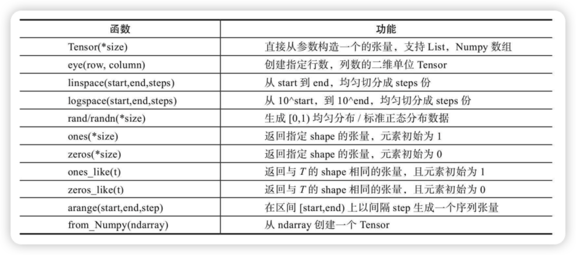
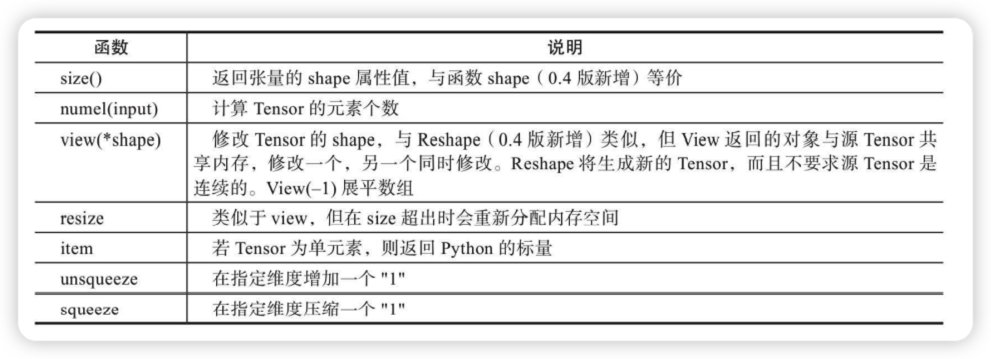
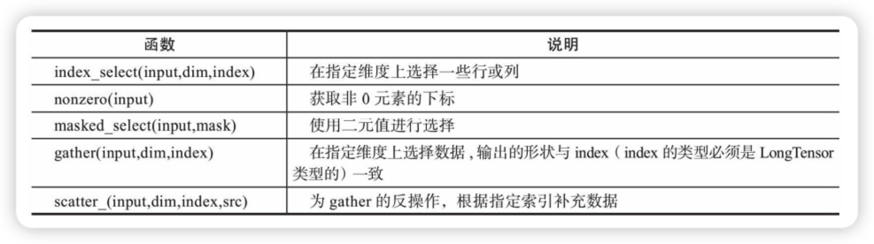
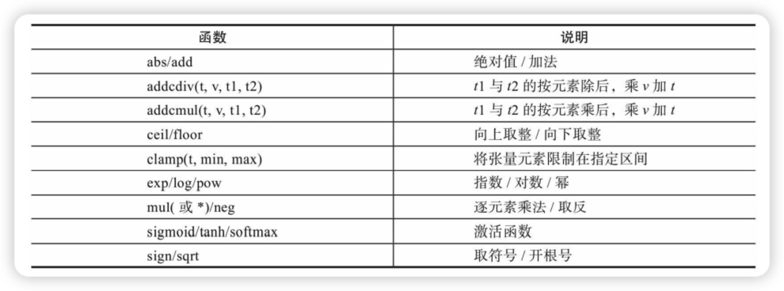
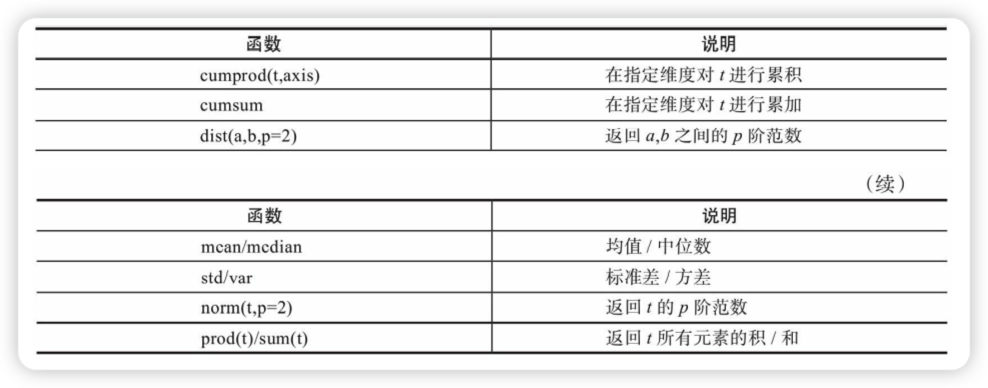
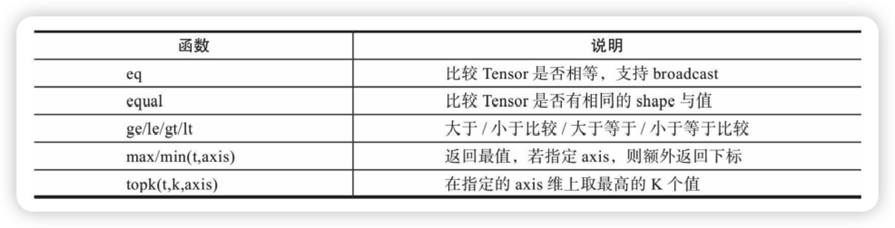
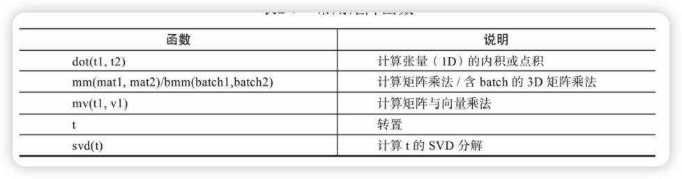
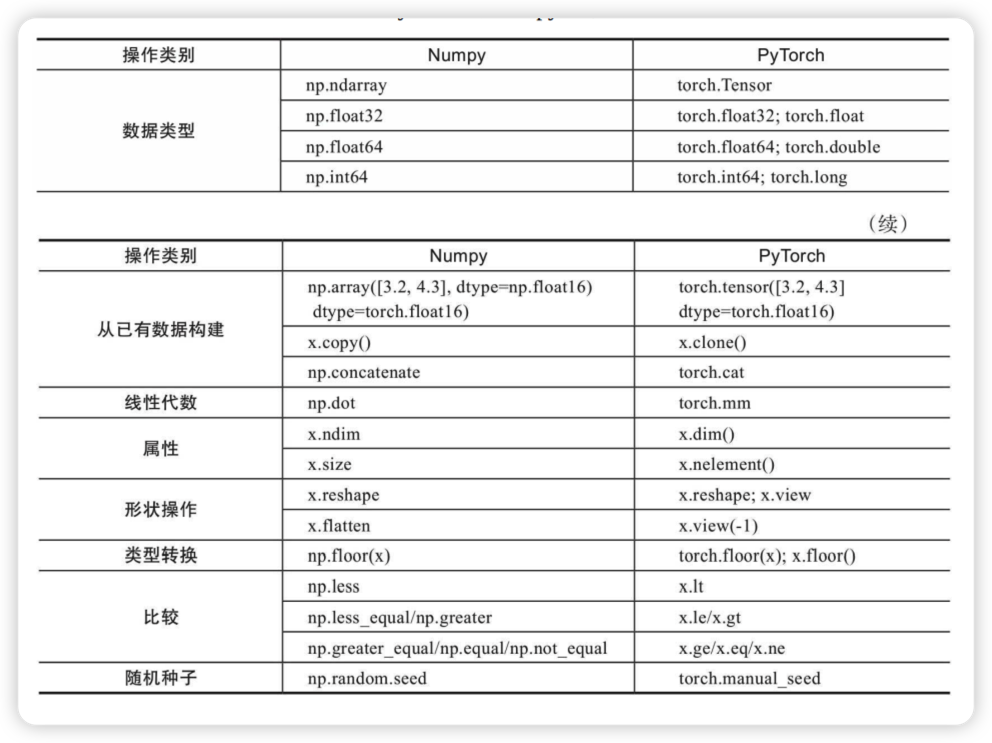
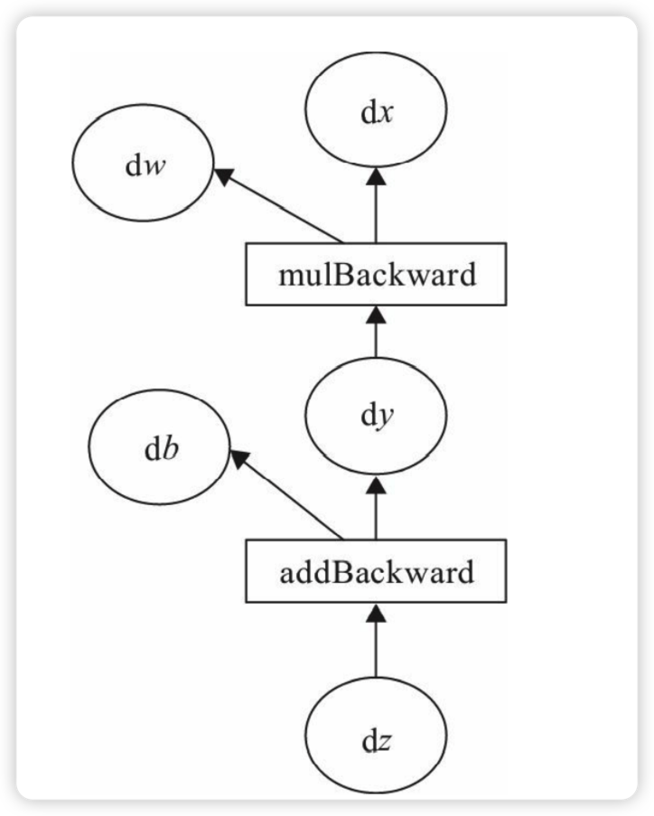
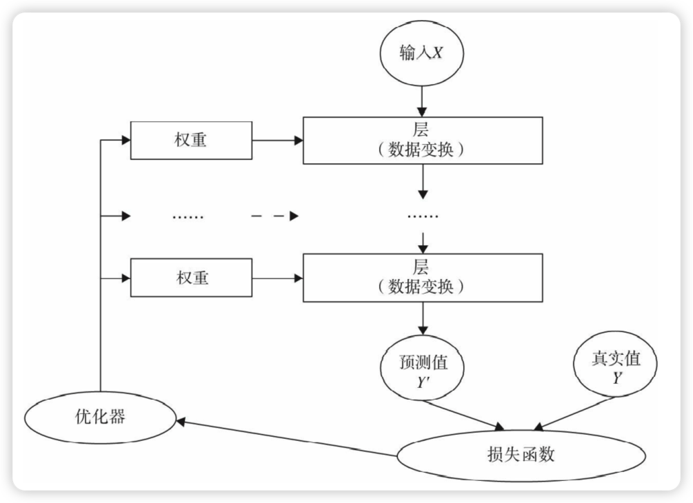

<!DOCTYPE html>
<html lang="zh-Hans-CN"><head><meta charset="utf-8"/><meta http-equiv="X-UA-Compatible" content="IE=Edge"/><link rel="stylesheet" type="text/css" href="css/modern-norm.min.css"/><link rel="stylesheet" type="text/css" href="css/prism.min.css"/><link rel="stylesheet" type="text/css" href="css/katex.min.css"/><link rel="stylesheet" type="text/css" href="css/wolai.css"/><title>Pytorch学习 - wolai 笔记</title><link rel="shortcut icon" href="data:image/svg+xml,%3Csvg xmlns=&apos;http://www.w3.org/2000/svg&apos; viewBox=&apos;0 0 800 800&apos;%3E%3Cdefs%3E%3Cstyle%3E.cls-1%7Bfill:%23fff;%7D%3C/style%3E%3C/defs%3E%3Cg%3E%3Cpath class=&apos;cls-1&apos; d=&apos;M610.08,0c66,0,90,6.88,114.13,19.79a134.62,134.62,0,0,1,56,56l2.28,4.4C793.93,103,800,127.88,800,189.92V610.08l-.08,11.56c-.78,57.38-7.58,79.89-19.71,102.57a134.62,134.62,0,0,1-56,56l-4.4,2.28C697,793.93,672.12,800,610.08,800H189.92l-11.56-.08c-57.38-.78-79.89-7.58-102.57-19.71a134.62,134.62,0,0,1-56-56l-2.28-4.4C6.44,697.75.4,673.72,0,616L0,189.92c0-66,6.88-90,19.79-114.13a134.62,134.62,0,0,1,56-56l4.4-2.28C102.25,6.44,126.28.4,184,0Z&apos;/%3E%3Cpath d=&apos;M610.08,0c66,0,90,6.88,114.13,19.79a134.62,134.62,0,0,1,56,56l2.28,4.4C793.93,103,800,127.88,800,189.92V610.08l-.08,11.56c-.78,57.38-7.58,79.89-19.71,102.57a134.62,134.62,0,0,1-56,56l-4.4,2.28C697,793.93,672.12,800,610.08,800H189.92l-11.56-.08c-57.38-.78-79.89-7.58-102.57-19.71a134.62,134.62,0,0,1-56-56l-2.28-4.4C6.44,697.75.4,673.72,0,616L0,189.92c0-66,6.88-90,19.79-114.13a134.62,134.62,0,0,1,56-56l4.4-2.28C102.25,6.44,126.28.4,184,0Zm4.72,88.9H185.2L172.42,89c-32.78.62-43.68,3.24-54.71,9.14a45.84,45.84,0,0,0-19.54,19.54c-6.61,12.36-9.11,24.55-9.27,67.49V614.8L89,627.58c.62,32.78,3.24,43.68,9.14,54.71a45.84,45.84,0,0,0,19.54,19.54c12.36,6.61,24.55,9.11,67.49,9.27H610.08c46.79,0,59.41-2.44,72.21-9.28a45.84,45.84,0,0,0,19.54-19.54c6.61-12.36,9.11-24.55,9.27-67.49V189.92c0-46.79-2.44-59.41-9.28-72.21a45.84,45.84,0,0,0-19.54-19.54C669.93,91.56,657.74,89.06,614.8,88.9ZM233.33,493.33A73.34,73.34,0,1,1,160,566.67,73.35,73.35,0,0,1,233.33,493.33Z&apos;/%3E%3C/g%3E%3C/svg%3E"></link></head><body><header>

</header><article><h1 id="nGCx4e24eXH71MphgnLen" class="wolai-block">前言（tricks）</h1><h2 id="exGJi4ANFFj2UZj86H1JeK" class="wolai-block">批量处理的技巧</h2>

在深度学习中，由于源数据都比较大，所以通常需要用到批处理。如利用批量来计算梯度的随机梯度法（SGD）就是一个典型应用。深度学习的计算一般比较复杂，并且数据量一般比较大，如果一次处理整个数据，较大概率会出现资源瓶颈。为了更有效地计算，一般将整个数据集分批次处理。与处理整个数据集相反的另一个极端是每次只处理一条记录，这种方法也不科学，一次处理一条记录无法充分发挥GPU、Numpy的平行处理优势。因此，在实际使用中往往采用批量处理（Mini-Batch）的方法。

 

如何把大数据拆分成多个批次呢？可采用如下步骤：

1）得到数据集

2）随机打乱数据

3）定义批大小

4）批处理数据集

下面我们通过一个示例来具体说明：

<code-block id="qiKGc3UtGAajfSkGfWaaEe" class="wolai-block">

<pre>import numpy as np
#生成10000个形状为2X3的矩阵
data_train = np.random.randn(10000,2,3)
#这是一个3维矩阵，第1个维度为样本数，后两个是数据形状
print(data_train.shape)
#(10000,2,3)
#打乱这10000条数据
np.random.shuffle(data_train)
#定义批量大小
batch_size=100
#进行批处理
for i in range(0,len(data_train),batch_size):
    x_batch_sum=np.sum(data_train[i:i+batch_size])
    print("第{}批次,该批次的数据之和:{}".format(i,x_batch_sum))
</pre>
</code-block><h1 id="oyyjN42H1Vu2KrBuxQAFpw" class="wolai-block">PyTorch基础</h1><blockquote id="9Sg7Nxbqc9La6LirySJwTX" class="wolai-block">PyTorch采用Python语言接口来实现编程，非常容易上手。它就像带GPU的Numpy，与Python一样都属于动态框架。PyTorch继承了Torch灵活、动态的编程环境和用户友好的界面，支持以快速和灵活的方式构建动态神经网络，还允许在训练过程中快速更改代码而不妨碍其性能，支持动态图形等尖端AI模型的能力，是快速实验的理想选择。</blockquote>

PyTorch是一个建立在Torch库之上的Python包，旨在加速深度学习应用。它提供一种类似Numpy的抽象方法来表征张量（或多维数组），可以利用GPU来加速训练。由于PyTorch采用了动态计算图（Dynamic Computational Graph）结构，且基于tape的Autograd系统的深度神经网络。其他很多框架，比如TensorFlow（TensorFlow2.0也加入了动态网络的支持）、Caffe、CNTK、Theano等，采用静态计算图。使用PyTorch，通过一种称为Reverse-mode auto-differentiation（反向模式自动微分）的技术，可以零延迟或零成本地任意改变你的网络的行为。

PyTorch由4个主要的包组成：

<code>·torch</code>：类似于Numpy的通用数组库，可将张量类型转换为torch.cuda.TensorFloat，并在GPU上进行计算。

<code>·torch.autograd</code>：用于构建计算图形并自动获取梯度的包。

<code>·torch.nn</code>：具有共享层和损失函数的神经网络库。

<code>·torch.optim</code>：具有通用优化算法（如SGD、Adam等）的优化包

<h2 id="bHjT29jK6YsrPJiCPYsW28" class="wolai-block">Tensor概述</h2><blockquote id="idbivvwLza1EJzqxhvkyfX" class="wolai-block">PyTorch的Tensor，它可以是零维（又称为标量或一个数）、一维、二维及多维的数组。Tensor自称为神经网络界的Numpy，它与Numpy相似，二者可以共享内存，且之间的转换非常方便和高效。不过它们也有不同之处，最大的区别就是Numpy会把ndarray放在CPU中进行加速运算，而由Torch产生的Tensor会放在GPU中进行加速运算（假设当前环境有GPU）</blockquote>

对Tensor的操作很多，从接口的角度来划分，可以分为两类：

<ul class="wolai-block"><li id="eaJJMQVtKFLyv2GHkaaNMd">
<svg width="24" height="24" viewBox="0 0 24 24" fill="currentColor" xmlns="http://www.w3.org/2000/svg"><path d="M12 14.5a2.5 2.5 0 100-5 2.5 2.5 0 000 5z"></path></svg>
1）torch.function，如torch.sum、torch.add等；</li><li id="jUGvVbfXvgoVENTCdxN1dC">
<svg width="24" height="24" viewBox="0 0 24 24" fill="currentColor" xmlns="http://www.w3.org/2000/svg"><path d="M12 14.5a2.5 2.5 0 100-5 2.5 2.5 0 000 5z"></path></svg>
2）tensor.function，如tensor.view、tensor.add等。</li></ul>

这些操作对大部分Tensor都是等价的，如torch.add(x,y)与x.add(y)等价。在实际使用时，可以根据个人爱好选择。如果从修改方式的角度来划分，可以分为以下两类：

<ul class="wolai-block"><li id="sJmWLs51v86r3MnwNH2d16">
<svg width="24" height="24" viewBox="0 0 24 24" fill="currentColor" xmlns="http://www.w3.org/2000/svg"><path d="M12 14.5a2.5 2.5 0 100-5 2.5 2.5 0 000 5z"></path></svg>
1）不修改自身数据，如x.add(y)，x的数据不变，返回一个新的Tensor。</li><li id="x2JTaRdajLDNbtmEJqxyPP">
<svg width="24" height="24" viewBox="0 0 24 24" fill="currentColor" xmlns="http://www.w3.org/2000/svg"><path d="M12 14.5a2.5 2.5 0 100-5 2.5 2.5 0 000 5z"></path></svg>
2）修改自身数据，如x.add_(y)（运行符带下划线后缀），运算结果存在x中，x被修改。</li></ul><h3 id="kmuWW4xF4PESatBiuMmXKn" class="wolai-block">创建Tensor</h3>

创建Tensor的方法有很多，可以从列表或ndarray等类型进行构建，也可根据指定的形状构建。常见的创建Tensor的方法可参考表：

<figure class="wolai-center" style="width: 100%"></figure>
<code-block id="k8yK2Sk2RkuurJArHgkq6U" class="wolai-block">

<pre>import torch
#根据list数据生成Tensor
torch.Tensor([1,2,3,4,5,6])
#根据指定形状生成Tensor
torch.Tensor(2,3)
#根据给定的Tensor的形状
t=torch.Tensor([[1,2,3],[4,5,6]])
#查看Tensor的形状
t.size()
#shape与size()等价方式
t.shape
#根据已有形状创建Tensor
torch.Tensor(t.size())</pre>
</code-block><aside id="h1TkacGdnJQxE3p4qas5Up" class="bg-cultured wolai-block">

注意torch.Tensor与torch.tensor的几点区别：<ul class="wolai-block"><li id="etjsdRafLTZ3EwbF1iHMtq">
<svg width="24" height="24" viewBox="0 0 24 24" fill="currentColor" xmlns="http://www.w3.org/2000/svg"><path d="M12 14.5a2.5 2.5 0 100-5 2.5 2.5 0 000 5z"></path></svg>
torch.Tensor是torch.empty和torch.tensor之间的一种混合，但是，当传入数据时，torch.Tensor使用全局默认dtype（FloatTensor），而torch.tensor是从数据中推断数据类型。</li><li id="prSCmQniUaULXtQkwDWMwV">
<svg width="24" height="24" viewBox="0 0 24 24" fill="currentColor" xmlns="http://www.w3.org/2000/svg"><path d="M12 14.5a2.5 2.5 0 100-5 2.5 2.5 0 000 5z"></path></svg>
torch.tensor(1)返回一个固定值1，而torch.Tensor(1)返回一个大小为1的张量，它是随机初始化的值。</li></ul><code-block id="bq4evnU7fvKWueJWr1tTgz" class="wolai-block">

<pre>import torch
t1=torch.Tensor(1)
t2=torch.tensor(1)
print("t1的值{},t1的数据类型{}".format(t1,t1.type()))
print("t2的值{},t2的数据类型{}".format(t2,t2.type()))
</pre>
</code-block></aside><h3 id="cGSjutpjgSiD238dUoYkrb" class="wolai-block">修改Tensor形状</h3>

在处理数据、构建网络层等过程中，经常需要了解Tensor的形状、修改Tensor的形状。与修改Numpy的形状类似，修改Tenor的形状也有很多类似函数，具体可参考表：

<figure class="wolai-center" style="width: 100%"></figure>
<code-block id="bFD13FuJyTq4EiX588uViT" class="wolai-block">

<pre>import torch
#生成一个形状为2x3的矩阵
x = torch.randn(2, 3)
#查看矩阵的形状
x.size() #结果为torch.Size([2, 3])
#查看x的维度
x.dim() #结果为2
#把x变为3x2的矩阵
x.view(3,2)
#把x展平为1维向量
y=x.view(-1)
y.shape
#添加一个维度
z=torch.unsqueeze(y,0)
#查看z的形状
z.size() #结果为torch.Size([1, 6])
#计算Z的元素个数
z.numel() #结果为6</pre>
</code-block><aside id="jYeFcr3hrRHiuG5pTfCRTc" class="bg-cultured wolai-block">

torch.view与torch.reshpae的异同
1）reshape()可以由torch.reshape()，也可由torch.Tensor.reshape()调用。但view()只可由torch.Tensor.view()来调用。
2）对于一个将要被view的Tensor，新的size必须与原来的size与stride兼容。否则，在view之前必须调用contiguous()方法。
3）同样也是返回与input数据量相同，但形状不同的Tensor。若满足view的条件，则不会copy，若不满足，则会copy。
4）如果你只想重塑张量，请使用torch.reshape。如果你还关注内存使用情况并希望确保两个张量共享相同的数据，请使用torch.view</aside><h3 id="hYAfRgYUHQFKwNdzTTG9ym" class="wolai-block">索引操作</h3>

Tensor的索引操作与Numpy类似，一般情况下索引结果与源数据共享内存。从Tensor获取元素除了可以通过索引，也可以借助一些函数，常用的选择函数可参考表：

<figure class="wolai-center" style="width: 100%"></figure>
<code-block id="x3ZmkVhVhoTerepvXmQWmW" class="wolai-block">

<pre>import torch
#设置一个随机种子
torch.manual_seed(100)
#生成一个形状为2x3的矩阵
x = torch.randn(2, 3)
#根据索引获取第1行，所有数据
x[0,:]
#获取最后一列数据
x[:,-1]
#生成是否大于0的Byter张量
mask=x>0
#获取大于0的值
torch.masked_select(x,mask)
#获取非0下标,即行，列索引
torch.nonzero(mask)
#获取指定索引对应的值,输出根据以下规则得到
#out[i][j] = input[index[i][j]][j] # if dim == 0
#out[i][j] = input[i][index[i][j]] # if dim == 1
index=torch.LongTensor([[0,1,1]])
torch.gather(x,0,index)
index=torch.LongTensor([[0,1,1],[1,1,1]])
a=torch.gather(x,1,index)
#把a的值返回到一个2x3的0矩阵中
z=torch.zeros(2,3)
z.scatter_(1,index,a)
</pre>
</code-block><h3 id="bYumJkafsDhbXRHYMiSPfg" class="wolai-block">逐元素操作</h3>

与Numpy一样，Tensor也有逐元素操作（Element-Wise），且操作内容相似，但使用函数可能不尽相同。大部分数学运算都属于逐元素操作，其输入与输出的形状相同。常见的逐元素操作可参考表：

<figure class="wolai-center" style="width: 100%"></figure>
<code-block id="mFZkXGEBrgDbrRs6D64bd5" class="wolai-block">

<pre>import torch
t = torch.randn(1, 3)
t1 = torch.randn(3, 1)
t2 = torch.randn(1, 3)
#t+0.1*(t1/t2)
torch.addcdiv(t, 0.1, t1, t2)
#计算sigmoid
torch.sigmoid(t)
#将t限制在[0,1]之间
torch.clamp(t,0,1)
#t+2进行就地运算
t.add_(2)
</pre>
</code-block><h3 id="oGKxB1UmJ7jdDo5uZG2UY9" class="wolai-block">归并操作</h3>

归并操作顾名思义，就是对输入进行归并或合计等操作，这类操作的输入输出形状一般并不相同，而且往往是输入大于输出形状。归并操作可以对整个Tensor，也可以沿着某个维度进行归并。常见的归并操作可参考表：

<figure class="wolai-center" style="width: 100%"></figure>
<aside id="kEQ8owp96uLoKFNCpDBcjr" class="bg-cultured wolai-block">

归并操作一般涉及一个dim参数，指定沿哪个维进行归并。另一个参数是keepdim，说明输出结果中是否保留维度1，缺省情况是False，即不保留。</aside><code-block id="hDg2nHgFHUXmLtMqAh1kvR" class="wolai-block">

<pre>import torch
#生成一个含6个数的向量
a=torch.linspace(0,10,6)
#使用view方法，把a变为2x3矩阵
a=a.view((2,3))
#沿y轴方向累加，即dim=0
b=a.sum(dim=0) #b的形状为[3]
#沿y轴方向累加，即dim=0,并保留含1的维度
b=a.sum(dim=0,keepdim=True) #b的形状为[1,3]
</pre>
</code-block><h3 id="k7jmKqVVP6jsJHH4gQGVJ2" class="wolai-block">比较操作</h3>
<figure class="wolai-center" style="width: 100%"></figure>
<code-block id="wEwWUXDCwfTopRPSUSPMRg" class="wolai-block">

<pre>import torch
x=torch.linspace(0,10,6).view(2,3)
#求所有元素的最大值
torch.max(x) #结果为10
#求y轴方向的最大值
torch.max(x,dim=0) #结果为[6,8,10]
#求最大的2个元素
torch.topk(x,1,dim=0) #结果为[6,8,10],对应索引为tensor([[1, 1, 1]
</pre>
</code-block><h3 id="8cLWNEWUR42XXMNUiZhotw" class="wolai-block">矩阵操作</h3>

机器学习和深度学习中存在大量的矩阵运算，常用的算法有两种：一种是逐元素乘法，另外一种是点积乘法。

<figure class="wolai-center" style="width: 100%"></figure>
<aside id="eDM8xhaSwWkNhcaho7Gtop" class="bg-cultured wolai-block">

1）Torch的dot与Numpy的dot有点不同，Torch中的dot是对两个为1D张量进行点积运算，Numpy中的dot无此限制。
2）mm是对2D的矩阵进行点积，bmm对含batch的3D进行点积运算。
3）转置运算会导致存储空间不连续，需要调用contiguous方法转为连续。</aside><h3 id="qrbAHRV1NU77qbrPKzMvQZ" class="wolai-block">PyTorch和NumPy比较</h3>

PyTorch与Numpy有很多类似的地方，并且有很多相同的操作函数名称，或虽然函数名称不同但含义相同；当然也有一些虽然函数名称相同，但含义不尽相同。有些很容易混淆，下面我们把一些主要的区别进行汇总

<figure class="wolai-center" style="width: 100%"></figure>
<h2 id="5ua15ggfnXEpzxUDg6CPkf" class="wolai-block">Tensor与Autograd</h2><blockquote id="iS7Fe3ES5AmrLefFeJbXxY" class="wolai-block">在神经网络中，一个重要内容就是进行参数学习，而参数学习离不开求导，那么PyTorch是如何进行求导的呢？
现在大部分深度学习架构都有自动求导的功能，PyTorch也不例外，torch.autograd包就是用来自动求导的。Autograd包为张量上所有的操作提供了自动求导功能，而torch.Tensor和torch.Function为Autograd的两个核心类，它们相互连接并生成一个有向非循环图。接下来我们先简单介绍Tensor如何实现自动求导，然后介绍计算图，最后用代码来实现这些功能</blockquote><h3 id="azbqXdDguUWG8GYJ5FZPSu" class="wolai-block">自动求导要点</h3>

为实现对Tensor自动求导，需考虑如下事项：

<ol class="wolai-block"><li id="eEXii3oi8hHvkdAC3sYSrZ">

创建叶子节点（Leaf Node）的Tensor，使用<code>requires_grad</code>参数指定是否记录对其的操作，以便之后利用backward()方法进行梯度求解。requires_grad参数的缺省值为False，如果要对其求导需设置为True，然后与之有依赖关系的节点会自动变为True。</li><li id="43YKwjt7BpHm6TzakpFZK">

可利用requires_grad_()方法修改Tensor的requires_grad属性。可以调用<code>.detach()</code>或<code>with torch.no_grad()：</code>，将不再计算张量的梯度，跟踪张量的历史记录。<b>这点在评估模型、测试模型阶段中常常用到。</b></li><li id="ns3KyvPdXwMZhvTZ2w6etG">

通过运算创建的Tensor（即非叶子节点），会自动被赋予grad_fn属性。该属性表示梯度函数。叶子节点的grad_fn为None。</li><li id="79dCAcevDDNfaamoLRpV4h">

最后得到的Tensor执行backward()函数，此时自动计算各变量的梯度，并将累加结果保存到grad属性中。计算完成后，非叶子节点的梯度自动释放。</li><li id="hG9Du29n2ZnPiMZcnx7qV1">

backward()函数接收参数，该参数应和调用backward()函数的Tensor的维度相同，或者是可broadcast的维度。如果求导的Tensor为标量（即一个数字），则backward中的参数可省略。</li><li id="9791CxYwMMhHtVs2BksANF">

反向传播的中间缓存会被清空，如果需<b>要进行多次反向传播，需要指定backward中的参数retain_graph=True。多次反向传播时，梯度是累加的。</b>否则会将计算图清空。</li><li id="ddyczTdZz4fnvppFsbkpN1">

非叶子节点的梯度backward调用后即被清空。</li><li id="sKPhGXTbyLkiP8raQMHmjn">

可以通过用torch.no_grad()包裹代码块的形式来阻止autograd去跟踪那些标记</li></ol>

为.requesgrad=True的张量的历史记录。这步在测试阶段经常使用。在整个过程中，PyTorch采用计算图的形式进行组织，该计算图为动态图，且在每次前向传播时，将重新构建。其他深度学习架构，如TensorFlow、Keras一般为静态图。接下来我们介绍计算图，用图的形式来描述就更直观了，该计算图为有向无环图（DAG）

PyTorch调用backward()方法，将自动计算各节点的梯度，这是一个反向传播过程，这个过程可用图2-9表示。且在反向传播过程中，autograd沿着图2-10，从当前根节点z反向溯源，利用导数链式法则，计算所有叶子节点的梯度，其梯度值将累加到grad属性中。对非叶子节点的计算操作（或Function）记录在grad_fn属性中，叶子节点的grad_fn值为None。

<figure class="wolai-center" style="width: 100%"></figure>
<h3 id="w98wyJDgGZnRopqMjP7fbL" class="wolai-block">非标量反向传播</h3>

在2.5.3节中介绍了当目标张量为标量时，可以调用backward()方法且无须传入参数。目标张量一般都是标量，如我们经常使用的损失值Loss，一般都是一个标量。但也有非标量的情况，后面将介绍的Deep Dream的目标值就是一个含多个元素的张量。那如何对非标量进行反向传播呢？PyTorch有个简单的规定，<b>不让张量（Tensor）对张量求导，只允许标量对张量求导</b>，因此，如果目标张量对一个非标量调用ackward()，则需要传入一个gradient参数，该参数也是张量，而且需要与调用backward()的张量形状相同。那么为什么要传入一个张量gradient呢？

传入这个参数就是为了把张量对张量的求导转换为标量对张量的求导。这有点拗口，我们举一个例子来说，假设目标值为<math xmlns="http://www.w3.org/1998/Math/MathML"><semantics><mrow><mi>l</mi><mi>o</mi><mi>s</mi><mi>s</mi><mo>=</mo><mo stretchy="false">(</mo><msub><mi>y</mi><mn>1</mn></msub><mo separator="true">,</mo><msub><mi>y</mi><mn>2</mn></msub><mo separator="true">,</mo><mo>…</mo><mo separator="true">,</mo><msub><mi>y</mi><mi>m</mi></msub><mo stretchy="false">)</mo></mrow><annotation encoding="application/x-tex">loss=(y_1,y_2,…,y_m)</annotation></semantics></math>loss=(y1​,y2​,…,ym​)，传入的参数为<math xmlns="http://www.w3.org/1998/Math/MathML"><semantics><mrow><mi>v</mi><mo>=</mo><mo stretchy="false">(</mo><msub><mi>v</mi><mn>1</mn></msub><mo separator="true">,</mo><msub><mi>v</mi><mn>2</mn></msub><mo separator="true">,</mo><mo>…</mo><mo separator="true">,</mo><msub><mi>v</mi><mi>m</mi></msub><mo stretchy="false">)</mo></mrow><annotation encoding="application/x-tex">v=(v_1,v_2,…,v_m)</annotation></semantics></math>v=(v1​,v2​,…,vm​)，那么就可把对loss的求导，转换为对<math xmlns="http://www.w3.org/1998/Math/MathML"><semantics><mrow><mi>l</mi><mi>o</mi><mi>s</mi><mi>s</mi><mo>∗</mo><msup><mi>v</mi><mi>T</mi></msup></mrow><annotation encoding="application/x-tex">loss*v^T</annotation></semantics></math>loss∗vT标量的求导。即把原来 得到的雅可比矩阵（Jacobian）乘以张量<math xmlns="http://www.w3.org/1998/Math/MathML"><semantics><mrow><msup><mi>v</mi><mi>T</mi></msup></mrow><annotation encoding="application/x-tex">v^T</annotation></semantics></math>vT，便可得到我们需要的梯度矩阵。

<code-block id="vWZha1LvtjqZFEZjdKEqWa" class="wolai-block">

<pre>backward(gradient=None, retain_graph=None, create_graph=False)
</pre>
</code-block>

上面说的可能有点抽象，下面来通过一个实例进行说明。

1）定义叶子节点及计算节点。

<code-block id="aAcY2xNQNSw4v1VH1cp4Lx" class="wolai-block">

<pre>import torch
#定义叶子节点张量x，形状为1x2
x= torch.tensor([[2, 3]], dtype=torch.float, requires_grad=True)
#初始化Jacobian矩阵
J= torch.zeros(2 ,2)
#初始化目标张量，形状为1x2
y = torch.zeros(1, 2)
#定义y与x之间的映射关系：
#y1=x12+3*x2，y2=x22+2*x1
y[0, 0] = x[0, 0] ** 2 + 3 * x[0 ,1]
y[0, 1] = x[0, 1] ** 2 + 2 * x[0, 0]</pre>
</code-block>

2）手工计算y对x的梯度。

我们先手工计算一下y对x的梯度，验证PyTorch的backward的结果是否正确。y对x的梯度是一个雅可比矩阵，我们可通过以下方法进行计算各项的值。假设x=(x1=2,x2=3), ，不难得到：

<math xmlns="http://www.w3.org/1998/Math/MathML" display="block"><semantics><mrow><mi>J</mi><mo>=</mo><mrow><mo fence="true">(</mo><mtable rowspacing="0.16em" columnalign="left left" columnspacing="1em"><mtr><mtd><mstyle scriptlevel="0" displaystyle="false"><mfrac><mrow><mi mathvariant="normal">∂</mi><msub><mi>y</mi><mn>1</mn></msub></mrow><mrow><mi mathvariant="normal">∂</mi><msub><mi>x</mi><mn>1</mn></msub></mrow></mfrac></mstyle></mtd><mtd><mstyle scriptlevel="0" displaystyle="false"><mfrac><mrow><mi mathvariant="normal">∂</mi><msub><mi>y</mi><mn>1</mn></msub></mrow><mrow><mi mathvariant="normal">∂</mi><msub><mi>x</mi><mn>2</mn></msub></mrow></mfrac></mstyle></mtd></mtr><mtr><mtd><mstyle scriptlevel="0" displaystyle="false"><mfrac><mrow><mi mathvariant="normal">∂</mi><msub><mi>y</mi><mn>2</mn></msub></mrow><mrow><mi mathvariant="normal">∂</mi><msub><mi>x</mi><mn>1</mn></msub></mrow></mfrac></mstyle></mtd><mtd><mstyle scriptlevel="0" displaystyle="false"><mfrac><mrow><mi mathvariant="normal">∂</mi><msub><mi>y</mi><mn>2</mn></msub></mrow><mrow><mi mathvariant="normal">∂</mi><msub><mi>x</mi><mn>2</mn></msub></mrow></mfrac></mstyle></mtd></mtr></mtable><mo fence="true">)</mo></mrow><mo>=</mo><mrow><mo fence="true">(</mo><mtable rowspacing="0.16em" columnalign="center center" columnspacing="1em"><mtr><mtd><mstyle scriptlevel="0" displaystyle="false"><mrow><mn>2</mn><msub><mi>x</mi><mn>1</mn></msub></mrow></mstyle></mtd><mtd><mstyle scriptlevel="0" displaystyle="false"><mn>3</mn></mstyle></mtd></mtr><mtr><mtd><mstyle scriptlevel="0" displaystyle="false"><mn>2</mn></mstyle></mtd><mtd><mstyle scriptlevel="0" displaystyle="false"><mrow><mn>2</mn><msub><mi>x</mi><mn>2</mn></msub></mrow></mstyle></mtd></mtr></mtable><mo fence="true">)</mo></mrow></mrow><annotation encoding="application/x-tex">J=\left(\begin{array}{ll}\frac{\partial y_{1}}{\partial x_{1}} &amp; \frac{\partial y_{1}}{\partial x_{2}} \\ \frac{\partial y_{2}}{\partial x_{1}} &amp; \frac{\partial y_{2}}{\partial x_{2}}\end{array}\right)=\left(\begin{array}{cc}2 x_{1} &amp; 3 \\ 2 &amp; 2 x_{2}\end{array}\right)</annotation></semantics></math>J=(∂x1​∂y1​​∂x1​∂y2​​​∂x2​∂y1​​∂x2​∂y2​​​)=(2x1​2​32x2​​)

3）调用backward来获取y对x的梯度。

<code-block id="zjhdDJDfJoBSuhgE4nWvf" class="wolai-block">

<pre>y.backward(torch.Tensor([[1, 1]]))
print(x.grad)
#结果为tensor([[6., 9.]])</pre>
</code-block>

这个结果与我们手工运算的不符，显然这个结果是错误的，那错在哪里呢？这个结果的计算过程是：

<math xmlns="http://www.w3.org/1998/Math/MathML" display="block"><semantics><mrow><msup><mi>J</mi><mi mathvariant="normal">T</mi></msup><mo>⋅</mo><msup><mi>v</mi><mi mathvariant="normal">T</mi></msup><mo>=</mo><mrow><mo fence="true">(</mo><mtable rowspacing="0.16em" columnalign="left left" columnspacing="1em"><mtr><mtd><mstyle scriptlevel="0" displaystyle="false"><mn>4</mn></mstyle></mtd><mtd><mstyle scriptlevel="0" displaystyle="false"><mn>2</mn></mstyle></mtd></mtr><mtr><mtd><mstyle scriptlevel="0" displaystyle="false"><mn>3</mn></mstyle></mtd><mtd><mstyle scriptlevel="0" displaystyle="false"><mn>6</mn></mstyle></mtd></mtr></mtable><mo fence="true">)</mo></mrow><mrow><mo fence="true">(</mo><mtable rowspacing="0.16em" columnalign="left" columnspacing="1em"><mtr><mtd><mstyle scriptlevel="0" displaystyle="false"><mn>1</mn></mstyle></mtd></mtr><mtr><mtd><mstyle scriptlevel="0" displaystyle="false"><mn>1</mn></mstyle></mtd></mtr></mtable><mo fence="true">)</mo></mrow><mo>=</mo><mrow><mo fence="true">(</mo><mtable rowspacing="0.16em" columnalign="left" columnspacing="1em"><mtr><mtd><mstyle scriptlevel="0" displaystyle="false"><mn>6</mn></mstyle></mtd></mtr><mtr><mtd><mstyle scriptlevel="0" displaystyle="false"><mn>9</mn></mstyle></mtd></mtr></mtable><mo fence="true">)</mo></mrow></mrow><annotation encoding="application/x-tex">J^{\mathrm{T}} \cdot v^{\mathrm{T}}=\left(\begin{array}{ll}4 &amp; 2 \\ 3 &amp; 6\end{array}\right)\left(\begin{array}{l}1 \\ 1\end{array}\right)=\left(\begin{array}{l}6 \\ 9\end{array}\right)</annotation></semantics></math>JT⋅vT=(43​26​)(11​)=(69​)

由此可见，错在v的取值，通过这种方式得到的并不是y对x的梯度。这里我们可以分成两步计算。首先让v=(1,0)得到y1对x的梯度，然后使v=(0,1)，得到y2对x的梯度。这里因需要重复使用backward()，需要使参数retain_graph=True，具体代码如下：

<code-block id="gLFMm59rM1gfJG9Bjs91K5" class="wolai-block">

<pre>#生成y1对x的梯度
y.backward(torch.Tensor([[1, 0]]),retain_graph=True)
J[0]=x.grad
#梯度是累加的，故需要对x的梯度清零
x.grad = torch.zeros_like(x.grad)
#生成y2对x的梯度
y.backward(torch.Tensor([[0, 1]]))
J[1]=x.grad
#显示jacobian矩阵的值
print(J)

</pre>
</code-block><h1 id="wHae6fSDg9tgvuYPQBTpo7" class="wolai-block">PyTorch神经网络工具箱</h1><h2 id="auAWErEMukjbGCf28kmYHJ" class="wolai-block">神经网络核心组件</h2>

神经网络看起来很复杂，节点很多，层数多，参数更多。但核心部分或组件不多，把这些组件确定后，这个神经网络基本就确定了。这些核心组件包括：

1）层：神经网络的基本结构，将输入张量转换为输出张量。

2）模型：层构成的网络。

3）损失函数：参数学习的目标函数，通过最小化损失函数来学习各种参数。

4）优化器：如何使损失函数最小，这就涉及优化器。

当然这些核心组件不是独立的，它们之间，以及它们与神经网络其他组件之间有密切关系。

<figure class="wolai-center" style="width: 100%"></figure>

多个层链接在一起构成一个模型或网络，输入数据通过这个模型转换为预测值，然后损失函数把预测值与真实值进行比较，得到损失值（损失值可以是距离、概率值等），该损失值用于衡量预测值与目标结果的匹配或相似程度，优化器利用损失值更新权重参数，从而使损失值越来越小。这是一个循环过程，当损失值达到一个阀值或循环次数到达指定次数，循环结束。

接下来利用PyTorch的nn工具箱，构建一个神经网络实例。nn中对这些组件都有现成包或类，可以直接使用，非常方便

<h1 id="eC37vaaMqxre37rnD1EQUx" class="wolai-block">PyTorch数据处理工具箱</h1><blockquote id="7QvMh7hEsTjM7ptLuWV1u3" class="wolai-block">Tensorboard是Google TensorFlow的可视化工具，它可以记录训练数据、评估数据、网络结构、图像等，并且可以在web上展示，对于观察神经网络训练的过程非常有帮助。PyTorch可以采用tensorboard_logger、visdom等可视化工具，但这些方法比较复杂或不够友好。为解决这一问题，人们推出了可用于PyTorch可视化的新的更强大的工具——tensorboardX</blockquote><h2 id="tpLGWksaYCmASXTSLG8vKf" class="wolai-block">可视化工具</h2><h3 id="sE6am5UHv8TG9Ecdnq8vgr" class="wolai-block">tensorboardX工具</h3><blockquote id="222RQfEHTZXA1Gxx2G6p7u" class="wolai-block">tensorboardX功能很强大，支持scalar、image、figure、histogram、audio、text、graph、onnx_graph、embedding、pr_curve and videosummaries等可视化方式。</blockquote>

使用tensorboardX的一般步骤如下所示:

<ul class="wolai-block"><li id="bH3hWxJ6cJ7vi392bt8sz6">
<svg width="24" height="24" viewBox="0 0 24 24" fill="currentColor" xmlns="http://www.w3.org/2000/svg"><path d="M12 14.5a2.5 2.5 0 100-5 2.5 2.5 0 000 5z"></path></svg>
导入tensorboardX，实例化SummaryWriter类，指明记录日志路径等信息。<code-block id="95wcCzDuepJeZH4hrcMSJL" class="wolai-block">

<pre>from tensorboardX import SummaryWriter
#实例化SummaryWriter，并指明日志存放路径。在当前目录没有logs目录将自动创建。
writer = SummaryWriter(log_dir='logs')
#调用实例
writer.add_xxx()
#关闭writer
writer.close()
</pre>
</code-block></li><li id="exTxyoghzWMT1afXNbBVaK">
<svg width="24" height="24" viewBox="0 0 24 24" fill="currentColor" xmlns="http://www.w3.org/2000/svg"><path d="M12 14.5a2.5 2.5 0 100-5 2.5 2.5 0 000 5z"></path></svg>
调用相应的API接口，接口一般格式为：<code-block id="tUzPPrps6AXmE51aTKjqWR" class="wolai-block">

<pre>add_xxx(tag-name, object, iteration-number)
#即add_xxx(标签，记录的对象，迭代次数)</pre>
</code-block></li><li id="gLHZwrFcXqG9tAwe6yN3MX">
<svg width="24" height="24" viewBox="0 0 24 24" fill="currentColor" xmlns="http://www.w3.org/2000/svg"><path d="M12 14.5a2.5 2.5 0 100-5 2.5 2.5 0 000 5z"></path></svg>
启动tensorboard服务：

cd到logs目录所在的同级目录，在命令行输入如下命令，logdir等式右边可以是相对路径或绝对路径:

<code-block id="u8eSMNrnjXhsUySFw9wJ8x" class="wolai-block">

<pre>tensorboard --logdir=logs --port 6006
#如果是Windows环境，要注意路径解析，如
#tensorboard --logdir=r'D:\myboard\test\logs' --port 600
</pre>
</code-block></li><li id="oxsJZoPSHwKwwFqmDKUUx5">
<svg width="24" height="24" viewBox="0 0 24 24" fill="currentColor" xmlns="http://www.w3.org/2000/svg"><path d="M12 14.5a2.5 2.5 0 100-5 2.5 2.5 0 000 5z"></path></svg>
web展示。

在浏览器输入： <a href="http://xn--IP-fr5c17cc4ew6ycgiln3b:6006">http://服务器IP或名称:6006</a> #如果是本机，服务器名称可以使用localhost

</li></ul><h3 id="ofp3dU7QXSFJ292z2XtsJU" class="wolai-block">用tensorboardX可视化神经网络（example）</h3>

（1）导入需要的模块

<code-block id="udxXCYUViySW9Qgr57MMxX" class="wolai-block">

<pre>import torch
import torch.nn as nn
import torch.nn.functional as F
import torchvision
from tensorboardX import SummaryWriter</pre>
</code-block>

（2）构建神经网络

<code-block id="dXem5JipM9jUzcq5cdZgdK" class="wolai-block">

<pre>class Net(nn.Module):
  def __init__(self):
    super(Net, self).__init__()
    self.conv1 = nn.Conv2d(1, 10, kernel_size=5)
    self.conv2 = nn.Conv2d(10, 20, kernel_size=5)
    self.conv2_drop = nn.Dropout2d()
    self.fc1 = nn.Linear(320, 50)
    self.fc2 = nn.Linear(50, 10)
    self.bn = nn.BatchNorm2d(20)
  def forward(self, x):
    x = F.max_pool2d(self.conv1(x), 2)
    x = F.relu(x) + F.relu(-x)
    x = F.relu(F.max_pool2d(self.conv2_drop(self.conv2(x)), 2))
    x = self.bn(x)
    x = x.view(-1, 320)
    x = F.relu(self.fc1(x))
    x = F.dropout(x, training=self.training)
    x = self.fc2(x)
    x = F.softmax(x, dim=1)
    return x
</pre>
</code-block>

（3）把模型保存为graph

<code-block id="5VEinUrAgT85WSHjHeaKRu" class="wolai-block">

<pre>#定义输入
input = torch.rand(32, 1, 28, 28)
#实例化神经网络
model = Net()
#将model保存为graph
with SummaryWriter(log_dir='logs',comment='Net') as w:
  w.add_graph(model, (input, ))</pre>
</code-block><h3 id="pDPWpD9YR6grra5uQXbq2T" class="wolai-block">用tensorboardX可视化损失值</h3>

可视化损失值，需要使用add_scalar函数，这里利用一层全连接神经网络，训练一元二次函数的参数。

<code-block id="avowxJ8dof2j3YRYKRQpAB" class="wolai-block">

<pre>dtype = torch.FloatTensor
writer = SummaryWriter(log_dir='logs',comment='Linear')
np.random.seed(100)
x_train = np.linspace(-1, 1, 100).reshape(100,1)
y_train = 3*np.power(x_train, 2) +2+ 0.2*np.random.rand(x_train.size).reshape(100,1)
model = nn.Linear(input_size, output_size)
criterion = nn.MSELoss()
optimizer = torch.optim.SGD(model.parameters(), lr=learning_rate)
for epoch in range(num_epoches):
  inputs = torch.from_numpy(x_train).type(dtype)
  targets = torch.from_numpy(y_train).type(dtype)
  output = model(inputs)
  loss = criterion(output, targets)
  optimizer.zero_grad()
  loss.backward()
  optimizer.step()
  # 保存loss的数据与epoch数值
  writer.add_scalar('训练损失值', loss, epoch)
</pre>
</code-block>

</article><footer></footer></body></html>